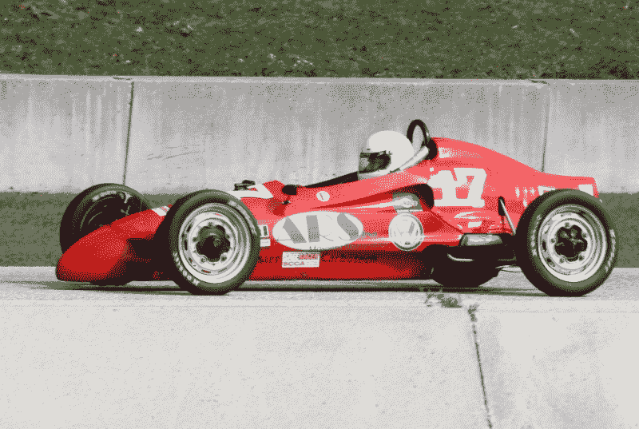

# 大众甲壳虫——最容易破解的汽车

> 原文：<https://hackaday.com/2016/05/03/volkswagen-beetle-the-most-hackable-car/>

如果你造了一个更好的捕鼠器，世界会找到你的。当然，如果你的捕鼠器是可靠的、简单的、便宜的、容易制造的，它会有所帮助。在汽车世界里，只要看看历史上最成功、最容易被破解的汽车就够了:大众 1 型，也就是通常所说的甲壳虫。在长达 65 年的生产过程中，这款车被改装以适应各种人群的需求，这证明了无论项目或产品如何，出色的设计、易用性和简单性都是成功的关键。

甲壳虫由费迪南德·保时捷于 20 世纪 30 年代在德国制造，是为任何人设计的汽车。当时的领导人想要一辆真正的“人民的汽车”(即“大众”)，德国家庭买得起，可以在新的德国高速公路上以持续的高速可靠地行驶，并且易于由其所有者修理。该车采用风冷发动机，以简化和节约成本:没有散热器，水泵，或冷却剂，加上降低整体复杂性。通过断开燃油管路、油门拉线和将发动机固定在变速驱动桥上的四个螺栓，可以很容易地拆卸发动机。整个车身由 18 个螺栓固定在底盘上，以今天的标准来看也很容易拆卸。没有空调，没有动力方向盘，客舱里有一个简陋的加热器，可以根据发动机的转速吹出更多的热空气。但最简单的例子可能是这样一个事实，即挡风玻璃清洗器机构由过度充气的备用轮胎中的空气加压，从而消除了在汽车中安装另一件设备的需要。

意识到这辆车有多容易被黑并不是一个很大的飞跃。甚至大众也意识到了这一点，并利用该平台制造了许多其他车辆:Type 2(也称为巴士、货车、嬉皮士货车、Kombi 等。)折衷型[卡门吉亚](http://www.karmannghiaconnection.com/history.html)，以及 3 型和 4 型。Type 1 的零件被用来制造[大众 181](https://en.m.wikipedia.org/wiki/Volkswagen_181) ，通常被称为“那个东西”。费迪南德·保时捷还利用 1 型车的设计元素和其他部件制造了第一辆保时捷，本质上是制造了一辆加大马力的甲壳虫。现代保时捷的后置引擎、后轮驱动布局是这种远亲甲虫的遗物。但真正神奇的是人们在 20 世纪 60 年代和 70 年代开始在他们的后院对甲虫做的事情:把它们变成童车、越野机器、赛车和今天仍在使用的热棒。

在这个时候的某个时候，一些人意识到甲壳虫是唯一适合越野比赛的。这种悬架结合后置引擎、后轮驱动的布局意味着，即使没有四轮驱动，这款车也可以在沙漠赛车中表现出色。在这场战斗中仍然有被称为巴扎虫的原始甲虫和改良甲虫。

一只“巴哈虫”在南加州的莫哈韦沙漠赛(MDR)系列赛中比赛。DevkotlanPhotography.com

用这些车制造各种风格的童车也很受欢迎。其中最著名的是[迈耶斯曼斯](http://www.caranddriver.com/reviews/meyers-manx-kick-out-ss-dune-buggy-tested-review)，它使用了缩短的甲壳虫底盘和发动机，但拥有不同的开放式车身。这款车很快就获得了成功，赢得了许多越野比赛，甚至作为一款街车也很受欢迎。今天仍然很常见到这些或其他童车是以同样的风格建造的。

甲壳虫也被用于公路赛车，而且[不仅仅被迪士尼用于真正有趣的电影](http://m.imdb.com/title/tt0064603/)(你可能只需要[跳过第二部](http://www.imdb.com/title/tt0071607/)，但其余的都很棒)。 [Formula Vee](http://www.formulavee.us) 是一种敞篷赛车，使用 1963 年甲壳虫的发动机、车轮、变速驱动桥和其他一些零件，所有这些都安装在定制的管状框架和车身中。这种课程很受欢迎，因为它的成本相对较低，而且很容易进入这项运动。

2010 年 SCCA 全国锦标赛决赛中，方程式赛车 v 型车冠军里克·希尔兹。来源:维基共享资源。

甲壳虫在飙车比赛中也很受欢迎，原因与它们制造伟大的越野车一样:发动机和变速器的重量直接在后轮上。由于这个原因，他们倾向于做令人兴奋的轮滑。然而，尽管有些甲壳虫使用了非大众的发动机，但稍加修改后，它们仍然在撕扯牵引带。在一场相关的比赛中，一辆[常见的甲壳虫在一英里长的比赛中击败了一辆全新的保时捷 911](https://youtu.be/SiAbcw5s9_8) ，尽管参与者对大众抱有偏见。

这些汽车易于改装，这也使它们受到了赛车爱好者的欢迎。“Volksrod”社区非常活跃，从大范围修改悬挂系统和新车轴到拆除车身面板、切顶和发动机调谐。还有其他不那么极端的甲虫类型。从本质上讲，这些汽车一切皆有可能，零部件唾手可得，所有这些加上汽车的独特性，使得它非常受欢迎，原因很多。

大众风格的 Hotrodding。维基共享网提供。[来源](https://www.flickr.com/photos/64197220@N00)

不过，甲壳虫不仅在汽车爱好者的车库里很受欢迎。直到 2012 年， [Type 1s 在墨西哥城](http://www.telegraph.co.uk/news/worldnews/centralamericaandthecaribbean/mexico/9120567/Mexico-Citys-Beetle-taxis-taken-off-the-streets.html)被用作出租车。2006 年，值得信赖的老甲壳虫占了墨西哥城出租车的大约一半，随着出租车执照的到期，这一数字逐渐下降。除了出租车，Type 2 还被广泛用作
卡车、[越野露营车](https://roadtrippers.com/stories/vw-syncro)，甚至[救护车](http://jalopnik.com/5801467/for-55000-this-may-be-the-oldest-type-ii-ambulance----in-the-world)的基础。

标志性的甲壳虫给汽车界留下了持久的印象。如果你曾经考虑过购买或改装一辆老爷车，甲壳虫是你第一辆车的绝佳选择。20 世纪 30 年代德国家庭的廉价家用汽车变成了各种不同的车辆，这都是因为设计注重简单、易于使用和维修以及实用性。甲壳虫是所有平台中产量最高的汽车，从 30 年代一直到当前的千年，产量超过 2100 万辆。事实上，最后一辆大众 Type 1 在 2003 年下线，世界可能再也看不到一辆无处不在、有用或可破解的汽车了。