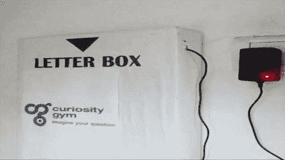

# 在等一封信？这个物联网邮箱会告诉你具体什么时候到。

> 原文：<https://hackaday.com/2016/11/15/waiting-for-a-letter-this-iot-mailbox-will-tell-you-exactly-when-it-arrives/>

如果你在等一封非常受欢迎的信，每五分钟检查一次邮箱可能会让你情绪起伏不定，更不用说耗费时间了。如果你落入这个陷阱，Hackaday.io 用户[ CuriosityGym ]就会创建一个[邮箱，一旦蜗牛邮件到达，它就会发送一封电子邮件](https://hackaday.io/project/17966-smart-iot-postbox-with-the-idiotware-shield)。

该项目使用一个 Arduino Uno、一个 ESP 8266 wifi 模块和一个独特的软件屏蔽板，具体利用其 RGB LED 和光敏电阻(LDR)。将 idIoTware 板上的 RGB LED 配置为稳定的白光，可以设置 LDR 的基线，当一个字母放入盒子时，亮度的变化会被 LDR 记录下来，触发 Arduino 发送电子邮件。

 他们使用一种名为 IFTTT 的服务来设置电子邮件流程，但你可以随意使用最方便的方式。如果你有一个金属邮箱，一定要把你的板子绝缘好！或者，放弃标准的信筒，建造你可能见过的最智能的[邮箱。](http://hackaday.com/2016/05/14/building-a-sturdy-remote-control-mailbox/)