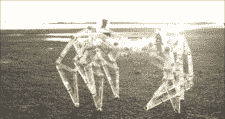

# 看着 ClearWalker 亮起来，蘸着它的脚趾

> 原文：<https://hackaday.com/2017/06/01/watch-the-clearwalker-light-up-and-dip-its-toes/>

【杰瑞米·库克】对 Strandbeest 的最新拍摄，[clear walker](http://imgur.com/a/5BBI3)，准备出发了！他已经在这个项目上工作了一段时间，并带领我们完成了电子和控制系统以及最终组装调整。ClearWalker 是完全可控的，包括一个云台摄像机以及可编程的 LED 段，甚至还有一个尾巴。

当我们最后一次看到[Jeremy] [在做这个设计](http://hackaday.com/2017/03/15/strandbeest-not-fooling-anyone-we-see-right-through-it/)的时候，它还没有投入使用。他向我们展示了所有重要的设计和组装细节，这些细节是为了创造一个机动化的聚碳酸酯版本的经典 Strandbeest 设计；这个过程不仅仅是简单地放大或缩小零件。令人高兴的是，[Jeremy]能够在他的照片库中展示晶莹剔透的美丽，以及下面嵌入的新视频。

 [https://www.youtube.com/embed/SN--deX80es?version=3&rel=1&showsearch=0&showinfo=1&iv_load_policy=1&fs=1&hl=en-US&autohide=2&wmode=transparent](https://www.youtube.com/embed/SN--deX80es?version=3&rel=1&showsearch=0&showinfo=1&iv_load_policy=1&fs=1&hl=en-US&autohide=2&wmode=transparent)

strand beest 的任何化身都令人着迷，更好的是看到对这一概念的不同看法，甚至(或特别是)像混合动力[strand beest 自行车](http://hackaday.com/2016/06/30/a-strandbeest-bicycle/)这样非常规的观点。