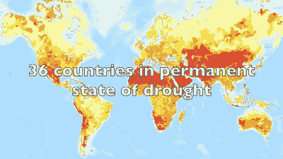
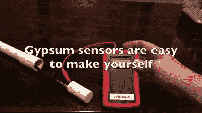
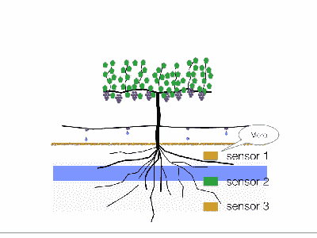
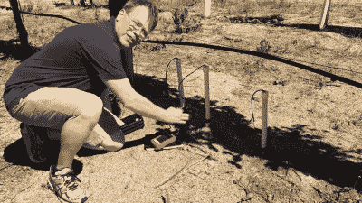

# 节水农业系统赢得最佳产品

> 原文：<https://hackaday.com/2015/11/18/water-saving-agricultural-system-wins-best-product/>

2015 年黑客日奖包括了一些新东西:最佳产品奖。获胜者获得了 10 万美元的资助，并在帕萨迪纳的 Supplyframe 设计实验室实习了 6 个月，帮助一个萌芽产品取得了全面成功。获胜者是…

## 温杜伊诺

 水是农业的重要元素:植物需要足够的水，但不能太多。在全世界，水也是越来越珍贵的资源。在加利福尼亚，农业用水量是居民用水量的五倍。例如，农业用水减少 25%，将完全抵消所有城市用水。考虑到这一点，许多加州农民正试图自愿减少他们的用水量。但是怎么做呢？

一个重要的发展是有针对性的灌溉。给每株植物精确地提供适量的水可以减少蒸发或径流损失的部分。这是一件小事，但却是一件大事。

Cue [Vinduino](http://hackaday.io/project/6444) “绅士农夫”和 hacker【Reinier van der Lee】的长期合作项目。作为一个系统，Vinduino 的目标是使测量不同深度土壤中的水量变得容易和相对便宜，记录这些信息，并最终根据植物及其环境调整农场的用水。在结果公布的第二天，我们在 Hackaday 超级大会上找到了[Reinier]。他分享了自己开发 Vinduino 的故事，并讲述了当它被评为最佳产品时的感受:

 [https://www.youtube.com/embed/TSUNCbV4zus?version=3&rel=1&showsearch=0&showinfo=1&iv_load_policy=1&fs=1&hl=en-US&autohide=2&wmode=transparent](https://www.youtube.com/embed/TSUNCbV4zus?version=3&rel=1&showsearch=0&showinfo=1&iv_load_policy=1&fs=1&hl=en-US&autohide=2&wmode=transparent)

赢得最佳产品奖的产品很简单，但执行得非常好。这是一个手持式土壤湿度传感器读取器，与 DIY 土壤探针设计相结合，创建了一个多功能和廉价的系统。所有 2015 年最佳产品决赛入围者都非常出色。Vinduino 对细节的关注，扩展的空间，以及帮助世界的潜力将这个项目推向了顶峰。

## 该系统

基本的手持式 Vinduino 是一种经过校准的交流电阻测量仪。坚固外壳内的 Arduino 首先以这种方式发送电流，然后通过湿度传感器，并测量一些已知电阻上的电压降。然而，至少一半的开发工作集中在地下湿度传感器上。

 当污垢变湿时，它更容易导电。原则上，你可以简单地测量这个电阻。但是不同的土壤成分使得校准变得困难，并且探针的腐蚀同样是一个问题。最后，探头的端子本身在置于土壤中时会产生一个电池，通过在想要测量的电阻上施加一个电压，极大地增加了校准问题的复杂性。

[Reinier]花了很多时间让他的 [DIY 石膏水传感器精确校准](http://vanderleevineyard.com/1/post/2012/11/gypsum-sensor-calibration.html)，标准化，并补偿“浓差电池”电池效应。他对这一过程的出色记录使得它可以在预算有限的情况下复制。让传感器坚固而便宜是很重要的，因为下一步是将三个(或更多)传感器以不同的高度植入植物的根 zo  ne。

将多个传感器植入地下，农民就能准确确定植物的需水量。测量土壤在表面、根区以及根下的湿润程度，可以计算出净水流，并且只有当根部变干时才浇水，而不是当根部的地面干燥时。

手持装置连接到这些水传感器，使测量这些不同水平的土壤湿度变得像拿着一本日志在葡萄园里走来走去一样容易。由于手持装置的固件是开源的，没有什么可以阻止农民使用不同的土壤湿度传感器，这些传感器需要不同的校准曲线，或者使用相同的设置来测量土壤盐分。

 但是【赖尼尔】心中有一个完整的系统，它不包括在田野里走来走去进行测量。他已经[建立了一个联网的、永久版本的手持装置](https://oshpark.com/shared_projects/EroKVTqF)的原型，它可以留在田间并记录连续的水分数据。接下来是全自动浇水控制，结合[对灌溉阀门](http://vanderleevineyard.com/1/post/2015/04/arduino-control-for-vineyard-irrigation.html)和[水压数据记录器](http://vanderleevineyard.com/1/post/2015/05/data-logger-for-water-pressure.html)的控制。

农业中最佳的、最少的用水量是一个有助于大规模节水的想法。通过使测量变得简单和便宜，Vinduino 帮助农民迈出了第一步。通过使其全部开源、模块化和可访问，更有可能产生影响。到目前为止，[Reinier]估计他已经减少了 25%的用水量，并且通过进一步开发他的系统，他正在为其他人创造可能。祝你和 Vinduino 好运，恭喜你！

### 10 个最佳产品入围者

 [https://www.youtube.com/embed/ShmdsgssUE0?version=3&rel=1&showsearch=0&showinfo=1&iv_load_policy=1&fs=1&hl=en-US&autohide=2&wmode=transparent](https://www.youtube.com/embed/ShmdsgssUE0?version=3&rel=1&showsearch=0&showinfo=1&iv_load_policy=1&fs=1&hl=en-US&autohide=2&wmode=transparent)

在 2015 年 Hackaday 奖期间，有 10 个项目被评为[最佳产品入围者](https://hackaday.io/list/7403-2015-best-product-finalists)。观看视频回顾，了解每一项内容，并深入了解条目列表，了解更多信息。

#### 2015 年[黑客日奖](http://hackaday.io/prize)由以下机构赞助:

