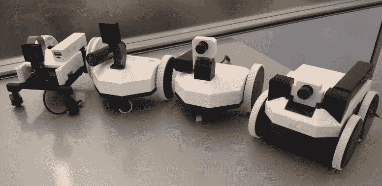

# 沃特尼:一个完全 3D 打印的漫游平台

> 原文：<https://hackaday.com/2018/07/15/watney-a-fully-3d-printed-rover-platform/>

我们开始意识到，在一个项目或黑客中看到 3D 打印部件并不像几年前那样令人兴奋。低成本桌面 3D 打印机的激增意味着，寻找一台打印机为你的建筑喷出几个零件不再是过去的冒险了。前往当地的黑客空间或大学，希望他们的 janky Mendel 那天想工作的日子已经一去不复返了。但这真正意味着黑客和制造商现在有能力更多地利用 3D 打印。忘记打印你设计的一两个部分，只打印全部。

 [这正是【尼克·伊万诺夫】对瓦特尼所做的，他的全 3D 打印漫游车项目](https://github.com/nikivanov/watney)。在感叹许多所谓的 3D 打印漫游者根本不是之后，他开始设计一种不仅主要由打印零件制成，而且足够坚固的漫游者，以便放入一些真正的工作。经过几次设计迭代，他建造了一个非常强大的四轮驱动平台，只需要一些电子设备和几个 M3 螺丝就可以投入使用。

只要你有一台足够大的 3D 打印机来处理这个机器人大约 120 毫米 x 190mm 毫米的身体尺寸，你就可以拥有自己的视频漫游车了。[Nik]建议在 PETG 印刷所有东西，毫无疑问，这是因为它在传动齿轮等方面的实力有所增强。此外，它的低翘曲，这真的会有助于打印身体的顶部和底部。建议使用 TPU 轮胎，但如果你没有轮胎(或者你的打印机被柔性细丝卡住了)，你可以用宽橡皮筋包住轮子。

[Nik]正在使用 Raspberry Pi Zero W 作为操作的大脑，但像这样的开放平台的优点在于，您可以轻松地将控件换成其他东西来满足您的需求。除了 Pi 之外，还有一个 L298N H 桥电机控制器与双齿轮电机接口，以及一个伺服机构为 SainSmart 相机模块提供倾斜。

我们经常对商业机器人平台的昂贵程度感到惊讶，所以我们非常有兴趣看看这种设计的可用性是否会刺激 DIY 漫游车的开发。虽然如果你在寻找一些更粗糙和翻滚的东西，[我们已经看到了一个 3D 打印的漫游者，看起来准备战斗](https://hackaday.com/2018/06/17/fpv-rover-2-0-has-3d-printed-treads-and-plenty-of-zip/)。

 [https://www.youtube.com/embed/sLKTDUVAV4g?version=3&rel=1&showsearch=0&showinfo=1&iv_load_policy=1&fs=1&hl=en-US&autohide=2&wmode=transparent](https://www.youtube.com/embed/sLKTDUVAV4g?version=3&rel=1&showsearch=0&showinfo=1&iv_load_policy=1&fs=1&hl=en-US&autohide=2&wmode=transparent)

