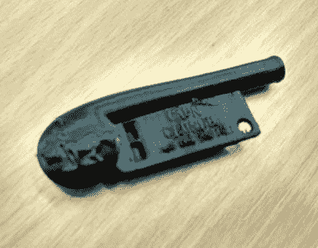

# 我们需要谈一些重要的事情

> 原文：<https://hackaday.com/2017/12/01/we-need-to-have-a-chat-about-something-important/>

Yes, I really did print this the day before the story broke.

事后看来，我选错了 3D 打印从 Thingiverse 下载的 Cap'n Crunch 哨子的日子。我当时正在报道 hackspace 纺织晚会，所以我启动了 Ultimaker，然后去制作一个笔记本电脑包。我的哨子是著名的新奇谷物包的合理复制品，其 2600 赫兹的音调允许特殊接入美国电话网络，已经准备好让我在回家的路上带走。

第二天，它就出现了。传说中的 phreaker[约翰·德雷珀]，在使用免费哨子后也被称为[嘎吱船长]，被曝光有对十几岁的男孩和年轻男子不恰当行为的历史，他在作为名人演讲者参观黑客社区时遇到了这些人。

我的哨子将不再作为一个凉爽的蜉蝣挂绳，它孤独地坐在我的长凳上。最近新闻中不断出现的骚扰指控已经到了我们家门口。

写一篇关于骚扰文化造成的伤害的演讲没有什么意义，我们知道你意识到这是一件坏事。即使是那些进行骚扰的人也知道他们的所作所为是错误的，所以写这样一篇演讲就像无效的 T2 南方公园顾问角色说“不要做淘气的事情，好吗”一样有用。

你很容易告诉自己，这是极少数所谓的害群之马所为，大多数人永远不会遇到他们，我们的社会是一个安全的社会，这种事情只会发生在其他人身上，一旦发生，总会有人处理肇事者。但事实并非如此，太多人的生活因此受到影响。

当骚扰和虐待发生时，权力动态的不平衡助长了它们:施虐者处于行使更大权力的地位。这种不平衡可以以多种形式存在，但明显的例子可能跨越社会、年龄、性别、残疾或种族界限。与受害者相比，像[Crunch]这样的名人可以行使巨大的权力，以至于他可以继续逍遥法外，任何可能说出来的人都不会被相信。把你自己放在一个易受影响的年轻黑客的位置上，像[Crunch]这样的人对他来说是上帝般的人物，你可能会看到这是多么容易发生。

为什么这些报道过了这么久才浮出水面？权力动态会产生一种效果，即把信任放在有权力的人身上。当你听到滥用权力时，重要的是要识别出任何涉及的权力失衡，并开始站在底层而不是顶层的人的角度思考问题。这有助于在收到报告时采取行动。故事中提到的有组织的活动有行为准则，现在这些行为准则被付诸行动，并导致[紧缩队长]被禁止参加会议..

我们的社区必须既欢迎又支持，并传播一种文化，在这种文化中，报告不良行为是安全的，并期望它会导致行动。在我们的社区中，没有人应该感到不安全，因此我们所有人都有责任确保我们的环境尽可能成为一个接纳和包容的空间。我们应该像局外人一样看待自己，问问自己的所作所为是否符合我们对自己的期望。

Hackaday 为我们举办的活动制定了一套[行为准则](https://hackaday.io/project/28093-code-of-conduct) ，我们希望它能得到认真对待。我们一致认为，无论一个坏演员是一个名人演讲者，还是一个随机的黑客，都不能容忍。但这并不是说我们满足于现有的成就，行为准则应该经常被审查，而不是一成不变的。我们已经通过 3.0 许可在 [CC 下许可了我们的行为准则。我们鼓励您为自己的活动和组织制定一套行为准则，并在必要时帮助我们改进它。](https://creativecommons.org/licenses/by/3.0/)

当[Crunch]的故事被披露时，我们在 Hackaday 的工作人员中进行了一次幕后讨论，我们一致认为我们在这件事上的立场应该毫不含糊。我们很难过地看到一个偶像被玷污了，但是我们认为你会同意我们的观点，安全和融入我们的社区要重要得多。

反正那个该死的‘3D 打印哨子’也没正常工作。