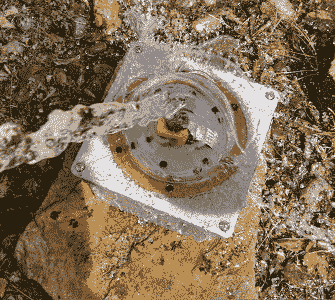

# 防风雨的 Pi 查找，所以你不必

> 原文：<https://hackaday.com/2017/11/09/weatherproof-pi-looks-up-so-you-dont-have-to/>

观看天空是一个迷人的爱好，但也有一个相当大的缺点，那就是需要在户外长时间凝视天空。然后是天气，即使你给自己准备了一条漂亮的毯子，天气也不冷，如果云层或光污染阻挡了你的视线，你可能什么也看不到。

Highly scientific testing procedure.

为了解决这些问题， [[Jason Bowling]决定将树莓皮放入防风雨的外壳中，并将其用作低成本的天空监测设备](http://shortcircuitsandinfiniteloops.blogspot.com/2017/10/raspberry-pi-skycam-w-noir-v2-camera.html)。他的装置使用了非红外相机和一个为智能手机相机设计的廉价广角镜头。整个装置由一个用于安全摄像头的透明丙烯酸圆顶和大量的衬垫材料保护起来。一些实验说服[Jason]在混合中加入光污染过滤器，这有助于改善他不太理想的观看区域的图像对比度。

软件方面相当简单:整夜拍摄 10 秒钟的曝光，然后用 ffmpeg 拼接成延时视频。[Jason]担心不断地向 Pi 的 SD 卡写入图像会导致过早的故障，所以他设置它通过 SSHFS 向家中的服务器写入图像。添加一个 USB 闪存驱动器可以完成同样的事情，但因为他想在一个更强大的机器上进行图像处理，这就省去了每天早上取回存储设备的麻烦。

这[并不是【杰森】第一次使用 Pi 来窥视天空](https://hackaday.com/2017/04/20/budget-astrophotography-with-a-raspberry-pi/)，虽然他以前的尝试[可能达不到商业产品](https://hackaday.com/2017/01/09/ces2017-astrophotography-in-the-eyepiece/)的水平，但考虑到硬件的成本，它们绝对令人印象深刻。

[https://player.vimeo.com/video/237934701](https://player.vimeo.com/video/237934701)