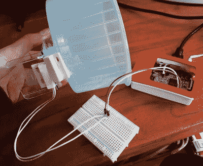

# 欢迎来到仓鼠网络

> 原文：<https://hackaday.com/2018/05/16/welcome-to-the-internet-of-hamsters/>

这只是时间问题。其他一切都在记录数据，并报告到互联网上进行详细分析，那么为什么我们的啮齿动物会有任何不同呢？封面故事是【妮可·霍沃德】[将她的宠物仓鼠哈罗德挂在网上](http://nicolehorward.com/2018/04/23/project-floofball/)，因为她想看看它是否得到了应有的锻炼。当然，真正的原因是哈罗德想在 Hamsterbook 上向他的“朋友”炫耀。

 这种黑客技术的硬件方面非常简单，一个磁性的门传感器(就像报警系统中使用的那种)被用来检测轮子每转一周。该传感器连接到 Raspberry Pi 的 GPIO 引脚，在那里由 Python 脚本读取。增加了一个小液晶显示屏，对哈罗德的日常活动提供一些视觉反馈，整个事情都被装在一个激光切割的外壳中。

这让[妮可]在哈罗德的笼子旁边有了一个可爱的小展示，但对分析他的活动没有太大帮助。为此，使用脚本[通过 MQTT 每分钟将数据上传到 ThingSpeak 通道](https://thingspeak.com/channels/345243)。这将从原始数据中自动生成有吸引力的图表，使人们更容易看到长期发生的事情。

现在可能是一个好时机来温习你的 MQTT 知识，这样你的宠物[就可以成为下一个加入物联网革命的人](https://hackaday.com/2018/01/05/bark-back-iot-pet-monitor/)。

 [https://www.youtube.com/embed/l9XZCoifg4A?version=3&rel=1&showsearch=0&showinfo=1&iv_load_policy=1&fs=1&hl=en-US&autohide=2&wmode=transparent](https://www.youtube.com/embed/l9XZCoifg4A?version=3&rel=1&showsearch=0&showinfo=1&iv_load_policy=1&fs=1&hl=en-US&autohide=2&wmode=transparent)

