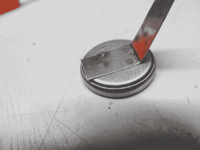

# 用电池焊接电池

> 原文：<https://hackaday.com/2017/12/19/welding-batteries-with-batteries/>

焊接设备总是又贵又笨重，对吧？天哪不！[Jaromir Sukuba]正在制造一种电池极耳焊接机，它可以放在口袋里，从硬币电池中获得能量。与电源焊机相比，它的功率可能很昂贵，但为了便于携带，这是相当便宜的。不仅如此，它在充电电路中使用了 555 个定时器。

他参加的 2017 年硬币电池挑战赛从硬币电池中吸取每一点能量，并将其储存在 100F 的超级电容器组中。所有储存的能量需要很长时间才能进入超级电容器，但它会在瞬间释放出来。事实上，充满电需要 12 个小时。为了大小的方便，我们不得不牺牲速度的方便。这应该是超新星和举重类别的有力竞争者。

我们看到一个成功焊接的标签的快速演示，它表明使用硬币电池将金属焊接到硬币电池上是同样讽刺和恰当的。Hackaday 上的其他焊工有一个更快的方法来控制你的[电池极耳焊接](http://hackaday.com/2017/09/16/a-battery-tab-welder-with-real-control-issues/)，安全丰富的[点焊](http://hackaday.com/2017/06/27/dual-purpose-diy-spot-welder-built-with-safety-in-mind/)，或者干脆完全脱离轨道，使用弧焊机制作一个[线圈枪](http://hackaday.com/2016/09/02/five-stage-coilgun-powered-by-an-arc-welder/)。

Coin Cell ChallengeBuild something cool powered
by a coin cell, win prizes[See all entries](https://hackaday.io/submissions/coin-cell-challenge/list)