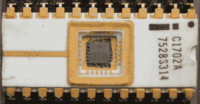

# 我们用固件这个词是错误的

> 原文：<https://hackaday.com/2017/09/29/were-using-the-word-firmware-wrong/>

前几天，我对为嵌入式系统编写的代码进行了一次有趣的讨论。我和 Voja Antonic 谈到了“固件”。对话继续进行，但我注意到他称之为“软件”。我们后来讨论了这个问题，Voja 告诉我，他认为只有与微控制器直接交互的那部分代码才是固件；其余的属于软件的更一般的术语。这真的让我想知道固件在哪里不再是固件，而仅仅是软件？

这个话题一直萦绕在我的脑海里，我终于开始查字典。令我惊讶的是，我一直在以不同的方式使用这个词，我认为我听到的大多数人都在这样做——至少就字典定义而言。我通常会参考韦氏词典和牛津英语词典，它们都表明固件是一种不可磨灭的软件:

> 编入只读存储器的永久性软件。
> 
> –[Oxford English Dictonary](https://en.oxforddictionaries.com/definition/firmware)
> 
> 永久保存在硬件设备(如只读存储器)中的计算机程序
> 
> –[Merriam-Webster Dictonary](https://www.merriam-webster.com/dictionary/firmware)

根据这个定义，我从来没有写过一点固件。我写的所有东西都是嵌入式软件。但是，随着技术的进步，这个术语肯定会随着时间的推移而改变，所以我继续挖掘。

### 固件控制硬件

我按照字典上说的生活吗？老实说，在 Hackaday 的编辑过程中，我每天都会查找很多单词——所以，是的，我很大程度上遵循了最广泛选择的定义。与此同时，定义随着它们在方言中的使用而变化。事实上，我听到很多业内人士称他们的代码为固件，这表明它的定义在不断变化。在这些情况下，我想看看维基百科的贡献者提出了什么:

> 固件是一种计算机程序，为设备的特定硬件提供低级程序控制。
> 
> –[Wikipedia](https://en.wikipedia.org/wiki/Firmware)

我们到了。我仍然在使用“错误”这个词，但这符合 Voja 在我们的对话中提出的观点。他断言，直接访问微控制器寄存器的代码是固件，在其上构建的任何东西都是软件。这是有道理的。但是如果你仔细想想的话，这就变得很棘手了。一个引导装载器显然是固件，但是你用那个引导装载器闪存到芯片的代码，它是部分固件，部分软件吗？

### 术语的演变

The first EPROM could be erased with ultraviolet light.

图片由 [Poil](https://commons.wikimedia.org/wiki/File:EPROM_Intel_C1702A.jpg) CC-BY-SA 3.0 提供

你可以通过回顾技术的发展来了解这个术语的演变。最早的计算机由 ALU 和寄存器组成(加上一些与它们接口的方法)。一旦接通电源，计算机什么也不做，直到你输入一系列指令和数据，或者通过手动设置寄存器值并移入，或者通过更自动化的方法，如使用穿孔卡。但是每次你想执行一项任务的时候就给计算机编程是一种徒劳。

进入只读存储器(ROM ),它最早的用途是存储在通用计算机上运行的程序。随着整个操作系统被存储为只读存储器，这种情况继续发展。当然，随着 EPROM 和 EEPROM 的出现，不可擦除 ROM 变得可重写。微处理器诞生了，固件开始出现在我们周围的设备中。

今天，我们想到的是路由器固件和 bios 固件。是的，这些可以通过一个特殊的过程来刷新，但它们是运行在设备上的最低级别的软件，显然还是固件。我们为微控制器写的东西模糊了这条线。

正如我之前所说，我们正在编写嵌入式软件，它本身就有固件元素。也许您可以通过将编码过程分为两个不同的部分来升级您的嵌入式游戏:编写在硬件级别(硬件抽象层)交互的固件，以及使用该基础的软件的其余部分——菜单系统，根据固件监控的用户输入改变行为，等等。但是这个过程绝不是永久的。我们很高兴能够将代码闪存到微控制器上数千次而不会出现问题，甚至可以在代码运行时使用片内调试来修改代码。自从 20 世纪 60 年代“固件”一词诞生以来，我们已经取得了惊人的进步。

通过所有这些理由，如果你把代码闪存到一个微控制器，我仍然想称之为固件。但我“错了”。我真的很高兴在与沃佳·安东尼克的对话中偶然发现了这个话题。作为一名计算机工程师，他很早就知道这个话题的复杂性。他的作品中我最喜欢的一个是[这个 EPROM 仿真器建于 20 世纪 90 年代](https://hackaday.com/2016/06/27/vojas-eeprom-emulator-from-1991/)，它用 PIC 微控制器的新热点取代了旧技术。擦除 EPROM 需要时间，但这个模块可以留在电路中，并快速重新编程，以加快开发周期。