# 硬件黑客大会上到底发生了什么

> 原文：<https://hackaday.com/2017/11/17/what-actually-happens-at-a-hardware-hacking-con/>

黑客日超级大会于上周末举行，这是全球最大的硬件大会。你能从会议徽章中得到什么？如果你回答“基于树脂的 3D 打印机”,你就有可能获奖。如果你决定把你的徽章放在一个会议水瓶里，做一把电击枪，你会受到所有与会者的崇拜。是啊，太疯狂了。

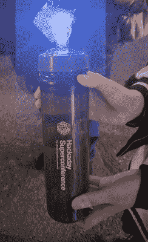

Yes, there’s a Supercon badge in that bottle and it’s now a stun gun.

在其他科技会议上，你会发现一群书呆子围坐在一张桌子前，旁边放着 MacBooks 和 Thinkpads。超级会议是不同的。在这里，你会发现烙铁、装满组件的工具箱和散落在地板上的松散的 WS2812s。助焊剂的味道在空气中飘荡。你发现了一丝臭氧。

由此产生的黑客攻击的深度和广度简直令人震惊。我们有一个双目虚拟现实黑客，一个互联网钓鱼徽章，blinky 附加板，音频附加板，一个电影节在徽章上拍摄，以及更多你会在下面找到的东西。

我们已经开始[一个徽章黑客列表](https://hackaday.io/list/28229-badge-hacks-2017-hackaday-superconference)，并希望看到所有黑客的详细信息。所以，如果你在 Supercon，一定要把它们发布在 Hackaday.io 上，然后[发一个 DM](https://hackaday.io/messages/new?user=5) 加入列表。

### 开始额外一天的黑客活动

为了让所有这些创意滚动起来，我们为今年的超级大会做了一些有点不同的事情。我们没有在周六早上开门营业，而是在周五下午设立了一个徽章破解区和派对。饮料像焊接好的导线上的弯月面一样流动，到周五下午 2 点，每个人都在为今年的 con 在令人难以置信的相机徽章上破解固件[。](https://hackaday.io/project/27427-camera-badge-for-supercon-2017)

 [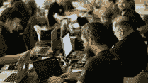](https://i0.wp.com/hackaday.com/wp-content/uploads/2017/11/dot6uepumaatv8i.jpg?ssl=1)  [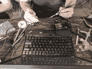](https://i0.wp.com/hackaday.com/wp-content/uploads/2017/11/dotasm5vwaem-1p.jpg?ssl=1)  [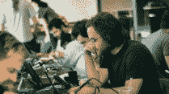](https://i0.wp.com/hackaday.com/wp-content/uploads/2017/11/dot5xlpvoaa28xc.jpg?ssl=1)  [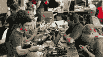](https://i0.wp.com/hackaday.com/wp-content/uploads/2017/11/dot6m8euiaavoyb.jpg?ssl=1) 

星期五我们没有停下来。超级会议是一个硬件黑客会议，这意味着我们拿出烙铁，用镓熔化铝，回流几块电路板，并创建了几个 deadbug LED 立方体。整个周末都是这样。

 [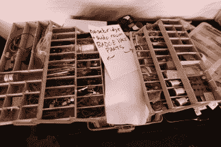](https://i0.wp.com/hackaday.com/wp-content/uploads/2017/11/img_1772.jpg?ssl=1) Noisebridge, the infamous San Fransisco hackerspace, showed up with a tackle box full of parts [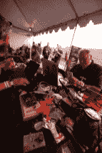](https://i0.wp.com/hackaday.com/wp-content/uploads/2017/11/img_1778.jpg?ssl=1)  [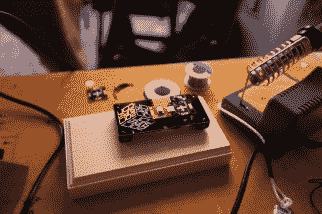](https://i0.wp.com/hackaday.com/wp-content/uploads/2017/11/img_1779.jpg?ssl=1)  [![[Ch00f] hacked his badge into a Polaroid camera with a receipt printer](img/97f9c1fd5adbc8afefc7d6a444c42551.png "IMG_1828")](https://i0.wp.com/hackaday.com/wp-content/uploads/2017/11/img_1828.jpg?ssl=1) [Ch00f] hacked his badge into a Polaroid camera with a receipt printer [![[Alex Williams], winner of the 2017 Hackaday Prize, added inductive charging to his Supercon badge](img/d93af60edd331fda9be04d92b8753f54.png "IMG_1830")](https://i0.wp.com/hackaday.com/wp-content/uploads/2017/11/img_1830.jpg?ssl=1) [Alex Williams], winner of the 2017 Hackaday Prize, added inductive charging to his Supercon badge [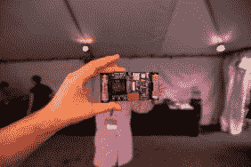](https://i0.wp.com/hackaday.com/wp-content/uploads/2017/11/img_1878.jpg?ssl=1)  [![[Jacob Christ]'s SLA 3D printer, constructed out of a Superconference Badge](img/20be91d2104d525286bd5d7ec068c0ed.png "IMG_1883")](https://i0.wp.com/hackaday.com/wp-content/uploads/2017/11/img_1883.jpg?ssl=1) [Jacob Christ]’s SLA 3D printer, constructed out of a Superconference Badge [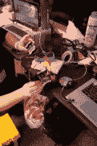](https://i0.wp.com/hackaday.com/wp-content/uploads/2017/11/img_1908.jpg?ssl=1)  [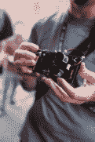](https://i0.wp.com/hackaday.com/wp-content/uploads/2017/11/img_1935.jpg?ssl=1)  [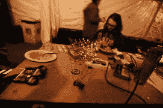](https://i0.wp.com/hackaday.com/wp-content/uploads/2017/11/img_2172.jpg?ssl=1) Deadbugged LED cube [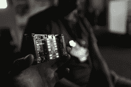](https://i0.wp.com/hackaday.com/wp-content/uploads/2017/11/img_2182.jpg?ssl=1) AND!XOR’s custom-manufactured badge add-on. This is a

毫无疑问，这是地球上最伟大的硬件黑客大会。其他黑客会议的名声来自令人难以置信的演讲和走廊会议，在那里你可以直接找到你感兴趣的任何领域的顶尖专家。Hackaday Superconference 拥有这一切，甚至更多。有些与会者整个周末都坐在折叠桌前，拿着几个烙铁和钢丝钳。这是他们的整个超级体验，这是惊人的。

### 帐篷里的变压器

Supplyframe 设计实验室后面的后巷有着悠久而传奇的高压黑客历史。一年左右前，巷子里看到一个电泡菜。这种方法的基本思想是拿一个焊机，在电极之间插一根泡菜，然后开始焊接。首先，泡菜变成了一盏发出美丽橙色光芒的钠灯。一旦积累了足够的碳，这种钠灯就会变成碳弧灯，沐浴在紫外线下观看的每个人的视网膜。很光荣。

[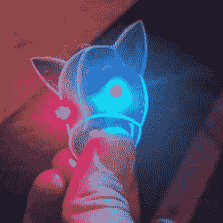](https://hackaday.com/wp-content/uploads/2017/11/doaqejav4aacusk.jpg)

A Tindie head, after surviving 12,000 VAC @ 30mA. It still works.

今年我们没有电焊机，但是我们有了下一个最好的东西:一个输出 12000 伏交流电的变压器。这是为[Will Caruna]的工作室 *Fun With High Voltage* 带来的，Supercon 的与会者在木块上制作了 Lichtenberg 人物。这个变压器后来被重新用于燃烧李奇登伯格的数字到*的一切。*

电气化最有趣的事？每个 Supercon swag 包中都包含 Tindie Blinky 徽章。[这些火绒头经受住了 12000 VAC](https://www.instagram.com/p/BbYxWccnzFw/)，没有燃烧，没有爆炸，而且之后还能工作。对于这些线路是如何幸存下来的，有几种观点，我认为这是因为电路板上没有走线，所有的电气连接都是接地层。其他人说这是因为自闪烁发光二极管中嵌入了神奇的电子元件。没有人能提供一个好的答案来解释为什么 Tindie 徽章如此有弹性，这意味着我们将不得不在下一次超级联赛中更加努力。

 [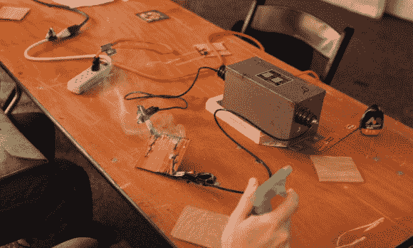](https://i0.wp.com/hackaday.com/wp-content/uploads/2017/11/hv2.jpg?ssl=1) Making Lichtenberg figures in a piece of wood with a transformer [![[Sarah Petkus] and her stun gun water bottle](img/dc186aa03f63853fa66a937595fcccb8.png "HVs2")](https://i0.wp.com/hackaday.com/wp-content/uploads/2017/11/hvs2.jpg?ssl=1) [Sarah Petkus] and her stun gun water bottle [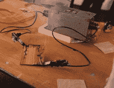](https://i0.wp.com/hackaday.com/wp-content/uploads/2017/11/hv1.jpg?ssl=1) Making Lichtenberg figures in a piece of wood with a transformer [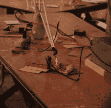](https://i0.wp.com/hackaday.com/wp-content/uploads/2017/11/img_7417.jpg?ssl=1) The pizza was cold [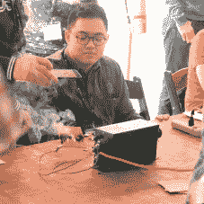](https://i0.wp.com/hackaday.com/wp-content/uploads/2017/11/img_73851.jpg?ssl=1)  [![[Sarah Petkus] and her stun gun water bottle](img/8954be2fee37be755e9850afbb74db75.png "HVs1")](https://i0.wp.com/hackaday.com/wp-content/uploads/2017/11/hvs1.jpg?ssl=1) [Sarah Petkus] and her stun gun water bottle

同样在甲板上接受高压黑客攻击的还有[莎拉·佩特库斯]和她创新的眩晕枪水瓶。所有 Supercon 的与会者都在他们的行李包里收到了一个水瓶，[莎拉]把她的水瓶变成了一把电击枪。应该注意的是，这是*而不是*一个 Tazer，因为每次我们在网站上放上‘Tazer’这个词，Tazer International 都会给我们发一个停止和终止通知，[除了那一次一个 Hackaday 编辑在 CES 上被 Tazer](https://hackaday.com/2010/01/09/ces-caleb-gets-tased/)。

当然，并不是每个人都只是为了好玩而加入硬件黑客的行列。这是一场徽章黑客竞赛，我们的会议徽章上的最佳黑客将获得丰厚的奖励。那是怎么回事？看看下面的徽章黑客颁奖典礼。

 [https://www.youtube.com/embed/FnbylR_kWzM?version=3&rel=1&showsearch=0&showinfo=1&iv_load_policy=1&fs=1&hl=en-US&autohide=2&wmode=transparent](https://www.youtube.com/embed/FnbylR_kWzM?version=3&rel=1&showsearch=0&showinfo=1&iv_load_policy=1&fs=1&hl=en-US&autohide=2&wmode=transparent)

### 最佳徽章影片

我们要求 Supercon 的与会者用他们的徽章做一些事情。由于 2017 年超级大会徽章包括一个能够录制视频的摄像头模块，所以举办电影节才有意义。获奖电影当然是艺术、工程和设计的杰作。这当然值得你花时间去 1:01:

 [https://www.youtube.com/embed/g7siOw5ezxM?version=3&rel=1&showsearch=0&showinfo=1&iv_load_policy=1&fs=1&hl=en-US&autohide=2&wmode=transparent](https://www.youtube.com/embed/g7siOw5ezxM?version=3&rel=1&showsearch=0&showinfo=1&iv_load_policy=1&fs=1&hl=en-US&autohide=2&wmode=transparent)

[郑健国]凭借他的电影《后巷的 T1》获奖。有几个片段使这部电影成为大会上最好的电影，其中最不重要的是[专为徽章](https://hackaday.io/project/28129-panning-time-lapse-with-supercon-2017-cambadge)制作的平移延时装置。这是一个简单的装置，带有一个时钟机构，设计用于在几秒钟内将徽章旋转一周。[Roger]在大会前的那个星期三开始着手这个项目，他之所以能够这样做，是因为徽章的机械设计已经提前发表了。

[罗杰]的电影不包括任何镜头外的编辑，但仍有多个场景和标题卡。他是怎么做到的？当然，是一点固件入侵。[Roger]开发了一个小程序，可以按顺序播放视频并添加标题卡。只需轻触一个按钮，视频就能播放。

这是我们希望在提交给 Hackaday 超级大会的电影节作品中看到的。[罗杰]建立硬件，他重新编程徽章，他设法在这个过程中制作了一个很好的视频。

### 最佳软件黑客

[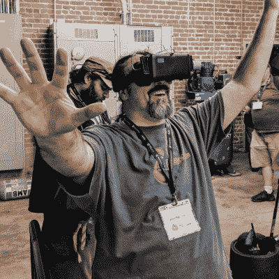](https://hackaday.com/wp-content/uploads/2017/11/ben.jpg) 

【本·亨克】测试他的软件徽章 hack。这是一个由两个超级会议徽章

构建的虚拟现实迷宫，除了一个电影节，我们还邀请超级会议与会者为徽章创建一个软件黑客。感谢[Mike Harrison]在 Superconference 徽章上所做的令人难以置信的工作，我们有了完整的 IDE、编译器和一套头文件，允许每个人从一开始就开始为徽章开发定制固件。应用程序令人难以置信。[Ariane]在徽章上抓拍了几张照片，将其转换为 1 位位图，并在 1983 年的康柏便携式电脑上显示这些照片。相机模块被重新用于物体识别，以解决去年超级会议徽章上的难题。这些软件黑客实际上是多么先进，这真的令人难以置信，尤其是考虑到它们是在短短两天内编写的。

但是当然，在徽章黑客挑战中，肯定会有赢家。2017 年 Hackaday 超级大会最佳软件黑客的获胜者是[【Ben Hencke】和他的 VR 徽章黑客](https://hackaday.io/project/28192-supercon-2017-vr-badge-hack)。这实际上是对两个徽章*的破解，通过串口连接在一起。一旦这些徽章被安装到头戴式展示盒中，它们就会变成一个由徽章上的加速度计控制的立体虚拟现实耳机。虚拟环境是一个迷宫，充满了变色墙和动画，展现了[里克·阿斯特利]对人类的最大贡献。这些都不是在周五的徽章领取派对之前写的，而且【本】[非常依赖光线投射](http://lodev.org/cgtutor/)的教程。*

[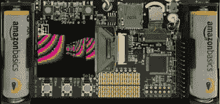](https://hackaday.com/wp-content/uploads/2017/11/demo.gif) 最佳软件黑客荣誉奖[得去这个徽章模拟器](https://github.com/graphiq/hackaday2017-badge-emul)。最佳软件黑客亚军由[graphiq]获得，因为他完全模拟了 2017 年 Hackaday 超级大会徽章。这个模拟包括一个帧缓冲区，可点击的按钮，鼠标加速度计，并计划模拟一个摄像头和通过麦克风的模拟输入。所有这一切都是在两天内完成的，甚至包括我们为 con 采购的亚马逊电池的精美渲染。这太棒了，证明了 Supercon 黑客场景实际上是多么先进。

### 最佳硬件黑客

软件黑客是一回事，但黑客日超级会议是一个硬件会议。我们分发了一些非常棒的徽章，并挑战每个人构建硬件，以利用整个周末挂在他们脖子上的硬件的引脚和寄存器。结果是惊人的。我们有了一个拍摄全景延时照片的工具，还有[一个将徽章连接到游戏机打印机的方法](https://hackaday.io/project/28154-camerabadge-printer)。这个星球上没有其他会议能像 Hackaday Superconference 那样给你提供硬件黑客的广度和深度。

但是，当然，只有一个徽章黑客挑战的赢家，男孩是一个滑稽可笑的。[【雅各布·基督】用他的徽章造了一台 3D 打印机。](https://hackaday.io/project/27822-had-super-con-2017-badge-hacking-sla-3d-printer)

 [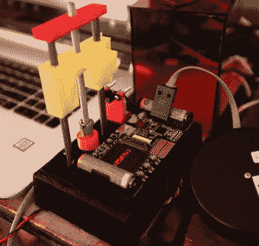](https://i0.wp.com/hackaday.com/wp-content/uploads/2017/11/img_2251.jpg?ssl=1)  [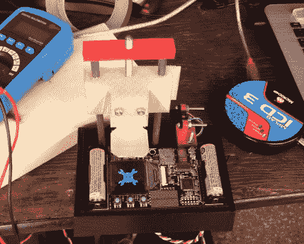](https://i0.wp.com/hackaday.com/wp-content/uploads/2017/11/dscf0259.jpg?ssl=1) 

[Jacob]以一个问题开始了他的徽章破解——他如何才能超越去年[Sprite_TM]的徽章破解[,当时他用四枚徽章破解了整个会议？](https://www.youtube.com/watch?v=43ErQc-u9wA&t=1733s)答案很明显，就是用徽章来制造 3D 打印机。

这个徽章黑客完全依赖于徽章中使用的有机发光二极管显示。经过一点注册调整和位摆弄，[雅各布]发现在这个徽章使用的显示器确实可以固化紫外线敏感树脂。这台打印机的零件是预先制造的，有一个由 Ponoko 制造的防紫外线盖，一个来自垃圾抽屉的 NEMA 17 电机，以及一个用胶带固定在一起的联轴器。这是一个真正的拼凑打印机，但它令人惊讶的工作。[Jacob]能够打印出非常非常粗糙的 Hackaday 头骨和扳手的渲染图，再多做一点工作，他完全有可能制作出类似于 Benchy 的东西，每个人都喜欢的拖船和任何 3D 打印机事实上的演示打印。

### 最大的硬件骗局

没有任何会议能够超过 2017 年 Hackaday 超级大会上徽章黑客会议的成果。在 12，000 伏特的电压下燃烧和让每个人都可以获得会议徽章的精致软件之间，我们不能要求更多了。Hackaday 超级大会是最终的硬件会议，我们很高兴所有与会者都准备好了，手里拿着电源和烙铁。

我们期待着下一次 Hackaday 超级大会，届时一切肯定会更大、更好，甚至有更多几千伏的电流。在此之前，我们很高兴所有与会者在这个星球上最好的硬件大会上度过了一段美好的时光。