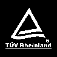

# 你笔记本充电器上的那些象形文字是什么？

> 原文：<https://hackaday.com/2018/02/02/what-are-those-hieroglyphics-on-your-laptop-charger/>

看看你笔记本充电器的背面，你会发现一堆符号和数字。我们敢打赌，你以前看过他们，从他们告诉你的事情中很少或没有得到理解。

这些符号就像你衬衫标签上的[标签一样复杂](http://www.textileaffairs.com/c-common.htm)从来没有教过你任何关于洗衣服的事情。它们是 T2 标准化和官僚主义的标志，几十个国家沐浴在通过发行证书赚来的钱的光芒中。

开关电源是许多家用电子产品的基础——显然不仅仅是笔记本电脑——因此它们是全世界的必需品。如果你能制造一个在大多数国家都得到认证的电源，你的市场将是巨大的，你只需要制造一个单一的设备，可能需要一个可互换的交流电源线来连接不同类型的插头。当然，这些符号在任何地方都有意义。

简而言之，这些符号告诉你电源的所有重要信息。他们的意思是这样的。

## 这都是关于市场准入

怎么每个电源最后都贴满了象形文字？它是这样工作的:Acme 公司想在 Benchoffistan 出售一台 Thingamajig，所以公司送了一托盘 Thingamajig 到那里。Benchoffistan 的海关官员看着这堆货物说:“我怎么知道这东西对我的公民使用是安全的？你必须有适当的证明，说明这种产品是允许进口的。”就这样，一个叫做“市场准入”的行业诞生了。

市场准入涉及各种各样的问题:物流、政治、税收和关税、标签和用户手册、材料、时机，甚至偶尔还有贿赂。每个国家都有自己的细微差别，有一些公司专门帮助谈判这个雷区。如果设备使用加密或连接到电信设备(BLE 和 WiFi 都算)，俄国要求进行特殊测试。许多国家要求进行国内测试。大多数要求公司的国内代表处理申请和沟通。有些有几个月的准备时间。

## 输入/输出

 每个电源上你首先看到的是输入和输出。输入几乎总是“100-240 伏~ 50-60 赫兹。[世界向这个范围内的插座供电](https://www.worldstandards.eu/electricity/plug-voltage-by-country/)。这意味着作为输入，插头期望连接到该范围的输入电压和频率。美国使用 120V/60Hz，欧洲使用 230V/50Hz，因此输入范围在所有国家/地区内是件好事。

输出线包含三条信息:输出电压(通常为 5V、9V、12V)，虚线上的实线表示 DC，a 表示交流，额定电流(通常为数百毫安，适用于插入的较小模块),以及砖块与插头分离时的电源电流。更换电源时，您需要匹配输出电压，匹配交流/DC 输出，并且输出电流必须至少与之前的电源一样大，甚至可以更大。这个数字只是供应的最大额定值，而不是它将提供多少。

下一部分是极性。这看起来像一个里面有+的圆，一个里面有–的圆，一个中间有 C 的圆。几乎总是,–会指向 C，而+会指向 C 内部的一个点，这意味着插头外部有–(地),内部有正电压。一些旧的插头不符合这一点，所以你应该在使用电源前检查一下。

## 通用

房子的符号意味着它只能在室内使用，正方形里面的正方形意味着电源是双重绝缘的。垃圾桶上的 X 表示它不应该被正常处理，而是与其他电子产品一起回收。

## 谁认证了你的电源？

有几家大公司做测试，他们有自己的图标。如果你能给这些公司打电话，从一个单一的来源核实他们是否真的有每一个证书，它就给其余的符号提供了有效性。

你会经常看到 UL 标志。UL 是保险商实验室，这是一个安全组织。他们有一系列的标准测试，将对设备进行测试以确保其安全性。在大多数情况下，销售不需要 UL 证书，但如果你的房子烧毁了，这是因为一个非 UL 上市的供应爆炸，那么保险公司将进行斗争，因为你没有在家里使用安全设备。许多大型零售商会要求你的设备也要上市，因为他们不想处理任何潜在的召回或劣质产品的诉讼。每个 UL 符号旁边应该是一个许可证号码。

BSI – UK

CSA – Canada

Nemko – Norway

TUV – Europe and North America

UL – United States

VDE – Germany

这是一个很好的提点，许多这些标志可能是假的——当[为产品](https://hackaday.com/2016/04/27/searching-for-usb-power-supplies-that-wont-explode/)采购 USB 电源时，我遇到过这种情况。海关代理人会看到这个符号，但可能不会跟进查看相应的证书是否真正适用于该产品，因此查找 UL 的上市编号并看到类似产品的图片并不罕见。那么，当调查一个产品的证书时，就有了某种平衡。你希望看到相关的证书，并确保它们是合法的，但你不能检查你接触的所有东西。

## 这个电源有哪些国家测试过？

其余的符号将因国家而异，有很多国家对测试有奇怪的要求。电源是一回事，但增加有意的无线电辐射，如 WiFi 或蓝牙产品，会将测试和认证提升到一个全新的水平，这超出了本文的范围。

Argentina

Australia

Brazil

China

Europe

Japan

Korea

Mexico

More Mexico

Russia

Singapore

Taiwan

一般来说，你在一个产品上看到的证书越多，它就越不粗略，生产该产品的公司就越大。小型制造商不会有资金或兴趣去追求大量的认证，可能会在他们的许多销售中被忽视。这也表明产品不会经常变化，他们已经锁定了他们的装配线。你不会看到制造商为了削减成本而牺牲安全而移除关键部件。