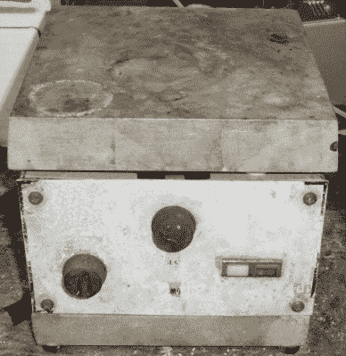

# 当你在家里尝试时会发生什么

> 原文：<https://hackaday.com/2015/12/28/what-can-happen-when-you-do-try-this-at-home/>

以某种倒计时的形式，[约翰·麦克马斯特]回顾了过去几年的项目，并记录了他在做酷的事情的过程中遭遇的事件(及其原因)。

[John]让我们从简单的开始——接错线，结果炸毁了一个 400 伏的电源。他总结道“仔细检查线路，尤其是大功率系统”。其他提示和危险包括我们很少发现自己的情况:在进入回旋加速器的实验舱之前，要“总是检查闭路电视”，以防止受到辐射。听起来是个好建议。

 【约翰】也做了很多 IC 解封工作，可能会涉及到热量和讨厌的酸。他的建议包括准备好大量的小苏打以防大面积泄漏，他还指出，与通常的小批量酸相比，需要更加小心大批量酸。不要把酸储存在不熟悉的瓶子里——所有的塑料都不一样——也不要把酸储存在你的卧室里。

这些事件从最不可怕到最可怕排列在一起，第二位的可能是稀氢氟酸飞溅。关键词:坏死。首先是 DIY 盐酸制造，自然包括将纯氢和氯气混合。会出什么问题呢？

无论如何，如果你要在家里做“这个”，我们知道你们中的一些人会:小心，被保护，做好准备。

感谢[J. Peterson]的提示！