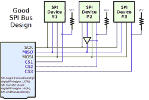

# 什么可能出错:SPI

> 原文：<https://hackaday.com/2016/07/01/what-could-go-wrong-spi/>

[串行外设接口](https://en.wikipedia.org/wiki/Serial_Peripheral_Interface_Bus) (SPI)其实并不是一个协议，更多的是一个通用的概念。这是在两个芯片之间尽可能快地传输大量数据的最简单的方法，仅仅因为这个原因，它是我最喜欢的方法之一。但这并不意味着一切都是拥抱和水仙花。尽管 SPI 很简单，但仍然有一些地方会出错。

在本系列的前一篇文章中，受实际读者问题的启发，我研究了异步串行连接的故障排除。既然您已经让它工作了，那么是时候调试您的 SPI 总线了！在简要概述系统之后，我们将讨论如何诊断 SPI，以及如何修复它。

## SPI 是什么？

SPI 的核心思想是每个器件都有一个移位寄存器，可以用来发送或接收一个字节的数据。这两个移位寄存器在一个环中连接在一起，一个的输出到另一个的输入，反之亦然。一个叫做*主机*的设备控制公共时钟信号，确保每个寄存器移入一位，就像另一个寄存器移出一位一样(反之亦然)。很难有比这更简单的了。

正是这种简单性让 SPI 变得快速。虽然异步串行通信可以达到每秒几十万位，但 SPI 通常可以达到每秒 10 兆位或更高。你经常看到人机异步串行，因为人相当慢。但在机器和机器之间，它将是 SPI 或 I2C(这是下一篇文章)。

[主机控制总线上所有设备共享的时钟(CLK 或 SCK)线路。与上面画的简单环不同，主移位寄存器实际上与从设备的每个组成一个环，组成这个环的线根据数据流的方向被标记为 MISO(“主输入，从输出”)和 MOSI(“主输出，从输入”)。](https://hackaday.com/wp-content/uploads/2016/06/spi_bus.png)

由于所有的环都是共享的，所以每个从机都有一条额外的专用线路，告诉它何时连接到总线上以及何时从总线上断开。也就是说，每个从机都有一条从机选择(SS 或有时称为片选 CS)线，当它为高电平时，从机断开其 MISO 线，并忽略通过 MOSI 输入的信号。当单个 SS 线被拉低时，从机接合。请注意，在任何给定时间，主机负责保持一条且仅一条 SS 线路低电平有效。

#### 典型 SPI 通信:

1.  主机将从机的个人从机选择线拉低，此时从机唤醒，开始监听，并连接到 MISO 线。根据*相位*(下面将详细介绍)，两个芯片也可以设置它们的第一个输出位。
2.  主机发送第一个时钟脉冲，数据的第一位从主机移动到从机(沿 MOSI)，从从机移动到主机(沿 MISO)。
3.  主机不断循环时钟，交换位，八位后，两端读入接收的数据，并排队等待下一个字节传输。
4.  以这种方式交换若干字节后，主机再次将 SS 线拉高，从机断开。

 这里是一个具体的交易，发生在一个微控制器主机和一个 25LC256 SPI EEPROM 之间。第一，高手掉 CS 线。然后它开始输入命令——在这个例子中是二进制的`00000011`,读命令。主机的下两个字节是读地址。从机一直保持其 MISO 线为低电平，返回零。接收到读地址后，从机开始发回数据。对于这种 EEPROM，它将继续发送连续字节，直到主机停止计时并提高 CS 线，从而结束处理。

当它工作的时候看起来很容易！

## 相位和极性

这是 SPI 线路的头号问题，也是您进行故障诊断时首先要考虑的地方。如果你仔细观察上面的轨迹，你会注意到两个芯片都在时钟周期的下降沿将数据推出 MISO/MOSI 线路。您看不到但可能猜到的是，它们都是在上升沿读入的，正好在一个时钟周期的中间。

Phase/Polarity Diagram from a STM32 Manual

选择在哪个边沿读取数据，以及时钟信号是高电平空闲还是低电平空闲，这两个二进制变量可以从一个芯片变化到下一个芯片，从而为我们提供四种不同的 SPI“版本”。时钟信号的空闲状态称为时钟*极性*，很容易解释。空闲高电平的时钟极性= 1，反之亦然。

不幸的是，如果你喜欢思考芯片在时钟周期中读取数据的时间，行业决定锁定传输的另一个方面，这映射到相同的事情:相位。相位描述数据是在第一个时钟跳变(相位= 0)还是第二个时钟跳变(相位= 1)时读取。如果时钟空闲为低电平(极性= 0 ),第一个跃迁将向上，因此在上升时采样的系统将具有相位= 0。然而，如果时钟空闲为高电平，第一个跃迁必然下降，因此在上升沿采样的系统将使 phase = 1，即在第二个跃迁上采样。写出来都头疼。

我是这样应对的。首先，我查看数据何时被采样。如果数据在时钟上升沿采样，相位等于极性，否则相反。上升沿读取值为 0，0 或 1，1。由于极性是有意义的，所以很容易在两者之间做出选择。如果它闲置低，你有 0，0。

|  | 上升沿采样 | 下降沿采样 |
| :-- | :-- | :-- |
| **时钟空闲低电平** | 相位:0
极性:0 | 相位:1
极性:0 |
| **时钟空闲高电平** | 相位:1
极性:1 | 相位:0
极性:1 |

大多数人都使用 0，0 或 1，1:数据在上升沿读取，在下降沿复位。有些设备对你使用这两个中的哪一个很挑剔，而有些则不然。例如，Microchip 25LCxxx 系列 SPI 存储器在上升时采样，根本不关心时钟如何空闲。那是我喜欢的芯片。

如果你懒得去读数据手册，或者你正在进行逆向工程，那么最终的结果是一个四向选择。如果是你唯一的变量，蛮力不难。大多数芯片都有状态寄存器或芯片 ID。在您的微控制器上设置相位和极性，发送命令从从设备中读取已知数据，并验证答案。如果相位和极性是你唯一的问题，你马上就能得到正确的配置。如果你的问题越来越严重，你就必须继续前进。如果你没有数据手册，你有四倍的工作量要做，所以尽可能把它做好。

## 速度

因为 SPI 是有时钟的，从机选择线限定了对话，所以同步两个器件不会出错。不多，除非主人说话太快，奴隶听不懂。好消息是什么？这很容易调试。

出于调试的目的，放慢速度不会有什么损失。几乎所有能以 10 MHz 速率处理 SPI 数据的芯片都能以 100 kHz 速率处理。(如果你知道例外，在评论里发帖吧！)另一方面，由于电压从导线的一端传播到另一端的各种现实问题，以及芯片将电流推入导线以克服其寄生电容的能力，您系统运行的最大速度是可变的。对于非常高的 SPI 速度(比如 100 MHz 及以上？)你的系统设计可能是限制因素。

所以测试一下。慢慢开始，逐步向上，直到你开始注意到错误，然后后退。我在 10 MHz 的短线路上从来没有遇到过问题，但你永远不会知道。这里的图像来自 EEPROM，额定频率为 10 MHz，焊接在一个粗略的分线板上，通过一束 20 厘米(8 英寸)的杜邦电缆连接。可以看到，它在 9 MHz 时满足(勉强)要求，但在 18 MHz 时有所滞后。在 35 MHz 频率下，它甚至不能快速切换线路以产生任何信号。

  9.1 MHz — Looking Good  18.2 MHz — Missed a Bit  35 MHz — Total Disaster  Tested Under Optimal Conditions

## 更多计时！

如果您向 SPI 从机发送命令，并期待一个永远不会到来的应答，请仔细检查主机是否继续切换时钟，直到从机完成。

这可能有违直觉，但请记住 SPI 是如何工作的——它是一个移位寄存器环。为了将数据从从机的移位寄存器中取出并送入主机(反之亦然)，需要有时钟脉冲。主设备负责发送该时钟，并知道触发该时钟需要多长时间。

对于我用作演示的 EEPROM，它将继续输出连续的字节，直到时钟停止。大多数记忆都是这样运作的。但其他设备，如温度传感器，通常只会返回一两个字节。如果你在那之后继续计时，它们经常返回全零。当从机必须返回一个变长包时，它可以先发送预期长度的包，也可以发送以数据结束标记结束的字节。这都是高层的东西。我只想让你记住，如果你想从从机取回数据，你必须给它一个时钟。

## 总线问题

到目前为止，我一直在考虑总线上的每个奴隶会出什么问题。如果你在总线上增加更多的设备(每个都有自己的 CS 线路，但是共享 CLK、MISO 和 MOSI ),事情会变得很棘手。原则上，所有器件的输出线都有三态驱动器，因此可以拉高或拉低，并在必要时断开。原则上，器件从不说话(在 MISO 线路上传输)，除非有人跟它们说话(它们的 CS 被主机拉低)。理论上，一切都很好。

### 切换相位和极性

还记得相位和极性的四种可能组合吗？这适用于总线上的每个设备。跟踪正在与哪个设备通话并设置几个配置位并不难，只是不能忘记这么做。向自己证明，每次添加新设备时，您都可以与总线上已有的所有设备通信。如果你曾经改变模式，开始写你需要改变回来的代码。

### 糟糕的演员

 主设备一次只能寻址一个从设备。如果 MISO 上有垃圾信号，请确保一次只有一条 CS 线被置位为低电平。如果是这样的话，可以想象其中一个奴隶行为不端。您可以尝试一次拔掉一个设备，直到找到问题所在。

[Paul Stoffregen]在 Arduino 平台上遇到了与 SPI 兼容性的[问题，因为 slaves 没有释放 MISO 线。他的解决方案是给违规设备添加一个三态缓冲芯片，并将三态线连接到芯片的 CS 线，这样它就永远不会束缚 MOSI 线，除非它正在被使用。这是解决问题的好办法。](http://hackaday.com/2014/11/25/better-spi-bus-design/)

### 开放收集器

虽然有些奴隶驾驶味噌线太多，其他人驾驶太少。特别是一些从器件可能无法上拉 MISO 线，节省了一个晶体管，而[只拉低了线](https://en.wikipedia.org/wiki/Open_Collector)。如果是这种情况，MISO 线路可能需要连接一个上拉电阻。同样，这也是非标准的，但例如使用类似 SPI 接口的 SD-MMC 存储卡就是如此。通过在 MISO 线路上添加上拉电阻，可以将它视为 SPI。

### 测试

为了测试 MISO 线路问题，不管是不良因素还是开路集电极，你可以在线路上临时连接一对(比如说)100 千欧的电阻，一个连接到 VCC，一个连接到 GND，作为中轨电压的弱偏置。将所有 CS 线置于高电平，这样从机就可以脱离总线。如果任何芯片未能达到三态，你会看到线被拉高或拉低，而它应该在中间休息。那些是坏演员。现在运行总线。如果芯片只能拉下线，你会看到看起来像有效的数据，但它会在中轨和 GND 之间而不是在 VCC 和 GND 之间变化。这是你的公开收藏家。

### 初始化

与此不无关系，当作为 SPI 总线主机的微控制器刚刚启动时会发生什么？SPI 总线(和 CS 线)上的电平浮动，本质上是随机的。时钟线可能会拾取电力线信号，并以 50 或 60 Hz 的频率振荡，在微处理器断言控制之前，一些芯片可能会开始相互通信，或者进入奇怪的状态。

因此，有些人主张在 CS 线上使用(弱)上拉电阻，这样，即使在微控制器启动并运行之前，所有 SPI 器件都会被取消选择。您可能认为这是一种功耗，但由于 CS 线路无论如何都处于高电平空闲状态，因此电阻仅在选择芯片时导通。我自己从断电状态下启动 SPI 芯片从未遇到过问题，但是如果您在启动时遇到奇怪的行为，请尝试一下。

## 摘要

调试损坏的 SPI 总线实际上并不难。由于这些线路的名字很明确(CLK、米索、MOSI)，所以在给电路布线时，你不必费很大力气，但无论如何都要仔细检查你的布线。大多数情况下，相位和极性配置不正确，可以通过示波器和查看数据手册来解决。之后，可能是速度问题，这很容易解决，只要放慢速度，直到它的工作，并从那里排除故障。你在记录从机的数据，对吗？

如果你有一个 SPI 设备总线，你可以单独对每个设备进行故障诊断，只要它们工作正常。弱拉 MISO 线到中轨，看它是否停留在那里可以验证他们是。如果需要的话，不要忘记在从机之间切换模式。

如果你正在使用 SD-MMC 卡，或者如果所有其他方法都失败了，或者如果你只是有点迷信，你可以尝试在各种线路上添加上拉电阻，以便在上电期间或出于其他一些神奇的原因稳定它们。SPI *应该是*四周都是推挽式驱动器的总线，所以应该不需要上拉。不过话说回来，你的总线也应该是工作的。

一如既往，我很想听听你的 SPI 调试技巧、窍门和恐怖故事！