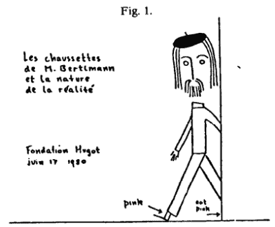
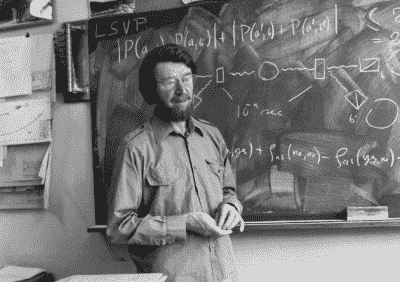
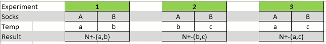

# 伯特曼的袜子对现实的本质意味着什么？

> 原文：<https://hackaday.com/2015/11/11/what-do-bertlmanns-socks-mean-to-the-nature-of-reality/>

一个人可以合理地确定，当一篇文章的标题包括短语“现实的本质”时，发人深省的话肯定在前面。但是当同一个标题似乎是询问一位男士的袜子，再加上一张恰好不相配的、颜色非常鲜艳的男士袜子的图片时，人们可能会认为这篇文章并不严肃。甚至可能是某种模仿。

我希望你会对爱尔兰物理学家[约翰·贝尔]的微妙天才感到惊喜，他用袜子、洗衣机和一点数学来展示我们如何测试量子物理的最基本的性质之一。一种确实存在于我们是其中一部分的现实的本质中的属性。很少有人能说他们从最基本的层面理解了贝尔不等式。给我一点你的时间，你会被算在这几个人里。

## 一个改变了一切的问题

首先，我们需要一次简短的历史旅行。我们的故事开始于不久前，但在一个非常非常遥远的星系。一个孤独的电子，以未知的状态存在于我们遥远的星系中。我说未知是因为我们无法知道。星系，因此电子在几百万光年之外。[爱因斯坦的]狭义相对论对信息传播的速度施加了限制，使我们无法了解电子的当前状态。【爱因斯坦】不知道， [](https://www.youtube.com/watch?v=PWuCXcoXNts) 然而，我们的电子也是特殊的。是*缠住了*。这意味着它与另一个电子有量子联系……一个恰好在我们实验室里的电子。纠缠的性质表明两个电子必须有相反的自旋。所以如果我在我们的实验室里测量电子的自旋，我就可以知道几百万光年外的星系中电子的自旋。不可能！

没有办法绕过它…量子理论*是否考虑到我们现实的这一神秘属性。[爱因斯坦]说这违反了他的相对论和宇宙速度极限。一个已经被证明无疑是正确的理论。怎么会这样呢？哪个理论是对的？[爱因斯坦]提出了一个替代理论，将满足悖论。他使用了所谓的局部隐藏变量，你可以在我第一次讨论巴特曼的袜子的[中补上。](http://hackaday.com/2015/10/06/bertlmanns-socks-and-the-nature-of-reality/)*

基本上，它说两个电子的自旋是预先确定的。但是这与量子理论的一个核心原则不相容，量子理论认为电子的自旋只有在测量后才能知道。因此，一场伟大的战斗诞生了，胜利者获得了定义现实本质的权利。不幸的是，量子理论的领军人物[爱因斯坦]和[尼尔斯·玻尔]没能活着看到这场战斗的结束。几十年后，你会看到历史上的某个时刻，约翰·贝尔终结了与武器之母——一双袜子——的争论。

## 袜子、洗衣机和热水

[](http://fmoldove.blogspot.com/2015/06/the-socks-of-mr.html) 【伯特曼博士】因穿错袜子去实验室而出名。当他的左脚进门时，你看到他的袜子是粉红色的。通过观察一只脚上的粉红色袜子，你可以推导出另一只脚上的袜子的信息。当你看到一只粉红色的袜子，你可以非常肯定地说，另一只袜子不会是粉红色的。

让我们借[伯特曼医生的]袜子做些测试。我们将看看它们在不同温度下如何经受长时间洗涤。我们将把剩下的袜子放在三种不同的温度下洗涤。让我们把左边的袜子标上“ **A** ”和三个温度“ **a** ”、“ **b** ”和“ **c** ”。我们将每只袜子洗同样长的时间，然后观察结果。完好的袜子会贴上“ **+** ”的标签，被破坏的袜子会贴上“**–**”的标签。注意，对于这个实验，水温和洗涤时间是不相关的。

### 基于数学的洗袜子预测

通过一点数学知识，我们可以推导出实验的一些预测，而不必真的去做。让我们用 set **n(a [+] ，b[–])**来表示在温度 **a** 下存活下来并在温度 **b** 下被破坏的袜子。我们也可以把这个值写成两个子集的和。让我们想象一下，一只袜子在温度 **a** 和 **c** 下存活下来，但在温度 **b** 下会被破坏。我们可以把这个写成子集 **n(a [+] ，b[–]，c [+] )** 。现在拿另一只袜子来说，它在温度 **a** 下存活，但在温度 **b** 和 **c** 下被破坏，我们用子集 **n(a [+] ，b[–]，c[–])**来表示。我们可以说，这些子集中的任一只袜子必定是集合 **n(a [+] ，b[–])**的一部分。同样可以用集合 **n(b [+] ，c[–])**来完成，因为这将是子集 **n(a [+] ，b [+] ，c[–])**和**n(a[–]，b [+] ，c)的和现在，让我们把它建立成一个等式:**

```
n(a+,b-) + n(b+,c-) = n(a+,b-,c+) + n(a+,b-,c-) + n(a+,b+,c-) + n(a-,b+,c-)
```

[](http://www.nature.com/news/quantum-spookiness-passes-toughest-test-yet-1.18255)

John Bell

这个令人头痛的等式可以这样分解:等号的右边是子集，左边是集合。在上一段中，我们讨论了如何从集合中获取这些子集。我们感兴趣的是中间的两个子集。这就是 **n(a [+] ，b[–]，c[–])**+**n(a[+]，b [+] ，c[–])**得出集合 **n(a [+] ，c[–])【T21。从数学角度来看，这是如何实现的？这毕竟是一种平等。你不能把 **n(a [+] ，c[–])**放在等式的左边。它不起作用。因此，我们可以得出结论:**

集合 **n(a [+] ，b[–])**和 **n(b [+] ，c[–])**之和必须大于或等于集合 **n(a [+] ，c[–])。**

现在，观察力敏锐的读者会意识到，如果一只袜子在温度为 **a** 时被销毁，它就不能在温度为 **b** 或 **c** 时进行测试。让我们不要忘记[伯特曼博士]有两只脚，袜子是成双成对的。它们可能是不同的颜色，但是它们的物理特征被认为是相同的。这样左袜子的测试结果可以用来预测右袜子的结果。

有了成双的袜子，并且了解到一双袜子一半的结果可以用来预测另一双袜子的结果，我们就可以进行真正的实验了。我们将对三双袜子的样品进行三次实验。左侧袜子将保留其标签“ **A** ”，右侧袜子将收到标签“ **B** ”。

## 实验时间

我们需要解决一只袜子因为在之前的测试中被破坏而不能继续测试的问题。如果一只袜子在温度为 **a** 时被破坏，我们如何在温度为 **b** 或 **c** 时测试它？我们将通过使用结对来解决这个问题。如果我拿一双袜子，袜子 **A** 和袜子 **B** ，让它们分别经受不同的温度(或测试)，我会得到两个结果。袜子 **A** 将完好无损( **+** )或损坏(**–**)地出来，袜子 **B** 也将类似地出来。因为袜子有相同的物理特征，我可以用一个测试的结果来预测另一个的结果。我这么说是什么意思？如果袜子 **A** 被温度 **a** 破坏，那么我可以预测袜子 **B** 也会在温度 **a** 被破坏。这解决了我们的困境，因为如果一只袜子在温度为 **a** 时被破坏，我可以用它的一双来代替下面的测试。我们现在可以进行真实世界的实验了。

考虑下面的图表。



如你所见，每个实验将在两种不同的温度下测试我们的每一双袜子。对于实验一，袜子 **A** 将经受温度 **a** ，袜子 **B** 将经受温度 **b** 。然后我们将关注袜子 **A** 存活(标记为'+')和袜子 **B** 被破坏(标记为'-')的袜子的数量，这将表示为 set **N [+-] (a，b)** 。下一点是理解我们为什么以这种方式进行测试的关键。

在假设测试中，我们认识到集合 **n(a [+] ，b[–])，**是子集 **n(a [+] ，b[–]，c [+] )** 和 **n(a [+] ，b[–]，c[–])**的和在我们的真实世界实验中，当这种情况发生时，我们将替换另一半。这样我们就可以说，数 **N [+-] (a，b)** 一定等于我们假设的数 **n(a [+] ，b[–])**。

对于实验二，我们将在温度 **b** 和温度 **c** 分别洗涤袜子 **A** 和袜子 **B** 。我们应用与上面相同的逻辑推导出 **N [+-] (b，c)** 等于 **n(b [+] ，c[–])**。第三个也是最后一个实验将把袜子 **A** 放在温度 **a** 和袜子 **B** 以及温度 **c** 处，我们得出结论，得到的集合 **N [+-] (a，c)** 等于 **n(a [+] ，c[-])**。

换元法告诉我们，集合 ****N [+-] (a，b)**和 **N [+-] (b，c)** 之和一定大于或等于集合 **N [+-] (a，c)** 。如果我们将我们的逻辑以一种概括的形式应用于概率的总和，我们得到:**

```
P+-(a,b) + P+-(b,c) ≥ P+-(a,c)
```

女士们先生们，这就是贝尔不等式。回头看看[第一部分](http://hackaday.com/2015/10/06/bertlmanns-socks-and-the-nature-of-reality/)，用纠缠的原子代替一双双袜子，用磁铁代替洗衣机，用磁铁的方向代替温度，你会得到同样的东西——贝尔不等式。让我们来算一些数字，这样你就能明白所有的大惊小怪是怎么回事了。

如果我们从第一部分结尾的地方继续，量子理论说 P [+-] (a，b) = 1/2 cos ² (x/2)其中 x =(b–a)。我们可以为我们想要的磁铁选择任何角度。假设:

**磁铁 A = 0**

**磁铁 B = 146**

**磁铁 C = 282**

将这些值应用于不等式会产生:

```
1/2 cos2 (73) +  1/2 cos2 (68) ≥ 1/2 cos2 (141)
```

或者

```
11.2% ≥ 30.1%
```

## 结论

数字显而易见。量子理论的预测违反了贝尔不等式。这是无法回避的。记住，磁铁的角度用洗涤水的温度来表示。不管我们在什么温度洗袜子，set**N[+-](a，b)** 和 **N [+-] (b，c)** 之和必须大于等于 set **N [+-] (a，c)** 。同样，磁铁和原子自旋的角度也是如此。从第一部分中，你了解了我们如何使用磁铁的角度来确定原子的自旋是向上( **+** )还是向下(**–**)，这类似于一只袜子幸存或被摧毁。通过改变磁铁的角度，观察不同自旋结果的概率，我们可以让这个悖论经历一个真实的、可测量的实验。[约翰·贝尔]让我们有能力进行一次真实世界的测试，看看谁是对的——[爱因斯坦]和他的隐藏变量，还是[玻尔]和他的量子理论。

> “如果隐藏变量扩展是局部的，它就不符合量子力学，如果它符合量子力学，它就不是局部的。”
> 
> 约翰·贝尔

当[贝尔]在 1980 年 7 月 18 日向科学界提出他的[不等式](https://cds.cern.ch/record/142461/files/198009299.pdf) (pdf)时，实际进行这种测试的技术还没有达到。但是很接近了。1982 年，法国物理学家[Alain Aspect]把进行这样一个试验作为他的论文。虽然结果倾向于量子理论的方向，但仍然有漏洞使[爱因斯坦的]隐藏变量依赖于生命支持。但是随着技术的进步，这些漏洞最终被堵上了，[给了量子理论胜利的一手](http://hackaday.com/2015/09/01/the-eulogy-of-local-hidden-variables/)。

下次你看到有人穿错了袜子，我希望你想想(约翰·贝尔)，想想他是如何用我们日常生活中如此微不足道的一部分来证明我们日常生活中并非如此微不足道的一部分。

## **来源:**

吉姆·巴戈特的《量子故事》。第三十一章 ISBN- 978-0199566846