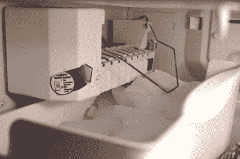

# 什么是家庭自动化？

> 原文：<https://hackaday.com/2016/07/15/what-is-home-automation/>

当谈到电子产品时，最热门的词汇可能是家庭自动化。这是物联网的一个分支，你可以去家庭商店，拿出装满产品的袋子。当前的 Hackaday 奖励赛向你发出挑战，让你的生活自动化，把目光投向家庭似乎是一个向所有人开放的领域。但是我们很难指出到底是什么让家庭自动化，更重要的是，让生活在这项技术旁边的人受益的最佳方式。所以我们想知道你的想法。

你有什么好主意让自动化家庭不仅仅是一个时髦词吗？也许你已经被卖掉了，并且一直在建造你自己的房子；跟我们说说吧！我们想知道你认为这将如何(以及何时)从一个流行词变成大多数人想要管理他们房子的东西。我们将从这次讨论中总结出最好的内容，在以后的文章中发表。作为感谢，我们将选出一些最佳评论，并从 Hackaday 商店向您发送一件 t 恤[。](http://store.hackaday.com/collections/swag)

Who doesn’t love an automatic ice maker?

你可以回到 50 年前的 1960 年代的卡通片，看到家庭自动化就在眼前。《摩登原始人》里有恐龙来处理日常事务，而《T2》里的《杰森一家》里有一个机器人女仆来管理家里一大堆稀奇古怪的小玩意。在那个时候，家里已经进入自动化领域，有恒温控制的空调和热水器。这大约是在同一时间，自动制冰机开始出现在家里的冰箱里，遥控车库开门器开始使用。

从 20 世纪 70 年代和 80 年代开始，在厨房的柜台下发现洗碗机变得很普遍。黄昏至黎明传感器的门廊灯选项开始使用，随后是使用 PIR 传感器的运动检测灯。自动草坪洒水器开始出现在家庭周围的院子里，监控门、窗和经常运动(再次使用 PIR 传感器)的安全系统成为了一件事。

这些都是经常被忽视的家庭自动化的好例子。如今，甚至更智能的恒温器也风靡一时，还有能让你通过互联网监控摄像头和门锁的附加安全系统。

这又把我们带回了这个问题。这一切将走向何方？在我们这个时代，什么样的自动化会发展到 50 年后成为每个家庭都需要的技术？我们是否已经有了自动化的硬件，只需要一些东西把它们缝合在一起？请让我们知道您的想法，如果您已经在从事自己的自动化项目，请不要忘记[参加 Hackaday 奖](https://hackaday.io/project/add?light&tag=2016HackadayPrize)。

The [HackadayPrize2016](https://hackaday.io/prize) is Sponsored by:   