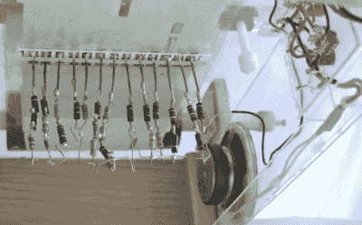
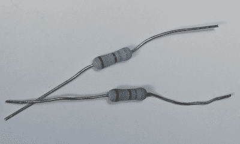
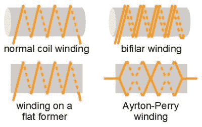
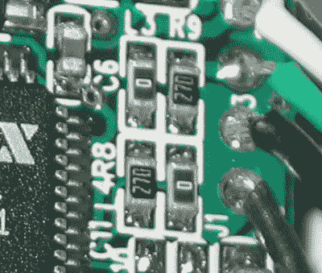

# 关于电阻有什么需要了解的？

> 原文：<https://hackaday.com/2016/09/06/what-is-there-to-know-about-resistors/>

电阻器:一个阻止电流流动的无源材料块。终端连接到你完成的每一端。还有比这更简单的吗？

原来根本没这么简单。毕竟，温度、电容、电感和其他因素都会使电阻成为一个相当复杂的元件。甚至它在电路中的用途也很多，但这里我们只关注不同类型的固定值电阻，它们是如何制造的，以及它们适合不同应用的原因。

先说一个简单的，也是最古老的。

## 碳成分

Carbon composition resistors in music player

这些电阻通常被称为“老”电阻，在 20 世纪 60 年代广泛使用，但随着其他类型电阻的引入，以及它们相对较高的成本，现在使用较少。它们由陶瓷粉末和碳的混合物组成，用树脂粘合在一起。碳是良好的电导体，混合物中碳的浓度越高，电阻越低。电线连接在末端。然后，它们被涂上油漆或塑料作为绝缘体，不同的[彩色条纹被涂上，以指示电阻值和公差](http://hackaday.com/2013/08/28/hackadays-resistor-code-reference-card/)。

这些碳成分电阻器的电阻会由于长时间暴露在高湿度下、焊接时电压过大和过热而永久改变。公差为 5%或更大。鉴于它们基本上只是一个实心圆柱体，因此具有良好的高频特性。与它们的小尺寸相比，它们还具有良好的耐热过载能力，因此它们仍被用于电源和焊接控制。

然而，他们的年龄并没有阻止我使用我从二手商店买的一包他们，以弥补我需要的 555 定时音乐播放器的不同阻力。你在上面的照片中看到的是我的组装机。

## 碳膜

碳膜电阻器内部构件，由 Shaddack [CC BY-SA 3.0]，via[Wikimedia Commons](https://en.wikipedia.org/wiki/File:Carbon-resistor-TR212-1.jpg)

碳膜电阻器是通过在一个陶瓷圆柱体上沉积一层纯碳，然后切掉一些碳形成一个螺旋，如图所示。然后用硅涂覆该产品。层的厚度和剩余碳的间距或宽度提供了对电阻器电阻的精细控制，给出了 2%或更高的容差，优于碳成分电阻器混合物所提供的容差。由于是纯碳，它们的电阻受温度的影响也较小。

碳膜电阻的电阻温度系数(TCR)典型值约为 200 至 500 ppm/℃, 200 ppm/℃就百分比而言，变化为 0.02%/癈。因此，对于 80C 的温度变化，200 ppm/°C 意味着电阻变化 1.6%或 16 千欧。

碳膜电阻器的典型范围从 1 欧姆到 10 千欧姆，额定功率从 1/16W 到 5W，并且可以处理千伏电压。典型用途是高压电源、x 射线、激光和雷达。

## 金属薄膜

金属膜的制作类似于碳膜，通过在陶瓷上沉积一层金属层(通常是镍铬合金),然后在金属上雕刻一个螺旋。根据制造商 Vishay 的一份文件，在连接端子后，以前通过研磨或喷砂对螺旋进行修整，但现在使用激光进行修整。然后将结果涂在漆上，并使用颜色编码或实际文本进行标记。

金属膜的电阻随温度的变化小于碳膜。金属膜的 TCR 在 50 和 100 ppm/℃

金属薄膜的起始公差也较低，为 0.1%。它们还具有良好的噪声特性、低非线性和良好的长期稳定性以及广泛的用途。

## 金属氧化物薄膜

Metal oxide resistors

这与金属薄膜电阻器非常相似，只不过金属通常是掺杂了氧化锑的氧化锡。这使其在额定电压、过载、电涌和高温方面的性能优于碳膜或金属膜。碳膜电阻的额定温度约为 200C，金属膜电阻的额定温度为 250-300C，金属氧化物电阻的额定温度为 450C。然而，它们具有较差的稳定性。

## 线绕式

Wire wound resistor

线绕电阻器是通过将电线缠绕在塑料、陶瓷或玻璃纤维圆筒上制成的。由于电线可以被切割成精确的长度，这些可以具有 0.1%或更好的公差的高精度电阻值。为了获得高电阻，导线必须又细又长。对于较低的额定功率，导线可以较细，对于较高的额定功率，导线可以较粗。它可以由许多合金制成，包括镍铬、铜、银、铁铬和钨。

它们通常被设计成能够承受高温，这取决于所使用的导线材料，纯钨导线的最高额定温度为 1700C，尽管银导线的最高额定温度可以在 0-150C 范围内。精密线绕电阻的 TCR 约为 5 ppm/°c，高功率线绕电阻的 TCR 更高，变化幅度更大。

高功率线绕电阻的范围从 0.5W 到 1000W，数百瓦的电阻可以涂上高温硅树脂或玻璃质珐琅。为了最高的散热，甚至可以有一个铝制外壳，它有鳍片来充当散热器，尽管这些鳍片似乎在 50W 范围内。

Wire wound resistor windings

由于缠绕导线基本上是一个线圈，它们具有足够的电感和电容，因此在高频下性能较差。为了减少或消除这种情况，可采用其他缠绕方式，如双线缠绕、在扁平线圈架上缠绕和 Ayrton-Perry 缠绕，如图所示。

在双线绕组的情况下，电感被消除，但是电容很高。通过缠绕在非常薄的扁平线圈架上，导线靠得很近，减少了感应。并且对于 Ayrton-Perry 绕组，由于电流方向相反的绕组彼此靠近，自感减小，并且电容最小化，因为在交叉点处电势相同。

由于耐用性的原因，电位计通常是线绕电阻。线绕电阻器也常用于断路器或保险丝中。并且可以通过测量感抗来确定流过它的电流，从而增强它们的感应并很好地用作电流传感器。

## 箔纸

Foil resistor

正如您可能猜到的那样，薄膜电阻使用几微米厚的箔片，通常是安装在陶瓷载体上的含添加剂的镍铬合金。尽管自 20 世纪 60 年代就已出现，但它们在所有电阻中具有最佳的稳定性和精度。通过在箔片上光刻出图案来获得所需的电阻值。它们没有电感，电容低，稳定性好，热稳定性快。公差可以低至 0.001%。

TCR 约为 1 ppm/°c，与上面的 1 Mohm 金属膜相比，对于 80C 的温度变化，变化仅为 0.008%或 80 欧姆。这是如何实现的很有趣。随着温度的升高，电阻当然会增加。但是电阻器是以这样一种方式制造的，即升高的温度导致箔片压缩，导致电阻下降。净效应是电阻变化很小。

由于没有电感，薄膜电阻非常适合涉及高频的音频应用。它们也适用于要求精度的应用，如电子秤。当然，任何温度波动较大的地方也可以使用它们。

## 薄膜和厚膜

SMD resistors

大多数表面贴装器件(SMD)电阻都是这种类型。厚膜电阻器中的膜比薄膜电阻器中的膜厚大约 1000 倍，并且厚膜电阻器是市场上成本最低的电阻器。薄膜的成本比厚膜高得多。

薄膜电阻器是通过将镍铬(通常)溅射到绝缘衬底上制成的。然后使用光蚀刻、研磨或激光修整对其进行蚀刻。厚膜电阻采用丝网印刷和模板印刷工艺制成。该膜是粘合剂、载体和金属氧化物的混合物。最终修整通过研磨或激光修整完成。

薄膜容差高达 0.1%，TCR 为 5 至 50 ppm/°c，厚膜容差高达 1%，TCR 为 50 至 200 ppm/°c，薄膜的电阻噪声也低于厚膜。

薄膜的典型应用是需要高精度的场合。厚膜几乎可以应用于任何电子设备——有些 PC 包含 1000 多个厚膜 SMD 电阻。

## 不再抵抗

还有其他类型的定值电阻器，但以上是最有可能在人们的电阻器抽屉中找到的。有没有你认为对某些应用特别有用的类型？如果是这样，请在下面的评论中与我们分享，以及你经常使用的其他类型。如果你想进一步了解你可能找到或想要收藏的典型元件，可以考虑看看我们关于电容的文章。