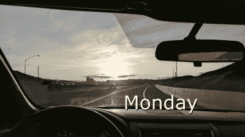
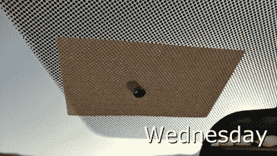
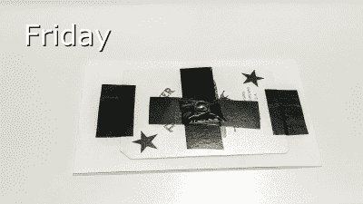

# 什么造就了黑客

> 原文：<https://hackaday.com/2017/10/23/what-makes-a-hacker/>

我想我可以总结出我们这些经常访问 Hackaday 的人和非黑客世界的区别。作为一个案例研究，这里有一个关于需要是发明之母和发明人的故事。

Hackaday 与 Pinterest 和 Instructables 等网站有重叠，但有一个重要的区别，我们选择用手头的材料创造一些新的美丽的东西。通常这些工具和技术非常简单。我们希望通过减少不必要的杂乱来使事情变得优雅，而不是添加亮片。如果有东西可以用 555 定时器建造，我们会让你知道。如果有更好的处理器选择，我们会告诉你。

我第一次真正的上班通勤是每天早上向东开 40 分钟，晚上向西开 40 分钟。这条路线每天两次把我的车直接指向太阳。每天盯着炽热等离子体的瘴气看一个半小时并不好玩，可能也不安全，但我们可以解决这个问题。

## 星期一，我很烦恼的一天

第一个星期一，我被路上盘旋的太阳惹恼了。上下班时，我眯着眼睛，尽我所能使用遮阳板，但这是一场失败的战斗。遮阳板使我很难看到车道上的汽车，即使太阳偏向一边。

打个比方，我们都来过这里。我们遇到一个问题，起初，它只是一个*是*的东西。我们的大脑会将此记录为一个新事件，并将其归入令我们烦恼的某件事情中。

## 星期二，那天我做了一个简单的选择

星期二，我买了太阳镜，但是它们不够。当太阳正好在地平线上时，我无法将遮阳板放下足够远，而太阳镜在直视远处的核反应堆时也无济于事。

此时，常规的解决问题的技巧开始发挥作用。标准的解决方案，比如太阳镜，已经试过了，也许我们会因为事情没有按照我们的方式发展而有点沮丧。在看着燃烧的氢球四次往返之后，我们的大脑开始看到一种模式。

## 星期三，我做了一件事

周三，我偏离了一个非黑客的道路。非黑客会继续抱怨道路的布局。他们会抱怨道路不应该是东西走向的，他们的税款是如何支付在高峰时间无法使用的道路的。他们会竭尽全力想出新的抱怨方式。

不是我。那天早上，在我去上班之前，我从冰箱里拿了几块磁铁和一张 3×5 的便条纸。我把一块磁铁放在挡风玻璃的外面，把另一块磁铁和便条卡放在里面。磁铁把便条卡固定住，让我可以把它放在挡风玻璃上的任何地方。不幸的是，薄薄的便条纸并没有很好地阻挡光线。那个空间球比压得很薄的枯树更有力量。

## 星期四，我做了一些更好的事情

周四，设计被修改。磁铁在挡风玻璃上移动得很好，所以我没有更换它们。便条卡的尺寸似乎比需要的要大一些，我需要能更有效地阻挡光线的东西。一张扑克牌被替换到了设计中。扑克牌的设计是为了防止光线穿过，这样就没有人能从背面看到你的牌。一个幸运的副作用是，卡上的低摩擦涂层有助于它在挡风玻璃上穿梭。

我的大多数问题都得到了解决，除了低摩擦表面让磁铁从卡片上滑落。卡片很小，足以挡住太阳本身，但光线仍然洒在它的周围，我必须保持我的头在正确的位置。事实证明，卡片的尺寸比我想象的要大。

工程的一个警告是它会导致过度工程化。我开始思考如何使用第三块磁铁或一个精心制作的梭子，它可以在拥抱挡风玻璃的同时抓住磁铁。

## 星期五，这一天我有了新的美丽的东西

周五，进行了最后的调整。胶带将磁铁固定在扑克牌上，更多的胶带将扑克牌固定在便笺上。我没有问题。当我开车的时候，每当太阳照在我脸上的时候，我就把磁卡放在挡风玻璃上。当我不需要它时，我把它移到一边，这样挡风玻璃雨刷就不会碰到它。这是一个功能性产品，但也许它会得到一些完成，所以它看起来像是属于汽车。人造碳纤维？

这种时间投资是一种风险，一场时间赌博，但回报是值得的。不是每一种创造对生活的改善都超过了创造它的成本，但愿意沿着这条路走下去，而不是一味地抱怨，是我们的区别。我们利用自己的能量让生活变得更好，并与世界分享，希望其他人能从我们的经历中受益。

## 法律注释

我应该警告你，在我的州，这在技术上是违法的，因为有法律禁止在司机和挡风玻璃之间放置任何东西。模糊骰子、停车许可证和雷达探测器都是驾驶时非法显示的。在自己动手之前，先检查一下你所在地区的法律。另一件使我们与他们不同的事情是，我会告诉你法律和我所做的事情，然后让你决定如何处理这些信息。

## 扩展一个简单的想法

如果你像我一样，想出一个简单有效的想法并不意味着坐以待毙，只是使用它，它必须超越最初的黑客。一个好主意可以变成一个伟大的想法。一个伟大的想法可以变成一个可怕的想法。一个很棒的想法，有一个产品支持，可以赚钱或者让你的生活变得更好。

这也是[范围蔓延](http://en.wikipedia.org/wiki/Scope_creep)的一个症状，但这不是本文要解决的问题。

手动操作的安装在窗户上的太阳能阻挡装置 HOWMSBA 没有得到更多的修改，因为它符合我的需要，但是，当我的大脑在发明模式下超速运转时，更多的想法出现了。手动调整卡可以很好地进行概念验证，但每当汽车在路上转弯时，都必须进行调整。连接绳子和马达似乎是一个合理的行动。四个马达可以用吸盘固定在挡风玻璃的角上，来拉动航天飞机。调节滑轮可以由一些步进电机或带有张紧反馈的简单连续旋转伺服系统提供动力。

X-Y 工作台可以工作，但很难在不明显阻挡视线的情况下拟合挡风玻璃的曲线。这也需要很大的张力来解释滞后现象。无论选择哪种马达，一个 1 美元的小模拟操纵杆就可以像控制电子游戏一样控制马达。也许操纵杆可以安装在方向盘上，通过无线方式与控制器对话。它也可以有一个太阳能电池包。更好的是，它可以通过安装在头枕上的太阳跟踪器自动完成，该跟踪器会自动跟踪最亮的点，并为我定位卡片，并根据安装位置进行短暂的偏移。

咻。

这就是精神垃圾场的样子。毫无疑问，你们中的一些读者有更好的方法来改进这样一个简单的黑客。也许这些想法中的一个会在 Hackaday 上结束，因为我们不是仅仅遵循食谱的人，我们是添加自己成分的人。