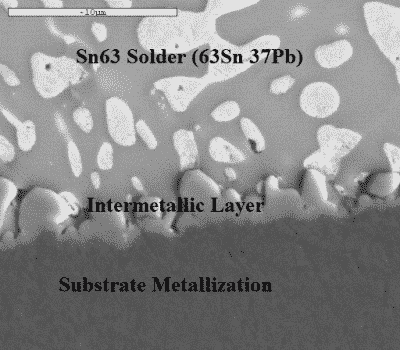

# 什么是焊剂:焊料到底是如何工作的？

> 原文：<https://hackaday.com/2017/02/23/what-the-flux-how-does-solder-work-anyway/>

我从事焊接工作很长时间了，我为自己的能力感到自豪。我不会说我是周围最好的焊料投掷者，但我很擅长这一基本的车间技能——至少对于通孔和“传统”焊接；我还没怎么练习过 SMD 的东西。我相信我可以在任何种类的电线或导体中制造出良好、坚固、稳定的接头，既有电气性能又有机械性能。

但是像我们中的许多人一样，我学习焊接作为一种实用技能；把焊料和铁放在一起，观察结果，重复有用的东西，避免无用的东西。似乎增加一点内部信息可能有助于我提高技能，所以我开始学习焊点内部发生的机械和化学变化。

### 焊料！金属胶

和其他金属加工方法一样，焊接也有严格的定义，这一点不足为奇。焊接是通过熔化填充金属来连接金属。与焊接不同，只有填充金属——焊料——熔化。被连接的金属通常具有比焊料高得多的熔点。在这方面，铜焊类似于钎焊；即使铜焊中的填充金属在比焊料高得多的温度下熔化，被连接的金属仍然不会熔化。

焊料本身的冶金细节可能要花很多篇幅来讨论，但对我们来说，这是非常简单的东西。焊料只是一种被设计成在特定温度下熔化的合金。对于电子产品来说，多年来焊料之王是由 60%的锡和 40%的铅组成的合金。应对环境问题的新法规导致了不同无铅合金的发展，但无论成分如何，焊料的工作都非常简单。焊料需要在可预测的温度下熔化，并在凝固时保持其机械和电气特性。换句话说，焊料需要足够强，以物理方式将接头保持在一起，而不会给接头带来任何不期望的电特性。

Intermetallic bonding. Source: [Indium Corp](http://www.indium.com/blog/intermetallics-in-soldering.php)

然而，焊料需要做的不仅仅是熔化和固化。人们似乎认为焊料是某种“金属胶”——将它作为液体使用，然后让它变成固体，从而将接头锁定在一起。不过，这只是一部分情况。为了使焊接点具有良好的电气和机械性能，焊料需要润湿待连接的金属。在焊接的情况下，*润湿*是熔化的焊料部分溶解到铜基底金属中的过程，形成一个部分是焊料部分是铜的区域。这就产生了金属间结合*和*，这是焊接的关键。在大多数焊料中，熔化的锡是溶解到铜基底中的主要溶剂，并形成在电气和机械上稳定接头的金属间结合。

金属间化合物对于良好的焊点来说是必不可少的，但就像许多事情一样，太多的好事也可能是坏事。金属间化合物倾向于变脆，因此如果金属间化合物层太厚，则接头的机械强度会变弱。金属间层中也可能存在增加机械不稳定性的空隙。

### 保持清洁

我们都知道助焊剂对高质量的焊点至关重要。但是助焊剂到底是什么，为什么焊料制造商要大费周章地把它塞进焊锡丝的芯中呢？

焊剂的重要性在于它能够对抗焊料的死敌:金属氧化物。金属氧化物对焊点没有好处——当有金属氧化物涂层时，焊料不能充分润湿焊点。焊剂是用来去除金属氧化物的，而且是在焊接接头时进行的。预先清洗金属并不能解决问题，当焊料流动时，大气中的氧气已经重新形成了足以破坏焊料润湿的金属氧化物层。

电子焊料通常有松香制成的助焊剂。松香是一种天然产品，来自松树，特别是美国产松香的火炬松和长叶松。它的优点是在室温下或多或少呈惰性，但液化后呈强酸性，熔点略低于焊料。因此，电子焊料的松香芯会在焊料熔化之前熔化，流入并围绕着焊点。酸性液体与金属氧化物反应，暴露出干净的金属，让焊料浸润其中。酸性液态焊剂将金属氧化物转化为金属盐和水，当焊剂凝固时，这些金属盐和水通常被锁定在焊剂中。此时，反应产物通常是无害的，但是一些过程仍然需要除去用过的焊剂。

当然，焊接还有更多的东西，但是这些是关于烙铁末端那团焊料内部情况的基础。