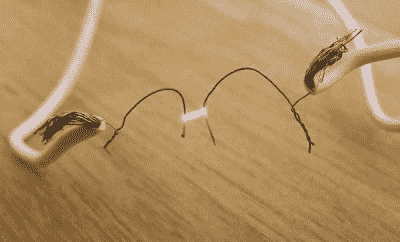
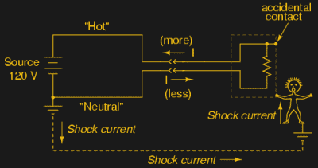
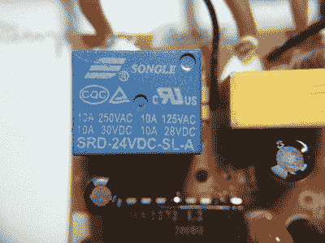
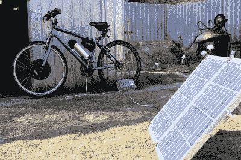

# 全 DC 房子的电压是多少？

> 原文：<https://hackaday.com/2017/03/06/what-voltage-for-the-all-dc-house/>

洋流之战 AC 取得了决定性的胜利。毕竟，不管你的墙上插座是 110 伏还是 230 伏，50 赫兹还是 60 赫兹，全世界都同意振荡频率应该严格大于零。从技术上讲，AC 胜出是因为三个交织在一起的事实。拥有几个大型发电厂比成千上万的小型发电厂更经济。这意味着电力必须传输相对较长的距离，这需要更高的电压。在那个时候，交流变压器是唯一可行的升压和降压方式。

No, not that AC/DC

但那是过去的事了。我们现在正处于发电革命的风口浪尖，至少如果你相信太阳能爱好者的话。这意味着两件事:当地的电力最初是由 DC 产生的。这完全推翻了三个对 AC 有利的因素中的两个。(高效的 DC-DC 转换器扼杀了变压器。)不，我们不认为一夜之间就会有开关，但如果有两个家庭电气系统变得越来越普遍，我们也不会感到惊讶——一个是由公用事业公司提供的远程高压交流电，另一个是本地产生的低压 DC。

为什么？因为如今大多数设备都使用低压 DC，只有一些大型电器例外。电池商店 DC。如果越来越多的家庭拥有一些本地 DC 发电能力，那么仅仅为了插上一个壁式电源而将本地 DC 转换成交流电，然后再将其转换回 DC 就没有意义了。Hackaday 的[Jenny List]避开了很多这样的设置，直接进入了她文章“[我的低压 DC 墙壁插座在哪里？](http://hackaday.com/2016/12/21/so-wheres-my-low-voltage-dc-wall-socket)”并提出了一些物理互连的解决方案。但是我们想支持一下。当低电压 DC 革命到来时，电压会是多少？

## 电阻加热

低压布线的问题是简单的物理问题。对于给定的功率需求，`P=I*V`，因此较低的电压意味着推动更大的电流。但是代入欧姆定律，更大的电流也意味着电线中电阻损耗`P=I^2*R`显著增加。通过使用更多的铜来降低导线的电阻是一种替代方法，但是关注电流平方项会得到更大的回报。

 这就是为什么，举例来说，[以太网供电(PoE)](https://en.wikipedia.org/wiki/Power_over_Ethernet) 方案使用大约 48 V 来传输大约 30 W 的功率——这些细以太网电缆只能承载这么多电流，而不会以热量的形式浪费掉大部分电流。即使在 50 V 左右，PoE 方案也要考虑布线中三到五瓦的损耗。因此，无论你家电气系统的低压 DC 部分使用什么电缆，它都要比 Cat-5 粗。

但是铜是要花钱的，所以电阻加热效应总会对电压产生一些向上的压力。

## 安全

 在大约 30-50 伏的电压下，电流开始对人类造成危险。这就是电流通过人体电阻[开始变得麻烦的地方](https://www.allaboutcircuits.com/textbook/direct-current/chpt-3/ohms-law-again/)。但是当每个人都说“安全第一”的时候同样值得注意的是，你的墙上现在有 110 或 230 伏交流电。显然这是现实世界中的“洗衣机第一”。也就是说，虽然低于 30 伏的 DC 会更安全，但我们怀疑这种安全性将被设计到连接器或断路器中。

## 开关和继电器

这让我们想到了最后一个问题。你焊接过电弧焊吗？起弧需要多少 DC 电压？对于专业单位来说，24 V 左右是一个相当常见的值，但人们已经能够用 20 V 工具电池组甚至 12 V 汽车电池进行焊接。我们看到的一些[点焊机设计只使用两到三伏电压，但它们通过将工件用力压在一起来产生所需的电流，从而形成低电阻路径。](http://hackaday.com/2012/10/31/diy-spot-welder-makes-metalwork-easy/)

 你有没有看过一个继电器，注意到它有 DC 和交流使用的额定值？例如，这些继电器在 250 伏交流电时额定电流为 10 安，但在 30 伏 DC 时仅为 10 安。这个十的因子从何而来？当两个触点靠得很近时，继电器触点可能会产生火花，在较高的 DC 电压下，继电器触点容易自行焊接在一起，而交流触点则不会，因为交流电弧每秒钟自熄 100 或 120 次。

那么，为你的 DC 家庭电力系统制造机械开关将会是一个问题，这将给电压带来下行压力。普通汽车包含许多继电器，它们似乎在大多数时间都起作用，所以在这里 12 V 可能是一个好选择。不过，不要相信我的话。这是一位汽车工程师在家中对 DC 的看法。这有点过时，但他抱怨在 24 V 柴油汽车上工作时的额外设计问题。我们认为这是对低电压的投票。

这里的 X 因素是 MOSFET 或 IGBT 制造的进步。固态 DC 断路器还没有机械式(交流)断路器便宜，但在我们考虑的家庭内部电压下，它们会实现的。较高的价格也可能只是反映了目前较低的需求。也许下行的电压压力会在不久的将来蒸发？

## 华盛顿时间

现在我们已经到了文章的结尾，让我们看看我们是否能理解所有这些。如果太阳能将在我们未来的能源需求中发挥作用，那么从 DC 到 AC 再回来是低效的。从面板到电池，再到终端设备，保持 DC 效率会更高，可能只需在此过程中使用高效的 DC-DC 转换器改变一两次电压。

 如果有一个互补的 DC 标准，加热损耗会推高电压水平，开关约束会推低电压水平，我们认为，安全是一个陷阱。太阳能电池板基本上可以配置成高电压或高电流，我们认为新的安装倾向于在 24-50 V 范围内运行。这充分说明了热量损失的重要性。电池同样灵活，因此将它们与电源匹配没有太大问题。

我们会为拥有 DC 插座和插入其中的设备而感到兴奋，所有这些都由我们屋顶上的一个中等大小的面板供电，并储存在我们地下室的中等大小的电池中。这是从面板到电池再到插头的 48 V 还是 12 V 电压将取决于铜和重型场效应晶体管的相对价格，但我们打赌场效应晶体管越来越便宜，铜越来越贵。我们个人希望看到这个相对较高的安全电压下降到 12 V，但我们不会吹毛求疵。它将是我们现有交流基础设施的完美补充。

你说什么？我们遗漏了哪些因素？你们中有谁已经有 DC 风格的房子了？DC 的电压是多少？