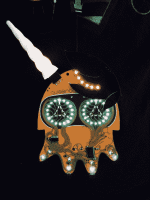

# 我们从 2016 年奎尔康徽章中学到了什么

> 原文：<https://hackaday.com/2016/08/10/what-we-learned-from-the-2016-queercon-badge/>

DEF CON 以创意电子徽章而闻名，现在我们每年都能看到各种各样的电子徽章挂在挂绳上。今年， [Queercon 徽章](https://blinkylights.ninja/blinky-lights/queercon-13-defcon-24-2016/)脱颖而出，成为最多人问“你从哪里得到的？!"又一次，[[埃文·麦凯](http://Blinkylights.ninja)，[乔治·卢森]，[乔纳森·尼尔森]和[杰森·佩因特]为这个为 LGBT 黑客和他们的朋友举办的[聚会颁发了一个令人敬畏的徽章。](https://queercon.org/)

徽章是一个鱿鱼形状，有一个俏皮的透明阻焊膜，印刷在黑色 FR4 上，并以自然弯曲的痕迹布线。乌贼的眼睛由六十个青色发光二极管组成，触须上有 RGB 发光二极管。眼睛做出表情，触须以可选择的模式发光。点击“墨水”按钮，使用板上的 2.4 GHz 无线电将你的模式发送到附近的所有设备，一组小连接器可以用来与其他徽章“配对”，以学习模式。是的，奎尔康徽章总是有暗示意味。

在玩了整个骗局之后，我们认为这个徽章对电子徽章设计师来说有一些很好的教训:

### 可变亮度

The Queercon Badge with Two Hats

这个徽章使用光电晶体管作为光传感器来测量环境光，并相应地设置亮度。超过 60 个发光二极管，这有助于两个 AA 电池持续几乎整个会议。

### 电源开关

这个徽章有一个电源开关。那个开关会关掉徽章。这可能听起来非常明显，但不幸的是，这在电子徽章上并不常见。这个开关意味着人们在晚上关闭徽章，当固件出现故障时，不必拔掉电池。

### 帽子！

徽章在乌贼的头上有两个扩展端口，用来添加帽子。这些都被赋予了权力，连接器规范在事件发生前发布。我们的最爱？里面有彩虹 LED 的独角兽角。

### 社会徽章很有趣

这是 Queercon 徽章连续第四次与其他徽章交流以解锁物品。这实际上是一种让人们互动的巧妙方式，并带来了一大堆暗示性的双关语。有人想做爱吗？

我们听说明年的徽章已经在工作中，我们期待看到这些人接下来会有什么。现在，你可以[获取所有硬件设计文件](https://blinkylights.ninja/blinky-lights/queercon-13-defcon-24-2016/)并为你自己的电子徽章制作获得灵感。