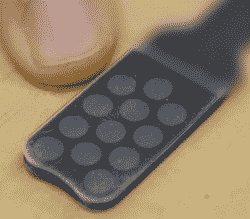

# 我们需要在触觉黑客中尝试什么

> 原文：<https://hackaday.com/2018/03/22/what-we-need-to-try-in-haptic-hacks/>

为你的触觉项目寻找灵感？YouTube 频道“每天都更聪明”的[Destin]从 HaptX 的工程师那里参观了他们的[全功能虚拟现实手套，具有惊人的触觉反馈](https://www.youtube.com/watch?v=s-HAsxt9pV4)，两者都具有非常精细的 120 点触觉，每个手指的力反馈，温度和运动跟踪。

Inflatable bladders for touch

在黑客中，我们通常通过振动皮肤来刺激触觉。戴上这种手套，他们利用气动原理来压迫皮肤。一个指尖有多个大约 1/8 英寸的气囊与之接触。每个气囊都是通过将空气压入其中而单独气动控制的。空气压力可以连续变化，使得气囊可以轻推、重推或两者之间的任何位置。手套上有 120 个这样的气囊分布在手指和手掌上。不幸的是，他们不允许他看到控制气动的阀门，但如果你正在寻找一种低频、低成本的方式来驱动阀门，你可能会考虑使用注射器的。工程师告诉[Destin],如果你的虚拟现实场景显示有东西压在你的虚拟手指上，只要你的触觉在大约 1/8 秒内压在你的真实手指上，你的大脑就不会注意到延迟。

他们还在研究利用冷热液体来感知手套内的温度。下面的第一个视频演示了这一点，当虚拟现实世界中的一条龙向他的手上喷火时，[Destin]感觉到了热量。幸运的是，其中一名工程师提到，我们的温度感觉是较慢的，它可以处理比触摸更长的延迟。我们可以看到在一个黑客中实现这一点，使用一个压在皮肤上的膀胱，同时管子通过它循环不同温度的流体。但是也许有一种用电的方法，可能是用热电模块，就像这个饮料冷却器一样？虽然安全问题可能会禁止。

提到的其他功能是每个手指的力反馈，以及使用磁性和光学方法跟踪指尖的自定义运动跟踪。不过剩下的就留给下面的视频吧。第一个是技术之旅，第二个是 VR 世界正在使用的手套。

 [https://www.youtube.com/embed/s-HAsxt9pV4?version=3&rel=1&showsearch=0&showinfo=1&iv_load_policy=1&fs=1&hl=en-US&autohide=2&wmode=transparent](https://www.youtube.com/embed/s-HAsxt9pV4?version=3&rel=1&showsearch=0&showinfo=1&iv_load_policy=1&fs=1&hl=en-US&autohide=2&wmode=transparent)

 [https://www.youtube.com/embed/OK2y4Z5IkZ0?version=3&rel=1&showsearch=0&showinfo=1&iv_load_policy=1&fs=1&hl=en-US&autohide=2&wmode=transparent](https://www.youtube.com/embed/OK2y4Z5IkZ0?version=3&rel=1&showsearch=0&showinfo=1&iv_load_policy=1&fs=1&hl=en-US&autohide=2&wmode=transparent)

我们感谢[Hassi]的提示。