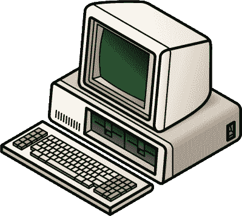
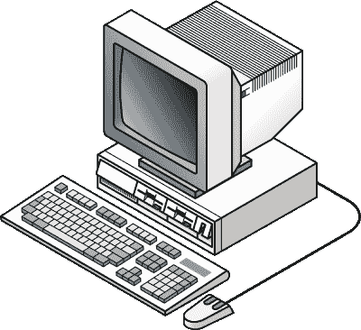
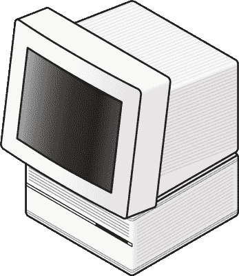
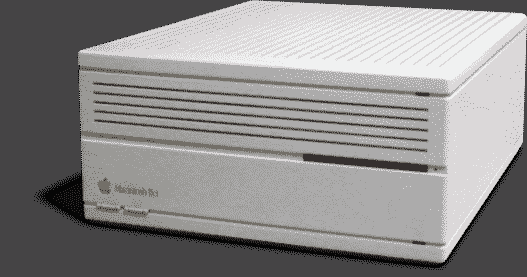
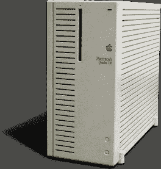
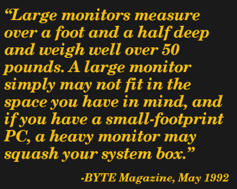

# 台式电脑到底怎么了？

> 原文：<https://hackaday.com/2018/02/16/whatever-happened-to-the-desktop-computer/>

如果你今天买了一台电脑，你最终可能会得到一台笔记本电脑。企业无人机的办公桌下塞满了信号塔。酷创意型的人在他们的开放式办公室里乱扔 iMacs。在任何一家电脑制造商的在线目录上找一找，你会发现只有三种类型的电脑:笔记本电脑、塔式电脑和一体机。快速浏览新蛋可以发现种类繁多的塔楼；你可以购买 ATX 全塔、ATX 中塔、微型 ATX 塔，甚至微型 ITX 塔。

事情并不总是这样。足够老的书呆子会记得台式电脑。这实际上是一座向一侧倾斜的塔。你可以把显示器放在上面，这样就不需要一堆教科书把你的桌面放在眼睛的高度。端口，你的 CD 驱动器，甚至你的花哨的 Zip 驱动器就在你面前。现在，台式电脑的时代已经一去不复返了，台式电脑已经成为历史。台式电脑怎么了，为什么专为水平放置设计的机箱如此难找？

The IBM Model 5150

### 家用电脑的黎明

从 IBM PC 时代开始，桌面计算机就是默认的。型号为 5150 的 IBM 装运时是一个米色的盒子，正面有两个 5 1/4 英寸的软盘驱动器，如果你付了钱，一个漂亮的 CGA 显示器就放在上面。

这台机器成为了整个 PC 行业的基础。英特尔 8088 处理器、兼容 PC 的 BIOS 和 ISA 扩展槽的组合成为标准，但 PC 本身的外形也成为标准。五年前发布的 Apple II 将主板和键盘放在一个盒子里，并为扩展槽留出了一些空间。一年前发布的备受争议的 Apple III 延续了这一传统，顶部集成了键盘和显示器。Commodore 当时的产品也是在一个外壳中集成主板和键盘。Trash-80 的外形与 Commodore 相同。这些是“家用”电脑，随着 IBM 个人电脑及其对商业用途的重视，最终出现了一种新的电脑类别:台式个人电脑。

The IBM PS/2

从最初的 IBM 5150 开始，桌面 PC 的设计不断发展。添加了 3.5 英寸驱动器，电源开关移至前端，架构也实现了合理的标准化。IBM 继其广受欢迎的 AT 和 XT 机器成功之后，推出了面向家庭的台式电脑 PCjr，以及后来的 IBM PS/2(不，不是端口，是计算机)系列。1984 年，首先向市场推出 IBM 兼容便携式计算机的康柏公司推出了 Deskpro 系列。这也是一个简单的米色盒子，背面有键盘和视频接口，可以水平放置在桌子上。戴尔紧随其后，Gateway 在它们的盒子上贴上牛印图案，每台电脑都是台式机。塔是存在的，是的，但是你能找到的每一个这种年份的塔都被降级为服务器或者至少是某种半无头的配置。那么这座塔是如何接管的呢？就像个人电子产品领域的大多数设计决策一样，从智能手机到可怕的安全漏洞，答案始于苹果。

The Macintosh IIci

### 苹果的设计影响力

最初的麦金塔是为了简单而设计的。没有扩展槽，也没有彩色显示器。将合理的高分辨率显示器、图形用户界面和漂亮的新型激光打印机结合起来，你就拥有了一台会成为出版业宠儿的机器。Aldus PageMaker 赚了一大笔钱，很快就出现了对更大显示器和更多扩展槽的需求。随着史蒂夫·乔布斯的离开，苹果公司会给 Mac 购买者想要的东西，这才是有意义的。

这款新的模块化麦金塔电脑是该公司的新曙光，电脑的设计严重依赖于当时标准的台式 IBM 兼容个人电脑。Macintosh II 于 1987 年发布，它的特点是一个米黄色的盒子，前面有 3.5 英寸的磁盘，后面有电源和视频连接器，内部有六个扩展槽，一个显示器放在由 Frogdesign 创始人哈尔穆特·艾斯林格设计的一块塑料板上。Macintosh II 之后是 IIx，后来是 IIcx，一个只有三个扩展槽的精简版本。IIci 被设计成一台台式电脑，其标志和品牌印在正面。

1991 年末，苹果公司推出了基于摩托罗拉 68040 的高性能计算机新系列。Macintosh Quadra 从 Quadra 700 和 Quadra 900 开始，分别是中塔式和全塔式。与这些显示器一起推出的是一个新的显示器系列，包括巨大的苹果 Macintosh 21 英寸彩色显示器，这是一个支持 1152×870 分辨率的巨大 CRT 显示器，价值 4600 美元，重 80 磅。我们已经走过了漫长的道路。

21 英寸彩色显示器是苹果对第三方生产的大尺寸显示器的回应。尽管第三方显示器从 Mac Plus 时代就开始销售(这是一个有趣的硬件黑客故事)，但随着模块化 Macintosh II 的发布，市场开始繁荣。Radius 发布的全页显示(FPD)给了 Macintosh 真正的所见即所得桌面出版；FPD 在屏幕上显示了一整张 8.5×11”的纸，没有滚动。Radius 随后推出了两页显示器和 sublime Radius Pivot Monitor，这是一种可以旋转 90 度的 CRT 显示器，可以将计算机的桌面方向从水平布局改为垂直布局。

  The Macintosh IIci  The Macintosh Quadra 700

### 壁球箱

这些第三方显示器有问题。像所有的 CRT 一样，它们很重，而 Macintosh II 很大。如果你曾经用过 Mac II，你会发现它的外壳顶部几乎没有结构支撑。当默认显示器是重量不到 30 磅的 13 英寸 CRT 显示器时，这不是问题，但是将 80 磅的显示器放在桌面上会使塑料外壳破裂。随着 Quadra 700 和 Quadra 900 的发布，苹果根本无法推出一款配有与儿童一样重的显示器的台式电脑。它会在强大的力量和 5700 美元的基础价格的重压下崩溃。

从无处不在的台式电脑到塔式电脑，Quadra 700 的重要性不容小觑。尽管 700 是一台更强大的工作站级机器，但它与早期的 Macintosh IIci 和 IIcx 有着惊人的相似之处。这不是一个错误，所有三台机器共用一份维修手册。除了塑料的一些变化，在 Quadra 上添加了可移动的直角橡胶脚和旋转的标志，这些情况都是一样的。那么，为什么会发生变化呢？

最简单的解释是，这样消费者就不会被诱惑把他们的 21 英寸显示器放在这么小的盒子上。这是你能得到的最清楚的证据，证明 CRT 的重量是一个行业从台式电脑转向塔式机箱的原因。苹果公司要对这一变化负全部责任吗？不，在 Macintosh Quadra 推出之前，towers 已经存在了十年。不过，这与为 14 英寸显示器设计的外壳在 21 英寸显示器上翻转的情况相同。没有比这更能证明工程决策考虑显示器重量的了。

### 无处不在的塔楼的极大讽刺

上 Newegg，点击/r/buildapc，并尝试找到一个桌面案例。它们是存在的，我在野外见过它们，但你要找到它们可要费很大的劲。你更有可能找到为基准测试而制造的开放式机箱，或者看起来像是从外星人卵囊里出来的奇怪形状的机箱。你会发现最接近传统的“顶部显示器”的东西是媒体电脑盒，它可以放在电视机下面的有线电视盒旁边。

有一个流传已久的笑话说，大学生每学期至少要花 500 美元在显示器支架上，以教科书的形式。至少可以有一百个巨大的显示器支架，立式办公桌的兴起趋势在一定程度上是对符合人体工程学的眼睛高度的显示器的回应。这里缺少了一些东西，只需将显示器放在机箱上就可以解决这些问题。

当然，对于接近一百磅重的 CRT 来说，这是不可能的。我们至少已经过了 15 年，现在我们已经享受轻薄的液晶显示器有一段时间了。机箱确实可以再次支撑显示器，但我们只剩下一个放在桌子下积灰的盒子。这是一种技术失忆症，最有可能是建立在拖着一个巨大的 CRT 到处跑的记忆上。不幸的是，机箱制造商仍然在运行只有塔式机的模式，对于任何想要台式机的人来说，最好的解决方案是拆除旧的 Packard Bell 机箱。它可能是米色的，但对一些人来说，它更实用。