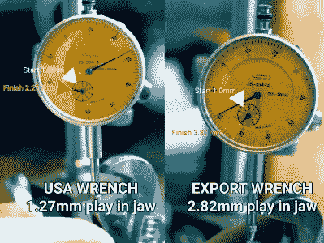
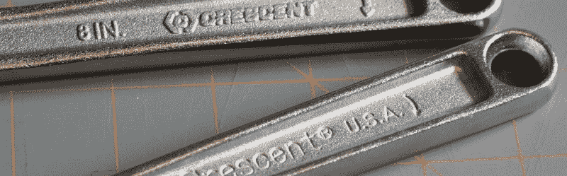
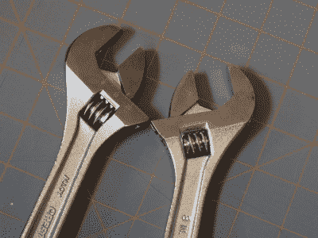

# 工具里有什么？美国制造的一个案例。

> 原文：<https://hackaday.com/2016/01/18/whats-in-a-tool-a-case-for-made-in-usa/>

很多人认为买美国、德国、日本、瑞士等国制造的工具不会错。他们发誓任何中国工具都将是垃圾，不值得购买。现在，任何一个明眼人都会说，“等一下，为什么？中国有巨大的经济，有经验的人，有能力使用所有可怕的化学物质来制造最好的钢铁。为什么他们的工具会比我们的更好或更差？”这是一个非常有效的论点。有许多中国工具是世界上最好的。我们在商店里看到的大部分东西都不是。所以有什么区别。为什么一个能做出最好的工具的国家却做不出最好的工具？当然，这不仅仅是削减成本。是文化吗？我想提出的观点是，这是一个设计意图沟通的问题。

我在工业界当过工程师。优质产品和劣质产品之间的一个共同点是，“设计产品的人参与了产品的制造吗？”如果将设计意图注入到原始产品中的人积极参与并致力于该产品的执行，那么该产品就有更大的机会成为好产品。或者换句话说:外包不会产生一个糟糕的产品，因为制造产品的新人不在乎。它制造了一个糟糕的产品，因为理解产品背后意图的人脱离了产品的执行。

As you can see the export made crescent wrench is not made to the same tolerances as the previous wrench.

我们以月牙扳手为例。月牙扳手过去是美国制造的。在过去的几年里，他们已经开始在中国生产。我们可以马上发现许多视觉差异。新的月牙形扳手有一个不同的形状，标志已经改变，标志的冲压是不可靠的，更糟糕的是，工具不像以前那样好操作。下颚没有那么硬，而且摆动得更多。发生了什么事？新月怎么能把他们的旗舰搞得这么糟糕。毫无疑问，他们只是想削减成本，而不是降低质量。这本身并不可耻

月牙扳手发生了什么，任何一个以前看过一个产品从设计到执行的人都很容易解释。美国的一家工厂着手制造一种优质的活动扳手。数百名工程师和员工在一栋大楼里工作，制造一把好扳手。当他们的机器不工作时，他们想出了解决办法。当他们的质量不足时，他们实施更好的过程。他们有一份可信供应商的名单。他们可以保证，当产品推出时，他们的愿景和意图会渗透到进来的材料中。随着时间的推移，所有这些人的意图和意志都聚集在一个地方。

Low quality finish and forging can be seen. A higher grit sandblast means less finishing was needed before the sandblasting step. Note the clarity of the logo. One is cast and one is stamped. The stamping of a logo was an extra step, and while casting it ensures that some damage to the logo will occur during the forging and sandblasting steps; it reduces cost.

当 Crescent 更换制造商时，我们可以很容易地预测所犯的错误。"嘿，既然我们要换供应商，就让我们稍微改变一下设计吧，它已经过时了."所以他们雇了一个设计师。“哎，标识旧了，我们换个新的吧。”所以他们又做了一个小小的改变。“哦，供应商回复我们说，新的锻造工具将会是几百万美元，但是如果我们修改他们库存中的一种形状，我们可以节省一半的费用！”干得好，詹金斯，你把公司经营得很好。像这样的小变化和协商忽略了扳手最初的设计意图。这些错误通常不是邪恶的，它们只是缺乏对产品的哲学理解，以及这些年来对产品的投入。他们会因为错误和无意的忽视而失去所有的意志和意图。

我想指出的是，同样的事情也可能发生在一个存在时间太长的产品上。现在，Starret 的许多顶级百分表卡钳都使用塑料表盘环，而不是金属表盘环。它越来越弱，越来越差，虽然它对仪器的测量能力没有真正的影响，但在手中感觉更差。这是一个公司不与自己沟通意图的例子。因为没有正确解释而改变产品的目标。我怀疑那里的任何人开始制造更差的产品，他们只是看到了省钱的好方法。失去了让产品变得伟大的东西的价值。

有点像那个[破窗](https://en.wikipedia.org/wiki/Broken_windows_theory)。在第一扇窗户被打破之前，一个废弃的街区和工厂将会保持几年的平静。其他人很快跟上，这个地方陷入混乱。

The addition of gimmick features are often a good indicator of a quality drop. A scale on an adjustable wrench is next to useless in its common operation. The advertised larger thumb-wheel in us makes the wrench easier to knock out of adjustment than helps the user put it into adjustment. Also, the jaws have increased in thickness, making previously accessible bolts unaccessible. Thin jaws are one of the features of a properly forged and tempered wrench. My bruised knuckles are a testament to this.

那么，利用这些知识，你能仅仅通过阅读产品的描述来了解产品的质量吗？嗯，大部分是的。很抱歉我不能让你觉得这更科学，但其中一些是围绕着培养良好的直觉。查看产品的设计意图有多少融入了产品描述是一个好方法。苹果在这方面很棒。苹果谈论他们制造的每件产品的材料、[电路、](http://hackaday.com/2015/05/20/tearing-down-the-apple-watch/)、工艺和[设计意图。它显示在最终产品中。没有人可以否认苹果的产品不漂亮。它们并不完美。操作系统是好是坏，是不是“最好的”—也许吧。现在，如果你看看竞争对手的产品，比如一款来自深圳的廉价 HiQ。你读到了产品能做什么，它的价格是多少，但不知道它的意图。](https://www.youtube.com/watch?v=IbWOQWw1wkM)

你也可以用螺丝刀来做。让我们比较一下港口运费和 Snap-On。两个质量等级完全不同的工具制造商。

你可以看到公司对他们产品的自豪。匹兹堡说“这是一个廉价的普通材料制成的螺丝刀。”这就是他们的设计意图。这没有错，但目的是价格不是螺丝转动。然而，Snap-On 说“这就是为什么我们做了我们所做的事情，这就是为什么我们做得最好”他们的意图是一个转动螺丝的装置。你可以感觉到每个人都想做一个好的螺丝刀，这表现在他们的产品中。

Note how harbor freight mentions what the tool does and snap-on mentions why it does its function better.

最后，我想指出中国公司确实生产了一些好东西。所有这些待售的 Harbor Freight、Princess Auto 等铣床实际上是一家名为[傅蓉](http://www.rongfu.com/en/Milling-Drilling-Machine/RF-45.html)的中国公司的仿制品。他们的工厂相当不错，因为该公司的设计意图接近其生产。同样，他们有更高的价格来匹配。虽然我听说，有点讽刺的是，傅蓉外包他们的铸件从原来的台湾商店搬到 mainland China，看到质量下降。我还应该提到德高望重的[里戈尔](http://hackaday.com/2014/10/22/how-to-reverse-engineer-featuring-the-rigol-ds1054z/)，他的示波器我们都知道并且喜爱。他们有自己国家制造的大量仿制品，但没人能否认他们的瞄准镜不出色。最后我想提一个成功外包的美国公司: [SawStop](http://hackaday.com/2013/10/23/table-saw-kickback-video-ends-badly/) 。虽然他们的机器是在台湾制造的，但他们专门在那里建立了工厂，并不辞辛苦地安装了工程师、经理等。以确保产品的设计意图得以实现。

所以下次你买工具的时候。检查它是在哪里制造的并且问你自己。理解该工具意图的人是否参与了该工具的制作。这与他们的设施无关。从来没有 3d 打印过的人不能成为一个好的打印机。一个制造卷尺的公司，但是没有雇佣使用卷尺的人，是不会制造出好产品的。他们只会擅长制作卷尺。一个公司能够[在那些有意图的人的控制下](https://www.youtube.com/watch?v=9JkyJaYuLpo)的步骤越多，产品就越好。包装上有提到他们的骄傲吗？我能从精度上看出它是用什么做的吗？我能把它比作更少或更多的东西吗？这是增加你买到好东西的机会的最好方法。意图是制造好产品的要素，而不是一个国家，其他一切都只是顺其自然的融化的石头和恐龙。