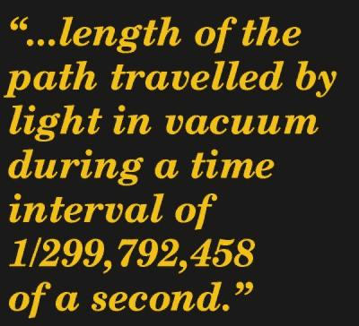

# 帝国制度到底有什么不好？

> 原文：<https://hackaday.com/2017/01/13/whats-so-bad-about-the-imperial-system-anyway/>

作为一名博客写手，你永远无法预测你的帖子会被评论到哪里。有些帖子似乎被忽略了，而另一些帖子却有源源不断的有用反馈。但有时评论会突然爆发，进入看似未知的领域，与最初的帖子关系不大。

例如[【Steven Dufresne】最近关于十进制时间](http://hackaday.com/2016/12/14/set-your-clocks-to-decimal-time/)的帖子，其中的评论迅速成为关于公制和英制单位孰优孰劣的激烈辩论。当我读这个帖子的时候，我回想起 reddit 上各种抨击帝国体系的无数类似的无关痛痒的评论，并决定适可而止。我发现对帝国制度的憎恨很大程度上是没有根据的，所以我想站出来为它辩护。

Did you measure that room in ‘feet’, or in ‘flip-flops’?

究竟什么是单位制？本质上，只是一种衡量世界的方式。我可以很容易地用我的脚测量房间的长度和宽度，从头到脚。我们大多数人可能在某个时候都这样做过，尽管处理你的下半身分裂有不方便和潜在的痛苦问题，但这是一个完全有效的方法，尽管有点不精确。例如，你可以很容易地步测出房间的长度，并复制这一测量来切割一块地毯。用你自己的单元去家庭中心买现成的地毯并不困难——你可能会看到一些奇怪的东西，但是你会随身带着你自己的测量尺。

当你试图把你的单位和不拥有你的脚的人联系起来时，麻烦就来了。试图在网上订购地毯，你会遇到麻烦。因此，除了简单地给我们提供测量世界的工具之外，单位系统需要标准化，这样每个人都可以测量同样的东西。将贸易扩展到自治领之外，人们可以参考国王手臂的长度，并让另一方理解这一点，首先是帝国体系的一个重要驱动力，然后是公制体系。这似乎是人们对美国顽固坚持使用我们的英尺、加仑和蒲式耳的一大不满。

## 我们说的有多荒谬？

关于英制单位是基于前面提到的王臂这种可笑的东西的论点？当一米最初被定义为从北极到赤道距离的千万分之一时，这不是一个争论。即使相对于真空中的光速或氪-86 发射的波长进行了严格定义，该仪表也是基于将使用 is 的人完全无法理解的现象，并且与他们的日常生活无关。至少每个人都见过大约一英尺长的脚。

他们说，在英制单位和国际单位之间进行转换既繁琐又容易出错。真的吗？也许我会接受一百年前，甚至五十年前的观点。但是随着技术的普及，一秒钟可以处理数百万次数学运算，这块骨头上的肉就不多了。我承认，如果每个人都在同一个系统上，这是一个不必要的额外步骤，而且它可能会导致舍入误差，这将在大量交易中增加相当多的金额。但即便如此，为什么这不被视为一个机会呢？看看金融市场——每天都有数十亿美元在货币兑换的“垃圾”中赚取。我发现不太可能有人还没有找到从单位转换中赚钱的方法。

我经常看到的另一个争论点是，英制单位毫无意义。是的，这是真的，我们有有趣的单位，如鳃、猪头、棒和链。但那又怎样？大部分英制可以归结为一些常用的单位，如英尺、加仑和磅，而曾经支持专业贸易的更奇怪的单位——测量员有他们的杆和链，药剂师有他们的德拉姆和谷物——现在已经从日常生活中大量废弃了。

## 处理它

对于仍被普遍使用的单位，我经常听到的抱怨是，“为什么我要被迫记住法定英里有 5280 英尺？为什么会有不同的海里？为什么一英尺有 12 英寸？一加仑有四夸脱，这有什么意义？”诸如此类。对此，我爽快的回答是，“那又怎样？”如果你不是帝国系统的日常用户，那么就不要用它来烦自己。坚持公制——我们不在乎。

如果你被公制化了，出于某种原因你不得不使用英制单位，那么做很多美帝不得不做的事情——处理它。我是一名科班出身的科学家，因此完全适应国际单位制。当我做钳工的时候，我每天都要用克、升和米来衡量。当我开车回家的时候，我看到了(并且很大程度上遵守了)以英里/小时为单位的限速标志。没有问题，没有尴尬的路边对话，一名警察解释说，我仍然在用公制思维，认为我的里程表上的 88 实际上是公里/小时，我实际上是 55 英里/小时。如果我在商店停下来买一加仑牛奶和几磅碎牛肉作为晚餐，我不会感到困惑，即使我在订单中加入了一瓶 2 升的苏打水。

一天下来，我真的看不出有什么大惊小怪的。英制和公制都有自己的位置，每个系统似乎都做得很好。如果你的论点是，帝国单位是不优雅和笨拙的，即使你是正确的，我不认为这足以动摇帝国的顽固分子。如果你只是因为我们固执己见而不愿意加入开明的公制群体而感到沮丧，那么我认为你可能会在未来很长一段时间内感到沮丧。