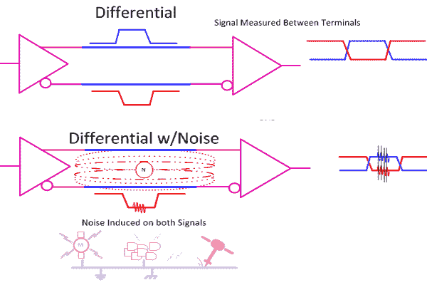

# 当差异很重要时:差分信号

> 原文：<https://hackaday.com/2016/03/29/when-difference-matters/>

我们已经讨论了一系列逻辑和互连技术，包括 TTL、CMOS 和各种低压版本。所有这些技术都有一个共同点，即它们都是单端的，即信号是以高于地面的“高”或“低”电平来测量的。

这对于简单的使用来说是很棒的。但是，当您开始谈论速度、距离或两者时，单端解决方案看起来就不那么好了。为了介入并传递火炬，我们有不同的信号。这是 LVDS 的“DS ”,只是整个行业的通用标准之一。让我们看看差分信号与单端信号有何不同，这对工程师和用户意味着什么。

## 单端的

  Single Ended: TTL, CMOS, LVTTL, Etc.  Single Ended and Sources of Noise

总的来说，TTL、CMOS 和 LVTTL 等标准被称为单端技术，它们有一些共同的不良属性，即接地噪声直接影响噪声容限(噪声容许量的预算)，任何对地感应噪声也会直接增加总噪声。

通过将电压摆幅提高到更高的电压，我们可以使噪声看起来更小，但速度会受到影响，因为更大的电压摆幅需要更多时间，尤其是我们有时看到的那种电容和电感。

## 差别

进入差分信号，我们使用两个导体，而不是一个。差分发射器产生信号的反相版本和同相版本，我们严格在两者之间测量所需信号，而不是接地。现在，接地噪声不算(大部分),两条信号线上感应的噪声被抵消，因为我们只放大两者之间的差异，不放大任何共同点，例如噪声。

 [https://www.youtube.com/embed/DivVHJD_1Lg?version=3&rel=1&showsearch=0&showinfo=1&iv_load_policy=1&fs=1&hl=en-US&autohide=2&wmode=transparent](https://www.youtube.com/embed/DivVHJD_1Lg?version=3&rel=1&showsearch=0&showinfo=1&iv_load_policy=1&fs=1&hl=en-US&autohide=2&wmode=transparent)

## LVDS、CML 和 LVPECL

有各种各样的标准，比较常见的有低压差分信号 EIA/TIA-644 (LVDS)、电流模式逻辑(CML)和低压正发射极耦合逻辑(LVPECL)。一般来说，差分信号的其它例子包括较老的 RS-422/485，其用于扩展被称为 RS-232(“标准”串行端口)的普通单端信号的范围。

LVDS 还用于串行 ATA (SATA)、Firewire、千兆以太网和 PCIe，并经常用于与 LCD 面板通信。CML 是 HDMI 的底层技术，顾名思义，它使用电流而不是电压。

演示 LVDS 信号的一种快速方法是利用许多 FPGA 和 CPLD 的输出可根据接口标准类型进行编程的事实。

## CPLD/FPGA 作为演示

首先，我们从 25Mhz 主时钟开始创建一个快速计数器，我使用了一个顶层的示意图条目:

在制作视频时，我创造了许多不同的输出给自己选择，但最终只使用了 25Mhz 的时钟版本。

接下来，我们转到零件的分配编辑器，只需选择 LVDS 作为引脚类型。通过选择一个引脚，它会自动分配一对引脚来完成差分路径。

 在这个 CPLD 中，实际上只有一个差分标准可供选择(LVDS 完成)。其它 CPLD/FPGA 的选择范围可能更广，可能需要使用外部电阻或其它元件，具体取决于器件和所选标准。它们还可能要求在一组引脚中或沿零件的整个一侧使用相同的标准。

## 示意图

 此处所示为 PCB 原理图，显示了引脚分配，插页显示了差分信号的带状电缆引脚排列。请注意 30 针带状电缆连接器上差分对之间散布的接地连接。

## LVDS

LVDS 标准是在被称为终端电阻的路径末端的电阻上产生 350mv。选择该值以最佳匹配信号路径的阻抗，对于电缆和 PCB 布局，典型值在 100-120 欧姆之间。随着速度的提高，我们越来越重视计算和控制整个路径的阻抗。

 这里所示的工作台上的例子没有接收器，只有终端电阻。在这些速度和这种类型的应用中，最好省去示波器探头上的长接地线，这里显示的是滑入式接地夹。

## 界定范围

使用示波器内置的数学功能，我可以通过从一个信号中减去另一个信号来模拟差分接收器中发生的情况。两者共有的任何东西，有时称为共模噪声或共模成分，都会被这种减法抵消。如果辐射噪声同等地影响两根导线，噪声消除效果会很好。为此，扭转电缆导体等技术是常见的，每英寸扭转次数越多，降噪效果越好，但成本、重量增加，灵活性降低。

这里显示的是各个轨迹，然后叠加，再求差值，最终重建的波形为红色。

## 一些标准

Some of the common differential standards.

请记住，我们这里讨论的只是物理信令，不包括转换最少的编码方案，也不包括时钟和信令嵌入数据流的编码方案。

为了优化高速性能或帮助从一种标准转换到另一种标准，可以通过使用与数据流串联的电容器来采用 DC 阻塞。DC 阻塞还允许接收机正好工作在 DC 偏置区域，这最有利于降低噪声和“抖动”之类的东西，抖动是信号中的可变延迟。

## 交流去耦

## 

然而，去除 DC 分量，即交流耦合信号，是有代价的。交流耦合要求信号始终处于运动状态或有规律地发生转换。

如果编码方案通过信号的跳变来表示逻辑“1 ”,通过无跳变来表示逻辑“0 ”,则交流耦合要求每隔一段时间发生一次最小的跳变，以便信号的 DC 基线不会漂移。如果没有通过串联电容耦合的交流转换驱动输入从a 高到低，电压将衰减并漂移到不可用的值。

## 编码

8b/10b 编码方案使用 10 位符号来表示 8 位数据，同时将一些转换“填充”到流中，使得没有转换不会过去太多时间。多年来，电信公司一直使用这种方案，利用差分信号通过双绞线长距离发送信息。

## 现货供应

各种技术中有各种各样的分立驱动器和接收器，正如您所料，供应商的网页提供了出色的产品选择工具。在过去，我们必须阅读或至少浏览关于该主题的每一份数据手册至少一次，然后通过仔细消化规格来缩小搜索范围。这里是 [TI 的优秀选择器](http://www.ti.com/lvds)，其中也包括曾经的国家半决赛:

## 结论

正如你所料，如今互联网上有大量的可用数据。我最喜欢的一本是 LVDS 用户手册，它可以从很多供应商那里买到。我在实验室里保存了一份复印件。

希望这开始把一个工具放入你的工具箱:如果你需要走得快，远或通过一个嘈杂的环境，然后考虑差分信号。