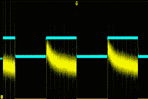
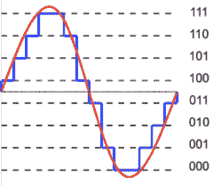

# 10 位 A/D 什么时候是 8 位 A/D？

> 原文：<https://hackaday.com/2017/12/06/when-is-a-10-bit-a-d-an-8-bit-a-d/>

营销人员喜欢更大的数字。越大越好，对吗？毕竟，赛百味称之为“一英尺长”，而不是 11 英寸。所以说到模数(A/D)转换，位数越多越好，对吗？嗯，那要看情况。很容易理解，A/D 将具有低和高测量值，低测量值将为零计数，高测量值将导致位数的最大计数。也就是说，8 位设备的最高值为 255，10 位设备的最高值为 1023，依此类推。

问题是:那些比特有意义吗？答案取决于几个因素。像我们处理的大多数组件一样，我们的理想模型不是现实，但也许它足够接近。

## 基本原则

模数转换器的概念非常简单。取某一电压范围内的模拟信号，并将其转换为数字信号。假设我们讨论的是线性转换，通常是这样，但并不总是这样，那么数字的范围将对应于电压的范围。

换句话说，如果 A/D 可以产生 0 至 100 的计数，电压范围为 0 至 1 V，则 100 的计数为 1 V，50 的计数为 0.50 V，12 的计数为 0.12 V，但在现实生活中，大多数情况下会使用 2 的幂计数来最大化分辨率。也就是说，8 位 A/D 的范围从 0 到 255，10 位从 0 到 1023，依此类推。

理论上，电压范围可以是任何值。有时是 0 V 至 5 V，也可能是-2.5 V 至 2.5 V，有时基准电压会被计数整除，例如 4.096 V。

 假设您有一个范围为 0 V 至 4.096 V 的 10 位模数转换器，至少在理论上，每位值为 4 mV。然而，假设您的电路受到+/-24 mV 噪声的影响。那么即使 A/D 是完美的，你真的不能相信最后两位。这似乎是显而易见的，所以保持你的系统噪音低。转换器只能转换它看到的东西，它不是读心术。如果你用望远镜放大一个干净的方波，你会看到很多上下波动。事实上，右边的图像显示了一个蓝色的方波，并且同一个方波的顶部(黄色)被放大了。模数转换器会忠实地记录这些微小的不规则现象。问题变成了:这个噪音是从哪里来的。显然，系统中的噪声超出了模数转换器的控制范围，但这只是其中的一部分。

## 责备游戏

 问题是你的模数转换器一开始就不完美。很明显，即使它是完美的，模数转换器也不能分割最低有效位。也就是说，在上面的例子中，测量 1.000 V、1.001 V 和 1.002 V 不太可能得到不同的值，即使没有固有的系统噪声。这是量化噪声，看起来是——在本例中，输入端的噪声为+/-2m V，因为量化电平为 4 mV。你可以在左边看到这个图表。

我将跳过数学计算，但您可以确定，对于大于 1 位值(本例中为 4 mV)的信号，噪声为 1.76 dB。对于给定的字长，您可以用它来获得理想的信噪比(SNR)。该公式计算出 B 的 6.02 倍(其中 B 是位数)。记住，那是理想的——你甚至不会得到那么好。因此，我们的 10 位模数转换器的性能不会超过 60.2 dB。顺便说一下，如果你需要复习一下数据库，[我们已经复习过了](https://hackaday.com/2017/03/07/saved-by-the-bel-understanding-decibels/)。

考虑一下:如果理想模数转换器的信噪比为 6.02 dB 乘以 B，那么很明显，如果我们有一个实测信噪比的实际模数转换器，我们可以通过重新安排数学计算来计算出它有多少“理想”位。这是数据手册上的“有效位数”ENOB。要获得 ENOB，从测得的 SNR 中减去 1.76，然后除以 6.02。顺便说一下，你通常会听到 ENOB 发“E 旋钮”

假设我们的 10 位模数转换器测得 SNR 为 51.76 dB。那么 50/6.02 = 8.3。我们的 10 位器件仅比分辨率为 8 位的理想模数转换器稍好一点。

请记住，这种噪声只是由模数转换器中的阶跃引起的，实际模数转换器中还有其它噪声源，包括电阻等元件的噪声和其它噪声源。

还有其他更微妙的误差来源。转换中的非线性就是一个例子。本质上，对应于一位的电压变化在整个测量范围内可能不同。虽然本例中计数的标称值为 4 mV，但一端可能为 3.95 mV，另一端可能为 4.02 mV。

另一个问题是时钟抖动。你总是以某种速率采样。也就是说，您可能每秒采集 10，000 个样本或 100 万个样本，但总会有一些离散的时间步长。在较低输入频率下，采样时钟可能相当不稳定。然而，随着频率的上升，时钟的任何抖动都会导致比量化噪声更高的误差。

随着计数增加，时钟抖动甚至会成为更大的问题，因为分辨率更高，量化噪声也更低。例如，对于 8 位转换器，1 kHz 正弦波不会产生任何误差，除非抖动超过 1.24 微秒。对于相同的输入，12 位转换器需要将抖动控制在 77.7 纳秒以下。当然，随着信号频率上升，最大容许抖动会下降。100 MHz 时，8 位转换器需要将抖动保持在 12.4 皮秒以下，12 位器件则需要 0.78 皮秒。

虽然下面的视频讨论的是 PLL 系统中的抖动，但抖动的背景信息通常是有用的。如果你想知道抖动和漂移的区别，你可以看看这个视频。

 [https://www.youtube.com/embed/anAKfZZkHfc?version=3&rel=1&showsearch=0&showinfo=1&iv_load_policy=1&fs=1&hl=en-US&autohide=2&wmode=transparent](https://www.youtube.com/embed/anAKfZZkHfc?version=3&rel=1&showsearch=0&showinfo=1&iv_load_policy=1&fs=1&hl=en-US&autohide=2&wmode=transparent)

## 抖动

噪音不好，对吧？不总是。事实证明，在处理音频或图像时，量化有一个不幸的副作用。考虑一个简单的例子。假设您有一个转换器，每个计数为 0.1 V，您测量的是一个重复信号，其值为 0.09 V、0.10 V、0.11 V 等等。在此范围内，您只能读取 0.1 V 和 0.2 V，您选择的精确舍入方式将决定哪些读数被归类为 0.1，哪些读数被归类为 0.2。如果信号是音频，甚至是图像，如果你重建信号，你的大脑会挑选出模式。例如，在图像中，您可能会看到原始图像中没有的一种颜色的条纹。

如果音频工程师出于同样的原因要减少样本量，他们也会做同样的工作。下面的视频涵盖了这一点，同样的想法也适用。在我们的例子中,“舍入”不是减少样本大小，而是采样一个点，并让它代表信号的范围。

 [https://www.youtube.com/embed/zWpWIQw7HWU?version=3&rel=1&showsearch=0&showinfo=1&iv_load_policy=1&fs=1&hl=en-US&autohide=2&wmode=transparent](https://www.youtube.com/embed/zWpWIQw7HWU?version=3&rel=1&showsearch=0&showinfo=1&iv_load_policy=1&fs=1&hl=en-US&autohide=2&wmode=transparent)

解决这个问题的方法是在输入流中注入正负半比特的白噪声。在上面的例子中，你可以注入+/- 0.05 V，这将随机导致一些值向上舍入，一些值向下舍入，没有可辨别的模式。对这些值求平均值实际上可以提高分辨率。

通常，噪声会出现在系统其余部分寻找的频率范围之外，因此很容易滤除。在 ADI 公司的这篇短文中，您可以了解有关该技术的更多信息以及有关模数转换器中噪声源的许多其他细节。如果你想知道更多关于 ENOB 的事，TI 有下面的视频。

 [https://www.youtube.com/embed/g1MjXj3PQnM?version=3&rel=1&showsearch=0&showinfo=1&iv_load_policy=1&fs=1&hl=en-US&autohide=2&wmode=transparent](https://www.youtube.com/embed/g1MjXj3PQnM?version=3&rel=1&showsearch=0&showinfo=1&iv_load_policy=1&fs=1&hl=en-US&autohide=2&wmode=transparent)

## 拿你知道的…

所有这些位计算都很有趣，但另一个更有趣的话题是这些转换器是如何工作的(当然，反之亦然)。我以前的数学老师常说“用你知道的去发现你不知道的。”当我与任何转换器打交道时，我总会想起这句话。我们的计算机擅长计数和计算时间。它们不擅长测量电压、电流、温度和其他真实世界的量。因此，大多数转换器以某种方式将这些量转换成计数或时间。例如，逐次逼近型转换器会将计数转换为电压，并将其与未知电压进行比较。一个未知电阻可能与一个电容器形成时间延迟，计算机可以测量该时间。

我想多谈谈模数转换器架构，但[Bil Herd]已经很好地讨论过了。如果您感兴趣，它并没有涵盖所有可能的转换器类型，但解释了您最有可能看到的类型。

就像您在计算中跟踪有效数字或在其他设计中考虑实际元件的不准确性一样，构建——甚至使用——有效的模拟转换器需要您充分理解数学，不要相信甚至转换没有任何意义的位。

照片致谢:

量化误差正弦波-【风信子】 [CC 乘 SA 3.0](https://creativecommons.org/licenses/by-sa/3.0) 。