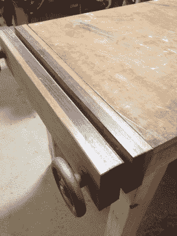

# 哪里有木材店，哪里就有黑客空间

> 原文：<https://hackaday.com/2017/07/28/where-a-wood-shop-goes-a-hackerspace-follows/>

我当地黑客空间的 2×4 竞赛引起了我的兴趣。挑战是用一个 8 英尺 2×4 英寸的单间来建造一些很酷的东西，获胜者可以在这个空间里获得免费的木材储存。我对一个项目有一点想法，但我没有时间了，甚至没有开始。我的想法是把木板切成一半厚的长条，用饼干把它们边对边粘在一起——基本上就是做更宽更薄的木板，做一些很酷的东西。

其中一个条目如上图所示。[Jon Alt]为他的智能手表设计了这款时钟和手机充电器，其中包括一个电容充电器。他利用 2×4 的纹理制作了一个华丽的外壳，雕刻掉了前面板的后部，只剩下一张信用卡厚度的木头，让 7 段可以透过来。其他参赛作品也很棒，我尤其喜欢 2×4 吉他。

T2:这次比赛最让我感兴趣的是它所展示的木材店:感谢志愿者和董事会，木材店经营得很好。事情正在发生！悲伤的木材店不举行比赛。推而广之，当商店做得好的时候，意味着黑客空间也做得好。

木材店是工具驱动的黑客空间的一部分。它不仅仅是志同道合者的聚集地；人们会去使用他们买不起的特定工具，让我们面对现实吧，总有一些工具要花很多钱才能买到。

我见过这个特别的商店开始是一个空的混凝土房间，有一个便宜的钻床和某人的旧带锯。很快工作台、架子和储藏室就建成了。更多的工具来了，有些是捐赠的，有些是借的，有些是用会费买的。那么其他空间如何复制这个木材店的成功故事呢？

黑客工厂有一台由董事会出资的凿榫机。纺锤形打磨器是借来的，据传立式锯子也是，尽管它至少从 2013 年就在这个领域了。一家隔音镶板公司捐赠了一个隔音盒，用来放置砂带磨光机的车间真空吸尘器。随着每一次捐赠、贷款或购买，商店变得更加强大。原因如下:当空间表现良好时，董事会就有钱购买新工具。很酷的工具吸引了想要使用它们的新成员，所以大家都赢了。

我特别喜欢看到公共项目被用来改善空间。木材店的伙计们为他们收集的积木搭建了一个可爱的架子，老实说，我从来没有见过更好的方式来展示这些笨重的工具。[Jon]在 Benchcrafted 捐赠的硬件上组装了一个 Moxon 老虎钳(左图)。我们买了一个锯挡块，很快就用烧坏的弹壳填满了一面墙。

不太优雅但同样有用的是，商店的常客为商店的大量管夹收藏建造了一个架子，这是他们一天建造项目的一部分，鼓励成员在离开前实际完成项目，在许多情况下允许项目实际完成。

 Of course, the wood shop folks don’t just build stuff for their own department. Those tools get used to build out areas in the space, from sawing beams for the finishing room to rehabbing the old office into a laser room. Those tools donated to one department absolutely help others.I suppose you could say that it’s true of all departments: you grab a meter from electronics to test the wiring on the room you’re building out, or get the metal folks to weld together a bike rack. But for me, the wood shop leads the way. The barriers for participation are low, the specialized tools are many, and there are so many uses for the shop beyond simply building one’s own projects. Maybe the wood shop is the soul: if it’s healthy the space is healthy.

成功的秘诀是在你的时间表中加入这些社交活动，这些活动将资深木工聚集在一起，并吸引希望开始工作的新手。它不是一个倾倒工具的地方，而是一个社交的空间，寻求帮助和回答问题，并在你工作的每个创作中建立一个故事。我想听听你的木材店发生了什么事。留下一些细节的评论。别忘了对你的木材店经理大喊一声，因为他换了刀片，运出了一袋袋锯屑——[Jon Alt]，就是你。