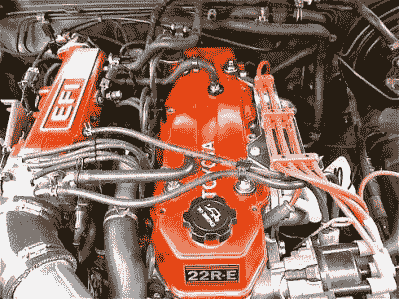

# 无凸轮发动机都去哪了？

> 原文：<https://hackaday.com/2016/02/16/where-are-all-the-camless-engines/>

电动汽车最近风靡一时，但我们不要忘记老的备用产品——内燃机。现代内燃机是工程学的奇迹。今天的发动机和周围的系统比以往任何时候都有更好的动力、更高的燃油经济性和更低的排放。几个世纪以来，人们花费了大量工程时间来改进发动机的各个方面，只有一个明显的例外。没有汽车制造商能够在活塞驱动的量产车中取消发动机的凸轮轴。具有讽刺意味的是，无凸轮发动机相对容易制造。普通黑客可以在他们的工作室里改装一台小型四冲程发动机，使其实现无凸轮运行。虽然它不是一个实用的设备，但它将是一个很好的实验和学习的试验台。

### 吸，挤，敲，吹

多缸汽油发动机是一支复杂的舞蹈。数百个零件必须同步运动。气门打开和关闭，喷油器喷出燃油，火花塞点火，活塞上下移动。都遵循四冲程“进气、压缩、燃烧、排气”[奥托循环](https://en.wikipedia.org/wiki/Otto_cycle)。凸轮轴通过打开和关闭发动机弹簧加载的进气门和排气门来控制这些。轴上的凸角压在挺杆上，然后挺杆移动气门杆和气门本身。凸轮轴本身通过正时齿轮、链条或皮带以曲轴一半的速度驱动。有些气门机构相对简单，比如顶置凸轮发动机。其他的，如整体式凸轮设计，更复杂，需要推杆、摇杆和其他部件将凸轮凸角的运动转化为气门的运动。

气门开启的准确时间和速度由凸轮凸角的轮廓决定。赛车和性能爱好者经常根据发动机的要求，将凸轮轴更换为更具侵略性的轮廓和不同的正时偏置。尽管一切都是有代价的。为获得最大功率而加工的凸轮轴通常不会怠速良好，会使发动机更难启动。过强的凸角轮廓会导致气门浮动，在高转速下气门永远不会完全落座。

### 无数解决方案

发动机制造商花了数年时间解决凸轮轴的局限性。结果是无数的专有解决方案。本田有 VTEC，可变气门正时和升程电子控制的简称。丰田有 VVT-i，宝马有 VANOS，福特有 VCT。所有这些系统都提供了在一定程度上调节阀门动作的方法。VANOS 的工作原理是允许凸轮轴相对于其正常正时稍微旋转几度，类似于在正时链条上移动一两个齿。虽然这些系统确实可以工作，但它们往往机械结构复杂，维修费用昂贵。

简单的解决办法是使用无凸轮发动机。这将意味着取消凸轮轴，正时皮带和大多数相关的硬件。螺线管或液压致动器以无限可变的方式打开和关闭阀门。阀门甚至可以无限期地保持打开，在不需要最大功率时有效地关闭气缸。

那么为什么我们不都开无凸轮发动机呢？有几个原因。无凸轮发动机相对于凸轮轴发动机的优势类似于电子燃油喷射(EFI)相对于化油器的优势。燃料喷射器的核心是一个电磁控制阀。燃油泵提供恒定的压力。发动机控制单元(ECU)在恰当的时间点燃喷油器，将燃油喷入气缸。计算机还会让气门打开足够长的时间，以便为当前节气门位置喷射适量的燃油。在电子方面，这与无凸轮发动机的要求非常相似。那么是什么原因呢？

Toyota’s celebrated 22R-E, an early EFI engine

30 岁以上的黑客们会记得，直到 20 世纪 70 年代末和 80 年代初，化油器才是王道。自 20 世纪 50 年代以来，公司一直在试验电喷。直到 70 年代严格的污染法律生效，该系统才成为主流。制造一台清洁、省油的化油器式发动机是可能的，但是需要如此多的机械和电子致动器，所以电喷是一个更好的选择。所以 70 年代的法律有效地控制了化油器的存在。我们在无凸轮发动机上看到了同样的情况。缺少的是强制发行的法规。

所有的大制造商都试验过无凸轮的概念。迄今为止最大的努力来自科尼赛克的子公司 Freevalve。他们有一个在萨博 T3 上运行的 T2 原型发动机。LaunchPoint Technologies 上传了[视频，展示了一些令人印象深刻的致动器设计](https://www.youtube.com/watch?v=ZYEjAv0hFug) LaunchPoint 正在与音圈合作，这项技术可以移动硬盘中的磁头。
这并不意味着你现在不能拥有无凸轮发动机——像瓦锡兰和曼这样的公司已经有商用发动机。然而，这些是用于驱动大型船只或发电的巨型柴油发动机。不完全是你想放在你的微型车！对于黑客来说，现在获得无凸轮发动机的最好方法就是自己动手。

### 女士们先生们，~~开始~~黑掉你们的引擎！

简单的单缸无凸轮发动机相对容易制造。从吹雪机、踏板车等的四冲程顶置气门发动机开始。确保发动机为非干扰型。这意味着气门实际上不可能撞上活塞。添加一个电源和一些螺线管。从那以后，只需要创建一个控制系统。例子在网上比比皆是。Sukhjit Singh Banga 在 T2 建造了这台发动机，作为 T4 大学项目的一部分。控制系统是一个带有电触点的机械轮，类似于分电器盖和转子系统。西弗吉尼亚大学的无凸轮发动机顶石项目使用微控制器来操作螺线管。请注意，该项目使用两个螺线管-一个用于打开阀门，一个用于关闭阀门。发动机不需要依靠弹簧来关闭。布莱恩·米勒[也为大学](https://www.youtube.com/watch?v=pt6eNAHiD18)建造了一个无凸轮发动机，在这种情况下，爱达荷州杨百翰大学的无凸轮发动机。[Brian 的]发动机在原来的凸轮轴上使用霍尔效应传感器来启动螺线管。这条路线是一个很好的踏脚石，然后再进行跳跃，以完全电子控制。

将这些项目扩展到多缸发动机并不需要太多工作。我们只等合适的黑客来接受挑战！