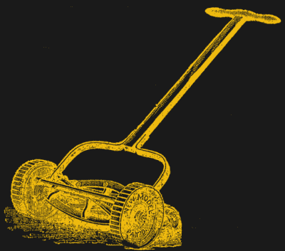
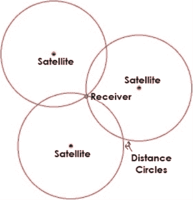
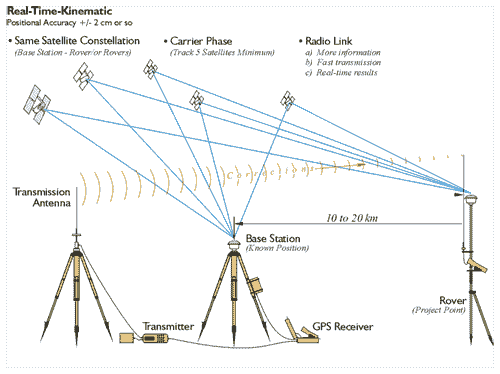

# 自动割草机在哪里？

> 原文：<https://hackaday.com/2017/03/01/where-are-the-autonomous-lawnmowers/>

不可能知道社会什么时候开始修剪它的草坪。说实话——割草过去是，现在仍然是必须的。但是保持杂草在海湾，修剪，边缘等等不是。在全球范围内，拥有一片漂亮的草坪已经成为现代郊区社会地位的象征。当外星人到来时，他们肯定会注意到的第一件事就是我们家前面的草坪有多好。我们文明的这一特征只有随着专门的割草机的出现才成为可能。

轮式割草机[公有领域](https://en.wikipedia.org/wiki/Lawn_mower#/media/File:ReelMower.png)

可以说最早的割草机是活的。问题是他们是非常高的维护设备，并且倾向于提供非常不均匀的切割，这对于在土路上努力获得最好的前草坪的家庭来说不是好兆头。加上它们副产品的恶臭，这些动物变得非常不受欢迎，并逐渐被移出场地，搬到后院。人们寻求其他的解决方案来维护久负盛名的前院。

第一台机械割草机是在 1830 年由一个名叫埃德温·巴德的人发明的，毫无疑问，他是为了胜过他的邻居，他的邻居仍然使用大镰刀。Budding 的割草机看起来很像今天的经典轮式割草机，其中一个旋转的圆柱体容纳刀片，并随着割草机的推进而旋转。英国为 Budding 的设备授予了专利，这让他的邻居非常沮丧——他们中的大多数人被迫购买了 Budding 的割草机，因为邻居中的其他人都买了一台，尽管他们实际上并不需要。

到 20 世纪 30 年代初，冷战从萌芽开始，他的邻居已经蔓延到地球上几乎每一个前院，看不到尽头。快进到现代，草坪和花园市场仅在 2014 年就实现了 100 亿英镑的销售额。技术的进步带来了高度先进的吃草机器。对于较小的庭院，大多数使用单缸内燃机驱动的推式割草机。许多人带着布袋来收集剪下的草屑，尽管每个人都不喜欢使用它们，因为它们会逐渐填满割草机，使割草机更重，因此更难推动。但是我们的邻居用它们，所以我们也要用。更大的院子需要昂贵的骑乘式割草机，其中许多拥有液压传动装置，业主们在邻里聚会上急切地吹嘘这种装置，即使他们对它实际上是什么没有丝毫线索。

美国黑客没什么不同。我们和其他人一样有前草坪。但是和其他人(包括我们的邻居)不同，我们有烙铁。我们知道如何使用它们。我建议我们试一试，用 85 年前萌芽公司的方式来扰乱邻居的草坪战争。所以，拿出你最喜欢的微控制器，让我们开始工作吧！

### 请真正的自动割草机站起来

首先，让我们先解决一件事。那些可笑的“机器人割草车”[使用一条边界线并随意切割路径](http://hackaday.com/2016/05/04/reverse-engineer-your-robot-lawnmower/)不是我们正在谈论的。任何相当于 0.1uf 电容的黑客都知道它需要定位。“怎么样？”，你问？嗯，只要看着其中一个东西像一些愚蠢的虫子一样在风中跑来跑去，你就会对自己说——“你知道，如果它知道它在哪里，它会工作得更好”。这就是我们要做的。为了制造真正的自主割草机，我们需要定位。如果我们能在 XY 笛卡尔平面上定位我们的割草机，那么自动化部分就容易多了。

是的，还有其他方法可以让我们的割草机实现自主，我强烈鼓励你在评论中讨论它们。但是本文将关注通过定位实现的自治。特别是由卫星提供的定位。

### GPS、RTK 和差分 GPS

说到在户外的东西上获得固定位置，首先想到的就是 GPS。大约 25 毫秒后，我想到的第二件事是准确性。我们都知道 GPS 的精度大概在 15 米左右。这对我们的自动割草机来说是行不通的。然而，还有另外两种选择:RTK 和差分 GPS。两者都具有我们所要求的精确度。

### 标准 GPS

Image Source: [3 Burdens to Society](https://3burdenstosociety.wordpress.com/2014/03/13/all-about-gps-global-positioning-system-that-thing-that-tells-you-where-to-turn-in-a-weird-voice/)

在我们进入其他系统之前。让我们快速回顾一下普通的老式 GPS。你手机里的 GPS 正在测量它和至少三颗卫星之间的距离。这允许它通过[三边测量](https://en.wikipedia.org/wiki/Trilateration)找到自己的位置(不要与三角测量混淆)。当然，精确度是由到卫星的距离测量的精确度决定的。这个距离是由来自卫星的原子钟精度的时间戳决定的。接收器只需将发送时间和接收时间之差乘以光速，就可以得到它和卫星之间的距离。

除了时间戳之外，卫星还传送它的位置。有了与卫星的距离和卫星的位置，接收器基本上知道一个圆的半径——卫星在中心，接收器在圆周上。一旦其中三个圆圈接触，砰！你通过三边测量得到了你的位置。

有几件事限制了准确性；其中最大的问题是大气。电离层会减缓信号，造成问题。信号穿过的大气越多，影响就越大。因此，来自地平线上的卫星的信号比来自头顶上的卫星的信号受到的影响更大。这种类型的干扰不断变化，并在定位中引入不可避免的误差——高达 10 米。

### RTK 和差分 GPS

Diagram via Penn State [GEOG862](https://www.e-education.psu.edu/geog862/node/1828)

既然我们知道了 GPS 的工作原理及其基本限制，我们就可以理解如何消除这些限制以获得更高水平的定位精度。这可以通过引入第二个“固定”接收器来实现。固定意味着它不会移动，它的位置是确切知道的。移动接收器(需要定位的那个)必须相对靠近固定接收器，这样两个接收器就可以比较来自同一个 GPS 卫星的信号，然后就此相互交谈。

固定接收机查看接收的 GPS 信号，然后查看从移动接收机接收的信号。因为固定接收机已经有了一个已知的位置，它可以发现信号中的任何错误，并把校正发送给移动接收机。这就是实时动态(RTK)和差分 GPS 的工作原理。

差分 GPS 可以达到 10 厘米的精度。RTK 同时检测信号的模拟部分和数字部分，精度可达 2 厘米。这对我们的自动剪草机来说非常准确。

### 自由市场期权

有一些选项可用于购买此类定位精度的硬件。它们并不便宜，但对于想要认真对待这个项目的任何人(或团体)来说也不是遥不可及的。REACH RTK 是我们能找到的最便宜的一款，售价约为 570 美元，但每次进货时都会很快销售一空。还有 Swift Navigation 的 [Piksi](http://store.swiftnav.com/s.nl/it.A/id.4216/.f) 设置，这是一个更昂贵的选项(我们已经[在](http://hackaday.com/2013/08/05/centimeter-level-precision-gps-for-500/)之前介绍过)，价格约为 1000 美元。如果你知道更多的 RTK 设置，请在评论中告诉我们。

使用 RTK 全球定位系统安装自动割草机现在是在你或你的团队掌握之中。如果你知道东西实时在哪里，那么写代码和做机械工程对于普通和直接的方法来说都是问题。那么为什么还没有做到呢？你还在等什么？

### 我们说的是草坪数控

也许这会给你的电容器组充电…当你把一台自动割草机和 gcode 结合起来会发生什么？令人兴奋的牛逼？给你的割草机配备开/关刀片的功能，你就可以割草了，而不仅仅是割草。

我画的这幅图对较大的草皮是有意义的，因为相对较小的电池驱动的机器人效率较低。有了足够大的土地面积，安装周界电线变得不太合理，并使 GPS 设置更令人满意(尽管有[种方法来伪造周界电线信号](http://hackaday.com/2010/06/26/cd-controlled-lawn-mower/)，这可以使有趣的 GPS 被黑进现有的机器人割草机)。

在消费者层面，大规模自主割草需要解决一些问题，如安全性、避障(倒下的肢体、人或牲畜)、燃料水平监控等。但是对于黑客来说，这个概念太有趣了，不能错过。我们很想听听你在自动割草方面的冒险经历，并完全期待有一天我们能看到一个 1 英亩大小的头骨和扳手被雕刻在一片草地上。给我们发一条关于你的故事的提示，它可能会出现在头版。