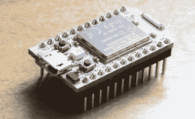
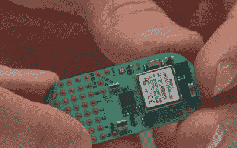
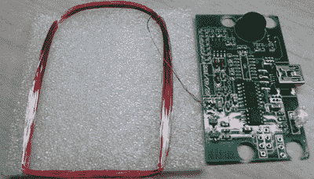
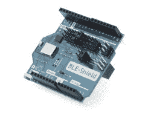
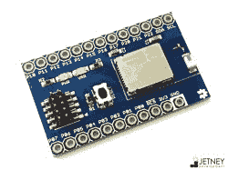
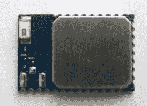
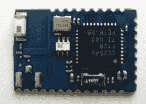

# 哪种无线技术适合您？

> 原文：<https://hackaday.com/2016/05/05/which-wireless-tech-is-right-for-you/>

似乎这些天所有的电子项目都是某种形式的无线。你是选择 WiFi，蓝牙 Classic，蓝牙低能，ZigBee，Z-Wave，Thread，NFC，RFID，Cell，IR，甚至信号量，信鸽，很大程度上取决于你项目的约束。有许多变量需要考虑，因此这里有一个指南来帮助您浏览选择，并得出在您的项目中使用哪个变量的结论。

只需几个问题，我们就能迅速将选项减少到合适的技术。

## 它需要连接到互联网吗？

The Spark Core (now Particle Photon) is a WiFi connected Arduino Compatible board.

如果有，并且需要保持持续连接，那么答案几乎肯定是 WiFi。WiFi 连接将获得自己的 IP 地址，管理与路由器的连接，并自行发送和接收数据包。考虑到你可能已经有了无线路由器，这几乎是板上钉钉的事了。许多人都在用 ESP8266 做原型，但也有其他选择，黑客最喜欢的是[粒子光子](https://www.particle.io/)(以前的火花核心)。[电动 Imp](https://electricimp.com/docs/gettingstarted/devkits/) 也经常使用，但没有 Particle 的开源组件，也没有 ESP8266 系列的价格。

这并没有完全排除其他选择，但它们需要额外的复杂性。BLE 和 ZigBee 需要另一个连接到互联网的集线器。它们是存在的(像 [disabled Revolv](http://revolv.com/) )，但它是你可能没有的额外硬件，或者可能无法依赖你的客户购买。他们也没有 WiFi 应有的带宽。

当你远离无线网络或者不能依赖它时，蜂窝连接是另一个选择。然而，最大的缺点是它很贵。原型越来越便宜，但为数据付费可能会变得很快，更大规模地开发一个产品是极其困难和昂贵的。大多数运营商在允许产品连接到他们的网络之前需要大量的测试和认证，所以原型和大规模生产之间的差距是非常令人生畏的。

## 它需要连接智能手机吗？

如果是的话，蓝牙可能是未来的发展方向，WiFi 和 NFC 将排在第二和第三位。Bluetooth Classic 较旧，像无线耳机一样用于高带宽流媒体。但是蓝牙 Classic 非常粗糙，有延迟、掉线和范围问题。[蓝牙低能耗](https://en.wikipedia.org/wiki/Bluetooth_low_energy)(有时称为蓝牙智能)是较新的版本。它完全不同，是为物联网或低带宽应用而设计的。但是，不要让低能量欺骗了你；因为它传输的频率低得多，数据也少得多，所以它可以以高得多的功率传输，从而导致显著更长的范围。对于 BLE 来说，模块有很多选择。个人最喜欢的是 [BlueGecko](http://www.silabs.com/products/wireless/bluetooth/Pages/bluegecko-bluetooth-smart-module-intro.aspx) (当他们被硅实验室收购时，从 [BlueGiga](https://www.bluegiga.com/en-US/) 改名)，但 PunchThrough design 有 [LightBlue Bean](https://punchthrough.com/bean) ，一个 OTA 可编程的 Arduino 兼容设备，以及一个用于扩大生产的模块。或者看看 Hackaday 商店里的[小 BLE](http://store.hackaday.com/products/tiny-ble)。

The LightBlue Bean, a small (and very hackable) Bluetooth LE device.

WiFi 是几乎每部智能手机都有的另一项技术，但建立直接连接可能是一件非常痛苦的事情。它会中断手机的互联网连接，因此您无法将 WiFi 连接到互联网或直接连接到设备。当使用 WiFi 时，设备通过互联网连接到智能手机要容易得多，就像有时用电子邮件给自己发送文件比通过 USB 传输更容易一样。

如果你的带宽要求很小(几个字节)，你的范围要求很小(厘米)，那么你可以尝试 NFC。

## 设备需要互相通话吗？

如果设备出于某种原因正在相互交谈，那么 WiFi 是一个很好的选择， [ZigBee](https://en.wikipedia.org/wiki/ZigBee) 是很棒的，并且有一个即将到来的规范称为蓝牙 Mesh，它将很快进入场景。

这里范围很重要，力量也很重要。任何能够加入网状网络的设备都必须持续监听消息。这意味着它要么啃光电池，要么需要市电供电。其他设备可能需要与网络通信，但不来回传递消息，因此它们可以打开，简单地说出需要说的话，然后继续睡眠。在 ZigBee 世界中，供电设备被称为路由器，因为它们监听并路由流量，而电池供电设备被称为终端设备，因为它们不能有自己的孩子。还有第三种称为协调器，在每个 ZigBee 网状网络中都有一个协调器，通常连接到互联网的网关。

了解您的覆盖范围非常重要，因为如果您需要比基站更远的覆盖范围，您必须拥有某种网状网络。如果您的 WiFi 路由器只能让您到达您家的后门，并且您的花园中有传感器，那么您需要在后门安装一个 WiFi 范围扩展器，或者一个 ZigBee 网络，节点分散，以便从一个传感器到下一个传感器有一条路径。不难想象，在一个仓库地板上，无线网络不会延伸很远，但一系列 ZigBee、插入的传感器充当网状网络，ZigBee 终端设备定期连接以吐出一些数据并返回睡眠。WiFi 是星型网络，所以路由器充当单点故障。ZigBee 是一个网状网络，因此如果任何节点出现故障，网络仍有可能继续工作。ZigBee 的模块不多，但是 XBee 是比较受欢迎的一个。

另一个选项是基于 IPv6 的线程。它使用 802.15.4，这是与 ZigBee 相同的无线协议，但 IP 寻址方面非常有吸引力。这仍然是相当新的，所以很难找到很多例子，但有一些大公司在努力推动它。

蓝牙 Mesh 是一个新进入者，很有前途。CSR(最近被高通收购)发布了一个在蓝牙 LE 上实现网状网络的堆栈，但他们是在标准发布之前做的，所以使用它要自担风险。

不过，Bluetooth LE 可能足以满足您的应用程序。蓝牙 LE 的概念是有服务器和客户端。服务器是收集数据或与硬件接口的东西，客户端是智能手机或其他希望向服务器提供数据或发送命令的设备。客户端可以连接到多个服务器，服务器可以有多个并发的客户端，但是服务器不能真正与其他服务器对话。在我们最近的 [Hackaday Dictionary 帖子中阅读更多关于 BLE 的内容](http://hackaday.com/2015/12/02/hackaday-dictionary-bluetooth-low-energy/)。

## 需要近吗？

一般来说，无线技术的优势是你不必靠得太近。但在某些情况下，当两个物体彼此足够接近时，你希望发生一些事情，比如一只猫接近自动猫门，或者一张信用卡在无线读卡器上轻点。为此，您需要 NFC 或 RFID。NFC 是 RFID 的一个子集，但它们有非常不同的用途。

RFID 可以具有更大的范围(高达几十米)。标签可以是有源的(电池供电和广播)，也可以是无源的(由扫描设备供电，因此受限于它们从空气中吸收的能量)。E-ZPass(收费公路用)是主动的，你宠物的皮下芯片是被动的。一般来说，它们只传输一个标识符，所以阅读器必须在数据库中查找。

NFC 更智能，允许双向通信。这是手机相互通信以传输联系信息或 URL 的方式，在一些国家的地铁中使用它们，允许你通过轻触手机来通过十字转门。NFC 也是零售商店触摸支付终端的工作方式。但是，预计通信只有几个字节，而且只有当你在几厘米之内。

## 你想变聪明吗？

有时你想探索一项新技术，只是想看看你是否能做到。有两种无线传输方法被小众采用，但仍然很酷。首先是[超声波](http://hackaday.com/2016/04/15/hackaday-dictionary-ultrasonic-communications/)。基本上，你通过扬声器播放的声音频率高于人类的听觉范围，但仍在扬声器和麦克风的能力范围内。加上一些频率分析，你就有了一个简单的无线电。亚马逊 Dash 按钮就是这样做的，它使用麦克风来听取一个特殊的智能手机应用程序传输的无线配置细节。

[调制光](http://hackaday.com/2016/03/10/gigabit-ethernet-through-the-air/)是另一种可能。这使用脉冲发光二极管以非常高的速度传输数据；快到你看不到闪烁。一些人已经尝试使用放置在智能手机屏幕上的 RGB 传感器来进行控制。欧洲的一些银行应用程序使用网页中的多个[闪烁点](https://www.youtube.com/watch?v=U7PnC1S-j4I&t=45s)来并行传输数据以签署交易。

当然，红外应该被算作调制光，虽然它已经存在了几十年，但它非常可靠(仅在室内)，工作良好，并且很容易用最少的元件完成。

## 选择你的芯片

您已经选择了您的无线技术，现在您需要构建它。根据您想要构建的内容，这项技术有多种打包方式。

这些无线技术都有 USB 解决方案。无论你选择什么，你都可以通过 USB 与计算机通信，而无需开发任何硬件。将加密狗插入 Pi，您就可以开始工作了。

下一步是 Arduino 屏蔽，同样，你可以找到所有这些技术作为屏蔽。之后是一个分线板，它允许您轻松地将特殊的 PCB 连接到试验板或其他接头。

接下来是模块。对于没有大量 RF 工程资源的产品原型、小型项目和中小型企业来说，模块是天赐之物。一家公司将开发一种包含 PCB、无线微控制器和天线的模块，为这种小型 PCB 获得 FCC 认证，然后出售。最棒的是，他们使用微型元件，所以你不必这么做；他们掌握了 RF 优化的魔力，所以你不必这么做；他们通过了 FCC 认证，所以你不必这么做；他们有一个软件堆栈，所以你只需编写应用层，不必担心最底层的通信。模块绝对是原型和小批量产品的必由之路，许多模块供应商以仅略高于组件本身成本的价格大量提供他们的模块。

但是如果你想进一步小型化，或者你有几十万的体积。这时，您应该考虑基于微控制器本身构建您的电路板，使用您自己的天线、巴伦和所有其他东西。尽管工作量很大，但除非你有 RF 设计经验，否则你无法做出优化的解决方案。然而，如果你保持聪明和简单，你就能做到。但接下来是认证这一步，这可能会很耗时，成本也很高。

也不要忽视开发环境。一些模块或芯片需要 IAR，这是一个可能花费数千美元的 IDE。其他人要求在免费但封闭的工具上进行开发。有些只是建立起来的巨大痛苦。您选择的芯片可能取决于您最喜欢的开发环境。

The BLE113 Arduino Shield

The BLE113 Breakout Board

BLE112 Module

Inside the BLE112 are the microcontroller, balun, antenna, and crystals.

无论你是在建造一个物联网水瓶还是联网叉子，无线技术都有很多选择，并且有太多的优势和限制需要考虑。然后有许多模块可以满足每一种选择。

(横幅图片中央模块的图片来源:维基百科上的 AutolycusQ。)