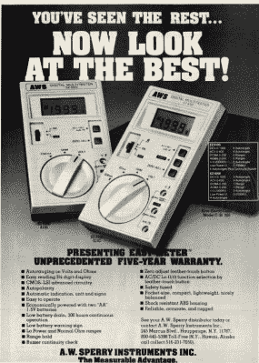
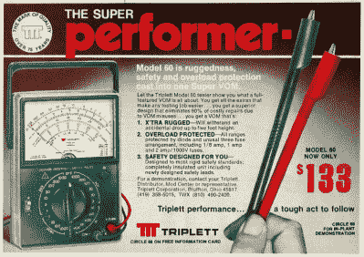
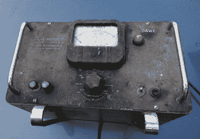
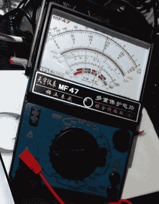

# 为什么你不应该完全忘记动圈万用表

> 原文：<https://hackaday.com/2017/11/08/why-you-shouldnt-quite-forget-the-moving-coil-multimeter/>

Did any of you have an AWS multimeter? Was it the best? [Radio-Electronics magazine](https://archive.org/details/radio_electronics_1981-08), August 1981.

如果你问一个随机的黑客读者，他们最基本的电子测试设备是什么，他们很可能会回答“万用表”。如果你让他们生产它，会出现一个熟悉的项目，一个顶部有 7 段 LCD 的手持砖块，一个笨重的旋转选择器开关，和一对测试探针。它们的质量和功能各不相同，价格从几美元到几百美元不等，尽管它们几乎都具有相同的基本功能。交流和 DC 电压，DC 电流，从欧姆到兆欧的电阻，可能还有一个连续性测试仪。更贵的型号有更多的功能，可能会自动调节范围，而且肯定会比便宜的型号有更好的电气安全，但总的来说，它们是一个相当标准的项目。

如果 Hackaday 出现在 40 年前，你问了同样的问题，你会拿出一套完全不同的万用表来检查。可能仍然是一个带有大选择开关的手持砖块，但你会看到一个大的动圈式仪表，有不同范围的刻度选择，而不是 LCD。从今天起，它将完成与数码产品基本相同的工作，但在这之间的几十年里，它是一种基本上已经消失的设备。因此，今天我将研究动圈式万用表，为什么你现在看到的动圈式万用表比以前少了很多，为什么你仍然应该考虑在你的军械库中拥有一个。

Evidently the Triplett Model 60 had hidden depths. [Radio-Electronics magazine](https://archive.org/details/radio_electronics_1981-08), August 1981.

从 20 世纪 80 年代到 90 年代，动圈和数码之间的过渡如火如荼。每个人都想要数字仪表，因为它们很酷。他们既精确又准确，而不是说“那大约是 5 伏”，你现在知道它是*确切的* 4.98 伏。两个读数之间的差异对有问题的电路没有任何影响，这无关紧要，因为你有一个很酷的万用表，可以测量到 0.01 伏的电压。工程师们戴着飞行员太阳镜走向他们的福特 Sierra/Merkur，他们知道他们已经控制了最后一点点电压，于是他们开车消失在夕阳下。

因此，我们可以在服装和测试设备上取笑 20 世纪 80 年代的时尚，但数字仪表的真正好处是什么？在于内阻。当你将动圈式电表接入电路时，你就在做功，从被测电路吸取能量来移动指针。想象一下，在一个假设的廉价动圈式万用表中，电表本身的满量程偏差约为半毫安。为了获得满量程读数，电表必须从被测电路中吸取 0.5 mA 电流。例如，要提供 10 V 的满量程偏转，电表必须串联一个 10kω的电阻，因此测量电压需要在相关电路中放置一个 10kω电阻。大多数像样的动圈式万用表的满量程偏差要低得多，需要更大的串联电阻，但原理是一样的。动圈式万用表加载被测电路，改变其特性。

High-impedance voltage measurement, 1950s style.

电表电阻问题在数字电表出现之前就有解决方案。几十年前，你可以买一个电子管电压表，它是由一个高阻抗输入的放大器驱动的。即使这些器件在固态时代被 FET 放大器取代，它们仍然是昂贵的器件，一般的工作台都没有。20 世纪 70 年代，当大众市场的数字仪表出现时，它们集成了 FET 输入级，因此很快就出现了阻抗为兆欧而非千欧的万用表。这些仪表可以被连接到一个电路上，从这个电路中它们可以获得可以忽略不计的电流，并且它们不会对电路的特性产生丝毫影响。人们买了数字万用表，再也不会看他们的动圈装置。

## 回到线圈

[![My Avo 8 isn't as clean as this one. Megger Ltd. [CC BY 3.0]](img/45e090d83490da14961f743e32bd733a.png)](https://hackaday.com/wp-content/uploads/2017/10/avo_model_8_mk7_p4_by_megger.jpg) 

我的 Avo 8 没有这个干净。那么，如果数字电表如此之好，你为什么还要在工作台上放一个动圈式电表呢？除了看起来有点复古和永远不用担心电池耗尽，这是。答案在于能够测量变化的电压。如果你曾经使用过需要调整的无线电或模拟电路，你会知道一些这方面的东西，当你看不到趋势时，调整波峰或波谷是非常困难的。动圈式电表的典型用途是通过调谐储能线圈来设置 RF 放大器，当线圈达到谐振时，放大器消耗的电流总会有一个峰值。

在过去 30 年左右的时间里，这里选择的动圈式流量计是一种古老的 Avo 8。这是经典的二十世纪中叶的万用表，一个大而重的胶木单元，内部潜伏着一个质量极高的仪表。电表本身的满量程偏转相对较小，为 50 A，因此它在测量电压时的阻抗优于上面引用的廉价电表示例，但在 2017 年，它有点像博物馆藏品。因此，这篇文章现在将变成一个更容易使用的动圈式电表的迷你评论，因为我将从 2017 年开始使用一个现成的模型，并对其进行测试。

5.8 V on the MF47 when it should be 6 V.

天语 MF47 可以从普通的中国供应商那里买到，价格约为 15 英镑或 20 美元。它不是最紧凑的万用表，前面板略大于 DVD 盒，厚度约为 DVD 盒的三倍。前面板的上半部分被大仪表占据，而选择开关占据了下半部分。仪表后面有一个把手可以折叠成一个桌子支架。它提供了通常的万用表电压，电流和电阻范围，加上晶体管测试仪，电池测试仪和电容计，由于全中文手册，我还不知道如何使用。

在背面是一个电池舱，一个 C 电池和一个 PP3，还有一个保险丝舱。一个非常好的接触是夹在里面的备用保险丝。根据谷歌翻译，仪表正面下方的中文文字赞美了其保护电路和镀金触点的优点。如果我想用一句话来描述它，我会把它描述为一款不太体面的经济型万用表，它相对较低的价格是其直接来自中国供应商的功能，而不是质量缺陷的象征。

通过一个简单的分压器，我可以立即演示与数字万用表相比，MF47 的内部电阻相对较低的效果。将两个 22kω电阻串联在一个 12 V 电源上，两个电阻交汇处的电压应为 6 V，即电源电压的一半。这是用一个数字万用表证实的，我的普通 Uni-T UT33D。然而，MF47 的测量值为 5.8 V，因为它具有足够低的内阻，足以影响分压器的下半部分，并将电压拉低 0.2 V，MF47 文档中有一个规格表，其中内阻被引用为 20kω/V，实际上，用 Uni-T 测量 MF47 在其 10 V 范围内的电阻会得到 200kω的数值。将这个额外的电阻添加到分压器电路中，可以得到 5.8 V。

当您处理低阻抗电路时，使用 MF47 等动圈式电表应该没有问题。这些仪表为汽车电气制造了坚固而廉价的仪器,(以保护电路的声明为准！)家庭布线，除了前面提到的在模拟电路中寻找电流峰值和谷值的用途。MF47 将作为 Avo 的更轻便的替代品留在我的工作台上，但它不会以任何方式取代我的 Uni-T。

这是一种有趣的与过去的重新连接，让我重新熟悉了动圈式万用表，并记住了为什么我们今天都使用数字仪表。有一种通过玫瑰色眼镜回顾过去的诱惑，但在万用表的情况下，它们并不真正合理。尽管如此，在你的工作台上放一个动圈式电表也不完全是浪费时间，所以如果有一个向你走来，不要错过它。别的不说，你再也不用担心手头是否有备用的 9 伏电池了。