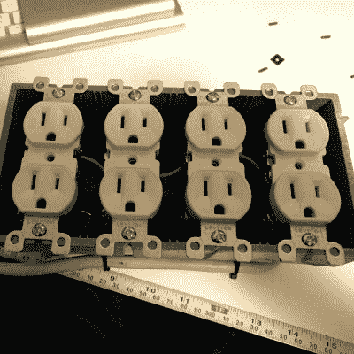

# WiFi 电源栏！

> 原文：<https://hackaday.com/2017/03/04/wifi-power-bar/>

曾经想在离开家的时候在你的电脑上访问一个文件或者运行一些程序，但是该死的东西却被关掉了？发现他们偶尔离家工作，不想让他们的电脑长时间开着，[robotmaker]的解决方案是侵入一个由 WiFi 控制的电源条！

在接线盒内，一个八通道继电器连接到一个 ESP8266 模块。该模块使用 MQTT 与 Home Assistant 进行通信，并由一个部分肢解的 USB 交流适配器供电——为了安全起见，该适配器用 kapon 胶带包裹。整个酒吧是通过一个 10A 的保险丝，同时也使用一个防火 4 组电箱。一旦插座连接好，关闭它就完成了电源条。

[robotmaker]通过一部运行 HADashboard 的廉价智能手机来控制插座，智能手机安装在一个 3D 打印的支架上。不要担心，他们已经将系统设置为在切断电源之前等待电脑关机，并且还配置为在继电器打开时启动。

最棒的是——这个能量棒只花了 25 美元。

[通过[/r/家庭自动化](https://www.reddit.com/r/homeautomation/comments/5w2m0o/i_made_a_custom_8_channel_wifi_controlled_power/)