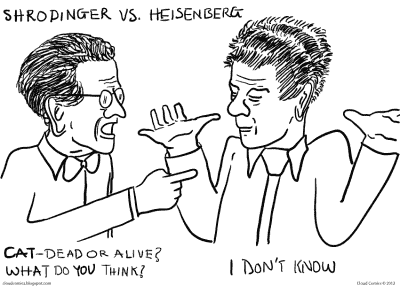
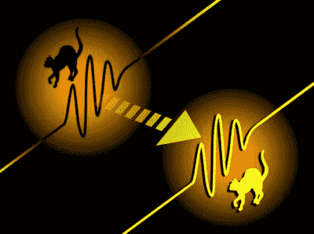

# 请真正的薛定谔的猫站起来好吗

> 原文：<https://hackaday.com/2016/10/18/will-the-real-schrodingers-cat-please-stand-up/>

薛定谔的猫的故事是众所周知的，也是量子理论在世界舞台上最流行的短语之一。你可以在 t 恤衫、汽车保险杠贴纸、网络迷因之类的东西上找到他的猫。然而，很少有人知道猫的起源，以及它是如何形成的。我怀疑除了“*同时死去和活着*”这句流行语之外，许多人并不理解它。毫不奇怪，正是爱因斯坦是薛定谔的猫背后的核心思想。在两人通过大西洋彼岸的信件进行的热烈讨论中，薛定谔对爱因斯坦的担忧做出了如下回应:

> 装在一个钢室里的是一个盖革计数器，它是用极少量的铀制成的，如此之少，以至于在接下来的一个小时里，很可能会有一个原子衰变，而没有。一个放大的继电器提供了第一个原子衰变打碎一小瓶氢氰酸。这只猫和一只残忍的猫也被困在钢铁密室里。根据整个系统的波函数，一个小时后，坐 venia verbo[原谅我的语言]，活猫和死猫被涂抹出等量。

这是第一次提到薛定谔的猫，如果说一封信中的这一段是猫出生的地方，这是没有错的。然而，思想实验背后的最初想法来自爱因斯坦和他对爱因斯坦-波多尔斯基-罗森(EPR)论文措辞的厌恶。他用几个简单的例子表达了他对薛定谔的失望，然后薛定谔把它推进了他著名的悖论。在这篇文章中，我们要探索的不是那只猫，而是思想实验背后的意义，以及它要传达的意思，同时保持它足够简单，让任何人都能理解。所以下次你在 t 恤上看到它的时候，你就能清晰地说出真正的含义，知道真正的薛定谔的猫了。

## 现实还是统计概率？

Cloud Comics: [Schrodinger vs Heisenberg](http://cloudcomics.blogspot.com/2012/05/schrodinger-vs-heisenberg.html)

爱因斯坦并不完全反对量子理论。他相信这个理论对于预测统计结果是有用的。他的问题是认为这是对现实的完整描述。他不相信自然是统计的，而是认为它是完全确定的，就像经典物理学一样。量子理论在预测实验结果方面是有用的，但仅此而已…只是物理学家的一个工具。不是一个完整的自然理论。

他用一篇名为《爱因斯坦-波多尔斯基-罗森(EPR)论文》的论文打出了他所希望的致命一击，这篇论文将展示所有这些量子业务到底有多愚蠢。我们已经在几个场合讨论过 EPR，所以我不会重复细节来烦你。相反，让我们关注为什么爱因斯坦不喜欢它，以及它是如何诞生薛定谔的猫的。在他们之间的许多信件中的一封中，他对薛定谔说“T2 被形式主义扼杀了”。他感到沮丧的是，他的主要论点被复杂性掩盖了，尽管它相对简单易懂。他打了个比方解释。

想象你面前有两个同样大小和形状的红色 Sparkfun 盒子，还有一个 Arduino。你把 Arduino 放在一个盒子里，然后洗牌，直到你不知道哪个盒子里有 Arduino。你有 50%的机会在你打开的第一个盒子里找到 Arduino。问题是——这是完整的描述吗？请记住，量子理论将统计结果与现实联系在一起，而爱因斯坦正试图在两者之间打入楔子。现在，回到问题:如果有 50%的机会在第一个盒子里找到 Arduino，这是完整的描述吗？我们只能有两种可能:

*   a)没有。Arduino 在其中一个盒子里。从系统中无法获得更多信息来告诉我们 Arduino 在哪个盒子中，我们被迫求助于概率——当我们打开第一个盒子时，有 50%的机会找到 Arduino。
*   b)是的。Arduino 同时存在于两个盒子中，当我们打开其中一个盒子的盖子进行观察时，它就被定位到一个盒子中。重复做，我们在 50%的时间里在每个盒子里找到 Arduino。该系统本质上是概率性的，不需要其他描述。

爱因斯坦试图展示量子理论作为现实描述的荒谬性。是的，它可以准确地预测概率结果，就像情景 b 一样。但情景 A 是对现实更明智的描述。这是爱因斯坦在 EPR 论文中想要解决的关键点。简单的一点，也许太简单了。

## 薛定谔的猫的诞生

[Image](http://www.livescience.com/38339-experiments-bolster-schrodingers-cat-idea.html) via Live Science

几年前，薛定谔发展了波动力学，并且仍然相信量子粒子的波函数在它们的行为中起了作用。他和爱因斯坦在这个问题上针锋相对。爱因斯坦相信波函数描述了系统的统计概率(在场景 B 中，Arduino 会有一个波函数允许它同时在两个盒子里。打开一个盒子会将它“折叠”到一个或另一个盒子中)，但并不以任何方式描述物理现实。他会梦想另一个思维实验:

对一批火药应用波函数。随着时间的推移，该方程模糊了爆炸状态和非爆炸状态之间的界限。不可能有一种合理的现实描述能同时将火炮威力置于爆炸和非爆炸状态。

在又写了几封信和简单的思想实验后，爱因斯坦把薛定谔争取到了他的身边。薛定谔已经确信他的波函数确实是对现实的描述。他将继续在一个实验中融合宏观态和量子态，用一只猫代替 Arduino，用毒药代替火药，试图创造一个他所说的“非常荒谬的案例”。

## 量子理论又赢了

这给量子力学的哥本哈根解释带来了相当大的问题，它坚持认为现实只能由我们的测量设备来定义。在测量之前询问猫的状态是没有意义的。但是爱因斯坦和薛定谔认为猫的波函数仅仅代表了猫是死是活的一个统计概率的观点要合理得多。

玻尔对薛定谔猫悖论没有任何回应，除了老生常谈的“测量仪器必须被经典地对待”。那只是意味着猫必须被经典对待，不能同时进入生死叠加。

此时，物理学界对似乎永无止境的哲学辩论越来越感到厌倦。量子理论在实验室中有效，大多数物理学家只是因为它有效才使用它，而对它的挑战者充耳不闻。这总结了现代的理论。仍然有一些哲学问题没有得到解答，但是这个理论在实验中仍然成立。并且在可预见的将来很可能会继续如此。

有更先进的方法来解决悖论，其中包括[量子退相干、](https://en.wikipedia.org/wiki/Quantum_decoherence)的后果，我们没有触及更深层次的问题，即在进行观察时发生的“波函数坍缩”期间到底发生了什么。这将在以后的文章中讨论，但是请在下面的评论中继续讨论。

**来源:**

吉姆·巴戈特的《量子故事》。第十七章 ISBN- 978-0199566846