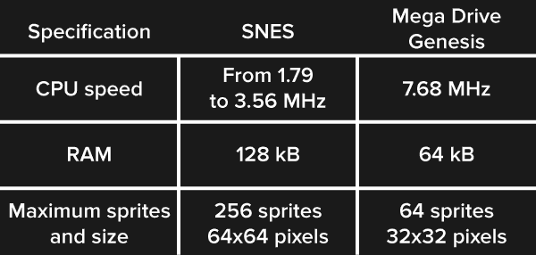
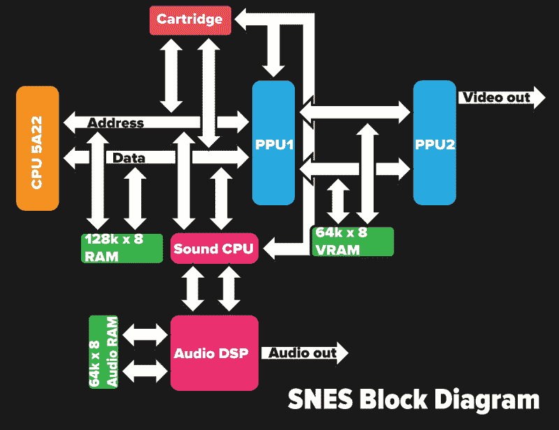

# 赢得主机战争——一项深入的架构研究

> 原文：<https://hackaday.com/2015/11/06/winning-the-console-wars-an-in-depth-architectural-study/>

我们 Hackaday 经常喜欢发布一些工程战争故事——将产品推向市场、取消产品以及为什么一种技术胜过另一种技术的勇敢和阴谋故事。今天的战争故事来自我们这个时代最残酷和野蛮的冲突，游戏机战争。

大多数人没有意识到的是，关于游戏机的战争从来都不是关于游戏机的。虽然战争是沿着创世纪/超级驱动和超级任天堂前线划分的，但战斗是在游戏之间进行的。真人快打是一场血战，但最终世嘉赢了。3D 图像战役很艰难，星狐的进攻可以和沙漠之狐在凯瑟琳山口的成功相提并论。在这两种情况下，只有世嘉的 32X 和英国第七装甲师进入突尼斯才能结束敌对状态。

无论如何，这些激烈的战斗将被历史学家不断地解释和重新解释。我只能提供我的游戏机战争的战争故事，这意味着硬件的解构。

### 世嘉创世纪和超级任天堂的建筑研究

两个控制台之间的传统比较通常以一系列规格、一串数字和记号来表示哪个系统在每个类别中胜出。虽然这确实说明了每个控制台的优缺点，但考虑到不同的架构，这是一种非常不精确的修辞技巧。通常的基准比较如下:

传统智慧——以及人们在互联网上的争论——告诉你越快越好，随着世嘉控制台拥有更高的时钟速度，它每秒钟能够进行更多的计算。当然，它可能无法像 SNES 那样在屏幕上绘制那么多精灵，但更快的处理器让 Genesis / Mega Drive 拥有了“更快”的游戏——例如 *Sonic* 系列，以及令人难以置信的体育游戏库。这是一个被包装得如此整齐的论点，这一传统智慧在近三十年来基本上是毋庸置疑的。[即使是互联网上最好的控制台专家也会成为比较不同架构规格的陷阱](https://www.youtube.com/watch?v=yGzgKCsrNHM&t=15m18s)的牺牲品，这完全是胡扯。

让我们来看看其中的一个数字——SNES 和 Genesis/Mega 驱动器的 CPU 速度。理光 5A22 的 SNES CPU 基于 65C816 内核，这是一种经常被遗忘的 6502 和相关芯片的 16 位分支，从 Apple II，Commodore 64，甚至最初的任天堂 NES 都可以找到。对于大多数游戏来说，SNES 内部的 5A22 的时钟频率约为 2.68 MHz。世嘉使用的是 68000 CPU，主频为 7.67 MHz。通过比较这两个数字，SNES 赢了，但这不一定是事实。

在比较两个不同 CPU 的时钟速度时，我们只关注总线被访问的频率，而不是每秒的指令数量。

在 68000 中，每条指令至少需要八个时钟周期才能完成，而 65c 816——就像它的弟弟 6502——可以每两三个时钟周期执行一条指令。这意味着 Sega 每秒最多可以处理大约 90 万条指令。SNES 每秒可以计算大约 170 万条指令，尽管它的时钟速度较低。

尽管 Sega 控制台的时钟更快，但它每秒执行的指令更少。

所以我们来到了争论的核心；大型游戏机大战的统计数据虽然没有错，但却经常被误解。那么，我们如何决定结果呢？

### 世嘉 Genesis / Mega Drive 的架构

虽然世嘉 Genesis/Mega Drive 通常被称为拥有 68000 CPU，但这并不是世嘉控制台内部发生的事情的完整画面。实际上，Genesis 是一台双处理器计算机，有两个 CPU 用于不同的任务。68000 处理游戏逻辑和图形，但令人惊讶的是没有太多其他功能。Z80——一种比 Genesis/Mega Drive 早十年推出的 CPU 用于读取游戏手柄的状态，并播放音频。

有趣的是，世嘉 Genesis / Mega Drive 包含了世嘉早期控制台[世嘉主系统](https://en.wikipedia.org/wiki/Master_System)的大部分组件。通过增加一个[电源转换器](http://segaretro.org/Power_Base_Converter)，当 68000 CPU 空闲时可以玩主系统游戏。

### 超级任天堂的架构

SNES 是一种完全不同的动物。一切都通过 5A22 / 65816 CPU 控制。控制器直接馈入 5A22 的数据线，DMA 指令能够在两个略有不同的图像处理单元之间穿梭数据。

这两个控制台之间一个有趣的区别是盒式磁带插槽和各种外围芯片之间的连接。Sega 机器的几乎整个盒式连接器都专用于 68000 CPU 的地址和数据线。虽然有一些控制信号，但还不足以让盒式磁带直接访问视频显示单元或 FM 合成芯片。

另一方面，SNES 的盒式磁带连接器可以直接访问一个图像处理单元和音频处理器。这种能力的开发见于各种游戏，从带有 SuperFX 芯片的 *Star Fox* ，到带有数学协处理器的 *Mega Man X* 游戏，再到*Super Mario RPG:Legend of the Seven Stars*及其超级加速器 1 芯片，该芯片基本上是主 SNES CPU 5a 22 的升级版本。

### 对比设计，以及谁赢得了游戏机战争

是时候对每个竞争平台进行整体分析了。到目前为止，SNES 是一个更有能力的控制台；它的盒式磁带能够将数据直接发送到 ppu 和音频处理器，速度更快，并且有更多的工作 RAM、vRAM 和音频 RAM。

The Sega ‘Tower of Power’. Image credit [/u/bluenfee](https://www.reddit.com/user/bluenfee)

Genesis / Mega 驱动器可能被视为更具可扩展性，这要归功于 Sega CD(第一款基于 CD-ROM 的游戏控制台，Sega 32X)，Genesis 的升级协处理器，与主系统电源转换器的向后兼容性，以及许多奇怪的盒式磁带，如带有“锁定”技术的 *Sonic 和* *Knuckles* 。然而，实际上是 SNES 的*更容易扩展。这肯定不是传统的观点，这种差异是由于可扩展性在每个控制台中的实现方式。*

为了给 SNES 增加额外的功能，游戏设计者会给游戏模块增加新的芯片。众所周知，Star Fox 利用 SuperFX 芯片利用了这一点，SNES 增强芯片的清单值得[在维基百科](https://en.wikipedia.org/wiki/List_of_Super_NES_enhancement_chips)中拥有自己的条目。

相比之下，Genesis / Mega Drive 只能通过组装来扩展，要么通过滥用 68000 和 Z80 CPUs 之间的 ASIC 芯片，要么在 32X 附加模块的情况下，完全绕过视频显示单元。

无论如何，这纯粹是一个学术练习。游戏销售游戏机，任天堂的知识产权组合——甚至在 90 年代初——包括拥有自己的卡通、真人动作电影和谷物的角色。

虽然这种学术练习在今天完全不重要——可能不会再有带墨盒的游戏控制台了——但这是一个关于可扩展计算机设计的有趣案例研究。