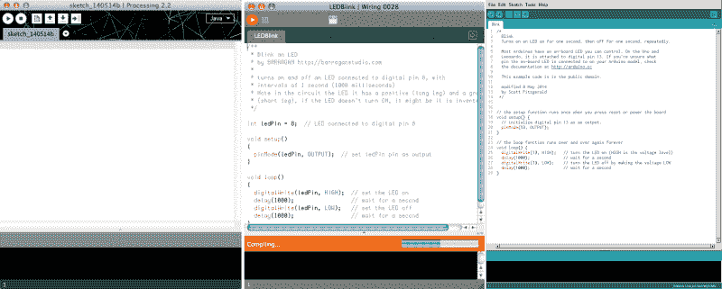
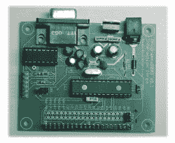
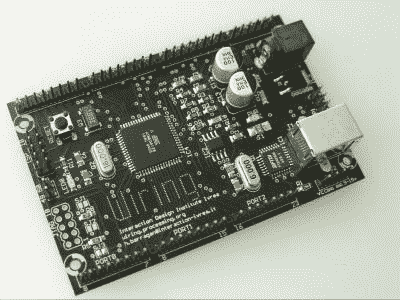

# 布线是 Arduino 之前的 Arduino

> 原文：<https://hackaday.com/2016/03/04/wiring-was-arduino-before-arduino/>

赫尔南多·巴拉甘是你从未听说过的阿杜伊诺的祖父。在归属问题上基本保持沉默多年后，他决定将一些怨恨一吐为快，澄清 Wiring 和 Arduino 之间的关系。这是一个很长的阅读，有时有点苦涩，但如果你一直在关注 Arduino vs Arduino 的崩溃，这是拼图中很重要的一块。

[布线](http://www.wiring.org.co/)，以防你不知道，`digitalWrite()`和公司是从哪里来的。也许更重要的是，布线基本上孕育了构建基于微控制器的硬件控制器平台的想法，该平台足够简单，可以编程供艺术家使用。事实上，它的目的是作为处理的[的物理对等物，这是一种用于艺术的可视化编程语言。我们一直想知道布线和 Arduino 之间的关系，很高兴听到布线方面的故事。(实际上，我们在今年早些时候采访了巴拉甘，他要求我们推迟采访，直到他在网上发表自己的观点。)](https://www.processing.org/)

简而言之，Arduino 基本上是布线软件的一个分支，被重新标记并运行在一个物理平台上，该平台从接线板借用了很多东西。这是否合法，甚至是否道德都不是问题——Wiring 是完全开源开发的，包括软件和硬件，所以 Massimo Banzi 有责任和其他人一样复制。但是考虑到 Arduino 从本质上来说是一个重新标记的连线(代码被移植到一个非常不同的微控制器上)，您可能会认为比“从连线中派生”更多的确认是合适的。

See what we mean?

从巴拉甘的角度来看，Arduino 的故事实际上是一个经典的悲剧:学生提出了一个非常好的想法，他的一位教授因此获得了荣誉并付诸实施。

这个故事开始于 2003 年，当时巴拉甘是意大利交互设计学院 Ivrea (IDII) 的一名硕士生。《过程》的两位作者之一的凯西·雷阿斯给了他建议并对他产生了很大影响。

 与此同时，马西莫·班兹正在 Ivrea 教授一门专为设计人员设计的微控制器课程，使用的是一种基于 PIC 的电路板，名为 Programma2003，以及一种你从未听说过的奇怪语言，“ [JAL:另一种语言](http://justanotherlanguage.org/)”。当时，没有 GCC 对 PIC 的支持，所以开源开发的选择很少。更糟糕的是，大多数设计专业的学生都在使用苹果电脑，而 JAL 只在 Windows 上编译。它对用户不友好。

如果你想知道 Arduino 来自哪里，巴拉甘的论文是必读书。总结就是你现在所知道的一切:如果能制造一个足够简单的硬件/软件平台，艺术家和非微控制器爱好者都可以进入，这将是革命性的。这正是计算机图形领域正在进行的革命，由处理驱动。让它开源并免费提供，你将接管整个世界。所以他转向 Atmel AVR 芯片，它背后有 GCC 开源工具链。

## 从布线到 Arduino

 因此，到 2004 年，巴拉甘制作出了一些线路板的原型，他和他的同学们非正式地将它们用于项目中。如果你用过 Processing 或 Arduino，这个 GUI 看起来会非常熟悉。由于学生们已经熟悉了处理过程，克隆它是很有意义的——当然是在 Casey Reas 的支持下。巴拉甘写了一个小程序，你可能听说过:`Blink`。

现在，巴拉甘在伊夫雷亚需要一名教员顾问，而他的兴趣显然与马西莫·班兹最为契合。因此，随着他的论文工作进展顺利，在 Reas 的支持下，barra gan 聘请 Banzi 作为他的顾问。在 Banzi 和其他三名教师的帮助下，布线平台得到了第一次真正的试运行，[“异常熟悉”的车间和展示(PDF)](http://www.wiring.org.co/exhibitiimg/book01.pdf) 。这是一个惊人的成功——在仅仅四周的时间里，学生们真的做出了东西。

Massimo Banzi teaching class with Wiring

巴拉甘于 2004 年毕业，并搬回哥伦比亚。《异常熟悉》的成功让马西莫·班兹像扔烫手山芋一样放弃了 Programma2003，转而用布线来教授他的物理设计课程。

据 Banzi 说，Arduino 项目的工作已经开始，因为他想要一种比线路板更便宜的电路板。因此，他用更便宜、更小的版本取代了 ATmega128 微控制器，并从线路板上砍掉了所有不“重要”的东西，比如电源 LED。这就是“Wiring Lite”板，也是第一个 Arduino 原型。

## 给 Arduino 应得的

Arduino 根本不承认接线是*而不是*的情况。确实如此。网站的演职员表部分第一段有几句话，如上所述。这加 4.5 美元可以给你买一杯大杯、四杯、脱脂、单杯、不加奶的摩卡，但是你还能要求多少呢？

Arduino 项目的营销非常精明，这一点不能用布线来形容。班兹结交了美国有影响力的人，最终以朋友之友的方式与戴尔·多尔蒂联系，戴尔·多尔蒂不仅发明了“Web 2.0”，还发明了“创客运动”和《创客杂志》。Arduino 和 Make 是天作之合，剩下的就是历史了。

但正如文章开头提到的，这是一个经典的悲剧故事。班兹有更好的关系和更多的营销动力和技巧。他推动了完全相同的项目——更名——比巴拉甘所做的或可能做的更努力、更好、更深入。Arduino 就是因为这个原因而家喻户晓。如果马西莫·班兹没有在方向盘后面，你不太可能会抱怨我们有多少基于布线的项目。

而且，作为开源软件和硬件，巴拉甘放弃了商店。他可能(天真地)期望从他的前顾问那里得到更多的信任，或者甚至被邀请一起乘坐。他问为什么 Arduino 分叉布线而不是继续与他合作，答案是绝对清楚的——Arduino 把它据为己有。他们可以。这不太好，但这是生意。

尽管如此，我们感受到了巴拉甘的痛苦。因此，我们很高兴，在沉默了十年之后，巴拉甘代表自己和 Wiring 站出来说话，因为这澄清了事实，因为在 Arduino 出现之前，他的项目确实是“Arduino”。