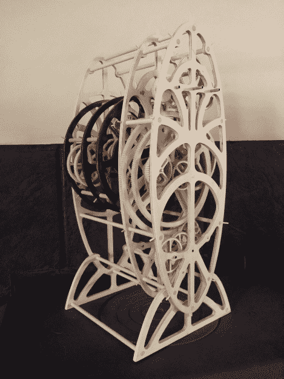

# 木制的 Antikythera 机械装置是为了伟大而设计的

> 原文：<https://hackaday.com/2016/04/27/wooden-antikythera-mechanism-is-geared-for-greatness/>

[戴夫]建立定制的木制或系列，这是太阳系的机械模型。因此，他对 Antikythera 机械装置感兴趣也就不足为奇了。Antikythera 机械装置是 1900 年在希腊海岸发现的一种小型齿轮装置，被认为是第一台模拟计算机，也是已知最古老的齿轮系统之一，部分是为了预测古希腊所理解的太阳系中天体的位置。

 【戴夫】决定建造[一个木制版本的安蒂基希拉机械装置](http://brassgoggles.co.uk/forum/index.php/topic,43364.125.html)作为概念的证明，它可以用木头而不是原来的黄铜制成。他还试图整合该设备齿轮系的所有现代理论。整个系统由 6 毫米厚的桦木胶合板制成，这些胶合板是[戴夫]用线锯手工切割的。没错——这里没有数控系统或激光。这既与实用性有关，也与复制原作的工艺有关。此外，齿轮齿的节距太小，无法用激光有效切割。

也没有马达。齿轮中心连接到嵌套的黄铜管，该机构由手摇曲柄驱动。这六页的论坛讨论值得一翻，看看[Dave]进步的图片和所有那些精心手工切割的齿轮。

[戴夫]花了两年的大部分时间来完成这件艺术品，休息之后你可以看到它在运转。随着第一个版本的完成，他已经开始了 Mk. II，它将具有原版的所有螺旋表盘和指针。如果你有兴趣进一步探索 Antikythera 机制，[这里是 Hackaday 自己对它的深入研究](http://hackaday.com/2015/11/23/the-antikythera-mechanism/)。

### 行星装置:

 [https://www.youtube.com/embed/G60GOw5FCUw?version=3&rel=1&showsearch=0&showinfo=1&iv_load_policy=1&fs=1&hl=en-US&autohide=2&wmode=transparent](https://www.youtube.com/embed/G60GOw5FCUw?version=3&rel=1&showsearch=0&showinfo=1&iv_load_policy=1&fs=1&hl=en-US&autohide=2&wmode=transparent)

### 首次运行:

 [https://www.youtube.com/embed/Ku9k8o2YIsE?version=3&rel=1&showsearch=0&showinfo=1&iv_load_policy=1&fs=1&hl=en-US&autohide=2&wmode=transparent](https://www.youtube.com/embed/Ku9k8o2YIsE?version=3&rel=1&showsearch=0&showinfo=1&iv_load_policy=1&fs=1&hl=en-US&autohide=2&wmode=transparent)

