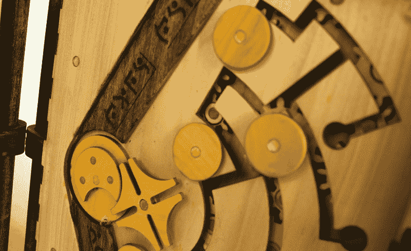
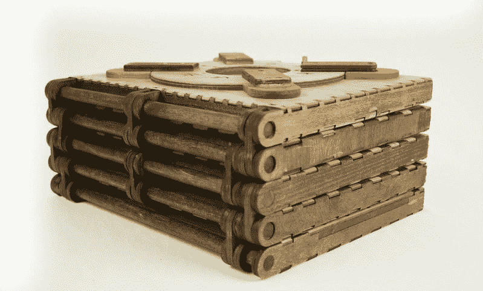

# 木制拼图书将扭曲和眼花缭乱你的大脑

> 原文：<https://hackaday.com/2016/10/20/wooden-puzzle-book-will-twist-and-dazzle-your-brain/>

在可能是激光切割、细木工、拼图、写作和装订最酷的应用之一中，[Brady Whitney]创造了[Codex si lenda](http://www.thisiscolossal.com/2016/08/wooden-puzzle-book/)——一本比例宏伟的文字解谜书。

[Whitney]最初为他在爱荷华州立大学的高级论文研究项目构思了法典的想法，其结果几乎是每个人都知道的。在法典的五页中的每一页上都有一个机械难题，必须解决才能进入下一页，同时伴随的文字编织了一个故事。这些复杂的页面是用 SolidWorks 设计的，并由激光切割木材精心组装而成。通过让读者直接参与揭示书的奥秘来打破讲故事的第四堵墙是一个独特的壮举，而且看起来很棒。

我们的大脑与解谜和讲故事联系在一起，这两者的结合唤起了对两者近乎孩童般的好奇。真的，西伦达法典是一件艺术品。

如果一本解谜书对你来说不够吸引人，看看会让你迷惑的[解谜桌](http://hackaday.com/2015/12/25/the-ultimate-puzzle-desk-myst-eat-your-heart-out/)。

【谢谢提示，伊泰·拉莫特！]

