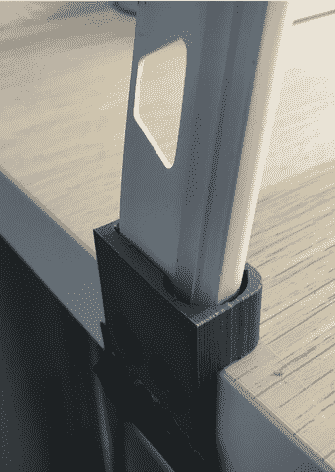

# 工作台轻拱上的廉价

> 原文：<https://hackaday.com/2018/04/05/workbench-light-arch-on-the-cheap/>

灯光拱门正如其名:一个安装有 LED 灯条的拱门，可以均匀地照亮下面的区域。它们在微型和模型制作社区变得非常受欢迎，因为它们在你需要的地方提供了大量的光线，而没有纯粹用头顶照明获得的阴影。这些相同的特性也使它非常适合电子工作，所以虽然我们还没有看到许多光拱出现，但我们预计不久它们就会开始出现。

 【斯潘塞·欧文】[最近来信告诉我们他的 LED 灯拱](https://www.thingiverse.com/thing:2846958)建造起来特别容易和便宜。无论你以前有什么借口不在你的长凳上尝试一个光拱，一旦你检查了这个建筑，它可能就不存在了。

拱门的中心是一段塑料瓷砖镶边，你可以从任何一家大盒子家装店买到。然后将 LED 灯条连接到瓷砖边缘的内表面，并将合适的电源连接到一端。[斯潘塞]提到他战略性地用扩散器包裹了拱门的一些部分，这对于你的特定应用可能是必要的，也可能不是必要的。

在这一点上，精明的读者可能已经意识到，这并不构成一个拱门，只会给你一个软软的荧光棒的东西。你说得对。这种设计的真正魔力在于 3D 打印的锚。你所需要做的就是弯曲瓷砖边缘，将末端插入锚定处，你就得到一个完美的拱形。

锚上的孔与瓷砖边缘的轮廓非常匹配，尽管可能需要调整以匹配与[斯潘塞]不同品牌的边缘。塑料的张力足以支撑足弓，而不需要胶水或紧固件。作为一个额外的奖励，拱门可以被拆除，只要把边缘拉出来，让它恢复到原来的形状。

用你新出现的足弓来照亮板凳当然很好，但是为什么要止步于此呢？为什么不把[当时钟](http://hackaday.com/2017/04/29/a-led-strip-clock-as-linear-as-time/)，或者玩[一个地牢爬虫](http://hackaday.com/2018/01/24/diy-dungeon-crawler-game-plays-on-single-led-strip/)？

 [https://www.youtube.com/embed/cVL4Q0deQd0?version=3&rel=1&showsearch=0&showinfo=1&iv_load_policy=1&fs=1&hl=en-US&autohide=2&wmode=transparent](https://www.youtube.com/embed/cVL4Q0deQd0?version=3&rel=1&showsearch=0&showinfo=1&iv_load_policy=1&fs=1&hl=en-US&autohide=2&wmode=transparent)

