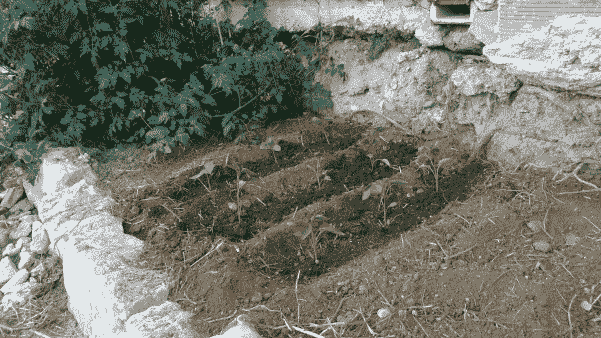

# 在世界创造日期间啜饮和膨化触摸屏和烤肉

> 原文：<https://hackaday.com/2017/05/16/world-create-day-2/>

在过去的几周里，我们看到 Hackaday 奖的参赛作品有了显著的增长。这在很大程度上要归功于世界创造日，一个全球性的建筑材料庆典。这是一个全球性的建筑马拉松，黑客空间遍布全球。现在我们可以一窥这些集会的结果，视频被上传，我们只是被世界创造日创造的东西惊呆了。

### 脊髓黑客

温哥华布鲁森脊髓中心的一帮人为世界创造日组织了一个为期两天的活动。这次活动的目标是建立一个 lipsync 的[；一种设备，使手部使用受限的人能够使用触摸屏设备。它看起来像一把射线枪，但它实际上是一个吸喷装置，参加了去年的黑客日奖。](http://www.hackaday.io/project/13424-lipsync)

### 塞浦路斯的园艺

塞浦路斯的 Limassol 黑客空间在所有参与的黑客空间中度过了可能是最棒的世界创造日。为什么？当然是烤肉。

Limassol hackerspace 的团队没有试图改善整个世界，而是决定在本地思考。用自动灌溉系统改善他们自己的菜园，种植蔬菜和烧烤占据了一天的大部分时间。一个成员甚至用桉树树干做了几个大盘子。这些部分的树裂开了，但是通过 CNC 路由器的巧妙应用，这个黑客空间能够在木头上镶嵌一些蝴蝶。它看起来很棒，如果有一堆烤肉串就更好了。

            

### 大阪创客空间

和我们大多数人一样，大阪创客空间的一些成员对微型机器人战斗感兴趣。当然，活动的第一部分是摆弄这些微型机器人。该空间的一些成员为 BLE 模块制作了一个分线板，对其进行编码，使其可以语音激活。不，这可能不是控制战斗机器人的最佳方式，但你应该做你想做的，而不是别人认为最好的。

同样在世界创造日，一些成员为孩子们建造了三把小椅子。不幸的是，孩子们正忙着看芝麻街。但是，嘿，至少螺丝孔被钉死了。大阪世界创造日的名单上还有修理坏掉的 MacBook Air。风扇停了，修理包括将风扇的电线焊接到主板上的焊盘上。

### 拉奥罗塔瓦

 奥罗塔瓦黑客空间的人们为世界创造日举办了一场盛大的活动。等等，奥罗塔瓦在哪？这是加那利群岛特内里费岛上的一个城镇。不，鸟是以岛屿命名的，岛屿是以狗命名的。

虽然他们没有成群结队的黑客来参加在大西洋中部的一个岛上举行的黑客日聚会(圣赫勒拿聚会，有人吗？)，Orotava hackerspace 确实有一些人来讨论 Hackaday 奖励项目。这次讨论产生的有趣项目包括自动农业机器人、精神病人的行动问题和低成本带锯。

The [HackadayPrize2017](https://hackaday.io/prize) is Sponsored by:   