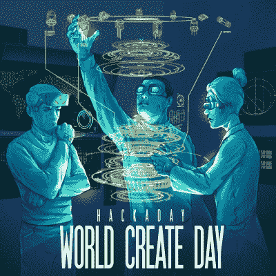

# 世界创造日:4 月 22 日聚在一起黑吧

> 原文：<https://hackaday.com/2017/04/11/world-create-day-get-together-and-hack-on-april-22nd/>

离开你的工作台，看看其他人今年都在做些什么。现在是黑客日[世界创造日](https://hackaday.io/event/20822-world-create-day-2017)的时候了，全世界的黑客都聚在一起为项目工作。

在 4 月 22 日，加入你所在地区的创意头脑几个小时的建设时间。这是一个激励他人和被他人激励的机会。没有比与他人分享你的工作更好的方式来实现项目的飞跃。这种思想的交流激发了创造力，也是结识新朋友的绝佳借口。

[现在就在你附近找一个聚会](https://hackaday.io/meetups)。在你的区域没有看到吗？[成为主持人](https://goo.gl/forms/25IYOZRqHIJLY8uM2)，很简单，我们会帮你的！

### 在世界创造日聚会上是什么感觉？

当 Hackaday 社区聚在一起时，总是一段有趣的时光。4 月 22 日的每次聚会都是独一无二的。这些都是当地组织起来的，并由出现的人赋予生命。带着开放的心态和你感兴趣的东西，你会感觉宾至如归。

We’re sending out stickers like this one, along with other swag, to meetups that sign up early. Do it now!

例如，如果我是 Brian Benchoff，我可能会带上我的 [3D 打印 WiFi 天线](http://hackaday.com/2017/01/30/increase-the-range-of-an-esp8266-with-duct-tape/)和一些不同的 WiFi 设备，看看是否有人想进行一些距离测量和信号强度表征。我自己一直在从事一个艺术项目，该项目使用计算机视觉和替换显示器作为我的锻炼机器，所以我会带一个这样的机器。在几个小时的黑客攻击后，习惯上是在房间里走一圈，让人们对他们的工作做一个非常简短的解释。

世界创造日是组建你的黑客奖团队的最佳场所。当想法飞翔时，请记住一个想法改变世界的力量。考虑选择一个挑战，头脑风暴一个想法，然后[参加黑客日大奖](https://hackaday.io/prize)。

### 照片或它没有发生

不要让伟大的想法只存在一天。确保你讲述了你的世界创造日的故事。在活动期间，在社交媒体上发布您的照片和描述，标签为 [#WorldCreateDay](https://twitter.com/hashtag/worldcreateday) 。您的 meetup 的 Hackaday.io 活动页面上应该添加图片、项目链接和简短摘要。我们希望在 Hackaday 上尽可能多地讨论这些问题，所以不要羞于告诉大家你的聚会上的人在做什么——完成的项目或铅笔画，我们想听听！

The [HackadayPrize2017](https://hackaday.io/prize) is Sponsored by:   