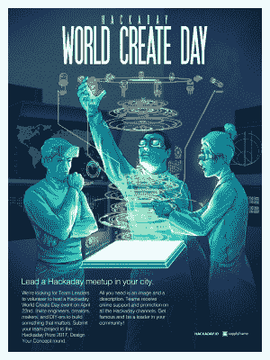

# 世界创造日:你所在城市的黑客日活动

> 原文：<https://hackaday.com/2017/04/05/world-create-day-the-hackaday-event-in-your-town/>

官方消息，4 月 22 日是世界创造日。和你所在地区的黑客们聚在一起，创造点什么吧！这是结识你所在地区所有黑客读者的最佳方式，也是在繁忙的生活中抽出几个小时享受项目工作乐趣的绝佳借口。

这些真的很好组织，但是没有你我们做不到。[立即注册，在您所在的城市举办聚会](https://goo.gl/forms/25IYOZRqHIJLY8uM2)！

世界各地的 Hackaday 社区将在 4 月 22 日星期六聚会，花时间一起建设。如果你和我们一样，有一长串想在“某一天”做的项目，那就是今天。收拾好你现在的工作(或者拿起工具开始新的工作)，和一些新老朋友聚在一起，互相合作完成你的项目。

传统的做法是在闪电谈话的最后留出一点时间来展示你们每个人一直在做的构建。别忘了拍照并上传你的世界创造日聚会的故事。我们很高兴通过这种方式[很好地了解了去年的许多聚会](https://hackaday.com/2016/04/27/the-incredible-success-of-world-create-day/),并希望今年扩大我们在首页上的特色内容。
T3

### 招聘 Meetup 组织者

[填写这张表格](https://goo.gl/forms/25IYOZRqHIJLY8uM2)让我们知道你想举办一次聚会。

这是第二年的世界创造日。去年，我们在 64 个城市看到了聚会。许多这样的活动今年还会再次发生，但我们也需要你在你所在的地区组织一次活动。我们将帮助您做好准备，并将您的活动放在[大地图](https://hackaday.io/meetups)上，这样您所在地区的其他人也会计划加入进来。现在就做，如果我们提前收到您的运输信息，我们会向您发送贴纸和其他赠品，以便在您的聚会上分发。

### 建造一些重要的东西

世界创造日的核心是停止找借口，去创造一些东西。既然你已经和其他人聚在一起了，考虑组建一个团队参加 2017 年 Hackaday 奖。目前我们正处于构思阶段:[设计你的概念](https://hackaday.io/prize/details#one)意味着处理一个问题并计划一个解决它的方法。当你把一群有创造力的人聚集在一个地方，伟大的想法就开始涌现。抓住时机，将创意转化为 Hackaday 奖的参赛作品，看看它会把你带到哪里！

The [HackadayPrize2017](https://hackaday.io/prize) is Sponsored by:   