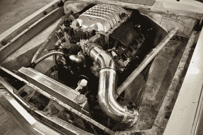
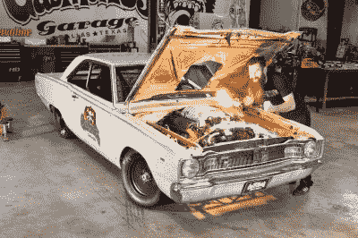
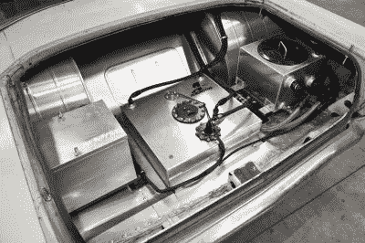

# 世界碰撞:热棒和黑客

> 原文：<https://hackaday.com/2016/02/23/worlds-collide-hot-rodders-and-hackers-needs-art/>

当我们想到普通的赛车时，我们会想到喜欢四个轮子上任何东西的男孩和女孩。他们擅长手工工具和制造，知道内燃机的来龙去脉。他们的专业工具是电焊机、磨床和套筒扳手。但是他们对电路的了解并不仅限于给 12 伏的 DC 尾灯接线。从表面上看，热门 rodder 的角色似乎与硬件黑客大相径庭。但是如果你抽象出他们做的事情，你会发现他们拿走机器，修改它们的设计，让它们做一些比最初设计的更多的事情。从这个角度来看，热门 rodders 就是黑客。

今天的汽车和卡车使用高度复杂的电子控制来保持最佳性能。如果没有扎实的计算机电子学背景，一个炙手可热的车手在试图对现代汽车进行任何实质性的改装时，将面临一个几乎不可能的挑战。这也是他们坚持使用老式汽车的原因之一。一般来说，热门车手不想与 1980 年以后生产的汽车或卡车有任何关系。

随着时间的推移，新一代的 hot rodders 点燃了他们的第一台 TIG 焊机，不可避免的是，他们将开始被引诱到我们的世界，希望 hot rodding 更多的现代汽车。新型汽车和卡车使用一种叫做动力传动系控制模块的计算机系统，简称 PCM。PCM 黑客组织已经在各地出现，热门 rodders 也越来越熟悉 CAN 总线、EEPROM 和 FLASH 等术语。ROM 烧录器和总线盗版开始与扳手和套筒扳手一起出现在世界各地的工具箱中。新一代的热门人物必然会成为电子黑客。

## 热门车手、黑客和真人秀

Richard Rawlings [Source](http://www.success.com/mobile/article/richard-rawlings-hot-rod-hero)

认识到现代热门人物和某些类型的黑客之间的关系是很重要的。我们都知道[汽车黑客运动](http://hackaday.com/2015/09/01/the-year-of-the-car-hacks/)试图破坏安全和破解协议。典型的热 rodder 对这种方法不感兴趣。他们的兴趣在于改进汽车的性能，并使它做设计工程师从未打算过的事情。最近，一个名为“快速大声”的电视真人秀节目展示了这样一个例子。

《Fast N' Loud》是一部受欢迎的电视剧，自 2012 年以来一直在探索频道播出。这是基于一个真正的热棒公司在得克萨斯州达拉斯所谓的气体猴子车库。他们制造真正的热棒，而且在探索频道用摄影人员淹没车库之前就已经这么做了。但是因为他们是电视真人秀的一部分，关于他们真实能力的问题和指控开始出现。我们都知道电视是如何运作的，我们都知道很多东西是为了娱乐价值而伪造的。

## 挑战

2015 Hellcat engine in 1968 Dart [Full size](https://hackaday.com/wp-content/uploads/2016/02/hotrod_02.jpg)

一小群自称公路杀手的飙车族试图通过挑战加油站的工作人员来摆脱他们。我说很少…他们有一个平均每集 350 万次观看的 YouTube 频道。因此，他们的规模足够大，可以让人们听到他们的声音，但不受制于任何电视网络或广告集团。他们是真正的人，对他们认为是一个忙于制作电视节目的虚假的热棒公司，而不是真正的热棒公司，提出了真正的挑战。

挑战很简单。他们将每人造一辆车，在八分之一英里的跑道上比赛。最快的汽车将被宣布为获胜者。唯一的规则是，该车必须使用 2015 年道奇 Hellcat HEMI 动力系统，这是一款老式车身风格的汽车。

## 戳熊

Aaron Kaufman [Full Size](https://hackaday.com/wp-content/uploads/2016/02/hotrod_04.jpg)

如果公路杀手的工作人员做了一点小小的功课，他们会发现气体猴子车库的主人，理查德·罗林斯，不是一个业余爱好者。他两次赢得了[口香糖球 3000](https://en.wikipedia.org/wiki/Gumball_3000) 和 [Bullrun](https://en.wikipedia.org/wiki/Bullrun_Rally) 拉力赛，并保持着目前的炮弹跑世界纪录，从纽约开车到洛杉矶用了 31 小时 59 分钟。他的搭档艾伦·考夫曼(Aaron Kaufman)是一位非常聪明的机械师和制造者，他的成长经历和你我非常相似——把东西拆开，并弄清楚它们是如何工作的。

不用说，当这两个人听说路杀挑战和对他们信誉的攻击时，他们认真对待了。非常认真。

## 黑客来拯救

Fuel pump and cooling jacket reveals professional work [Full Size](https://hackaday.com/wp-content/uploads/2016/02/hotrod_03.jpg)

将 2015 款 Hellcat 动力列车安装到一辆老款汽车上并非易事。首先，这是一场飙车比赛。所以汽车需要尽可能的轻，同时又要安全。[Aaron]解决这个问题的方法是将所有不必要的设备从汽车和 Hellcat 引擎中移除。然而，这给发动机带来了一个问题。今天的现代发动机 PCM 希望看到像电动车窗和挡风玻璃雨刷这样的东西。你不能拔掉插头就扔了它。这是[Aaron]和他在 Gas Monkey 的团队从惨痛的教训中学到的。他们把发动机装上电线后，它就发动不起来了。由于缺乏编程 PCM 忽略所有被他们撕掉的东西所需的知识，他被迫[打电话求助](https://www.holley.com/blog/post/diablosport_helps_gas_monkey_build_winning_hellcat_swap_car_/)。

一家名为 Diablo Sport 的公司的团队以精通克莱斯勒的所有事情而闻名，包括 PCM 编程。一队他们最好的人在比赛前的周五飞了过来，在对 PCM 进行了 6 个小时的修补后，他们终于让赛车启动了。

Roadkill 有相同的引擎，所以他们会有同样的问题。他们解决这个问题的方法是将所有不需要的电子设备塞到行李箱中，并将电线延伸到发动机。额外的重量将是他们的败笔，让[气猴制造的热棒以不到 6 秒](http://www.hotrod.com/cars/featured/1602-revealed-how-gas-monkeys-67-dart-beat-roadkill/)的成绩在[跑完 1/8 英里赢得了比赛](https://www.youtube.com/watch?v=ZQJ_D94HCZA)。

目睹热门 rodders 黑掉 2015 款 Hellcat HEMI 引擎，揭示了一种新的黑客。一个比特字节的黑客和一个螺母螺栓热棒黑客的结合——热棒黑客。我们黑客社区欢迎我们的 hot rodder 朋友，并期待听到更多 hot rod hacks。

 [https://www.youtube.com/embed/HRD4Z5R8s2c?version=3&rel=1&showsearch=0&showinfo=1&iv_load_policy=1&fs=1&hl=en-US&autohide=2&wmode=transparent](https://www.youtube.com/embed/HRD4Z5R8s2c?version=3&rel=1&showsearch=0&showinfo=1&iv_load_policy=1&fs=1&hl=en-US&autohide=2&wmode=transparent) 

**来源**

[内嵌图像。](http://www.hotrod.com/cars/featured/1602-revealed-how-gas-monkeys-67-dart-beat-roadkill/)