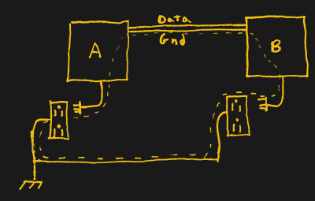

# WTF 是地回路？

> 原文：<https://hackaday.com/2017/03/09/wtf-are-ground-loops/>

这些神奇的生物不知从哪里冒出来，烧坏你的电子设备，或者骚扰你的耳洞。理解它们无疑会为你省钱和省事。简而言之，接地环路是指两个独立的器件(A 和 B)分别接地，然后通过某种通信电缆与地相连，形成环路。这提供了两个独立的接地路径(B 可以通过自己的连接接地，也可以通过电缆的地连接到 A，然后连接到 A 的地)，这意味着电流可能会以意想不到的方式开始流动。这在模拟 AV 设置中尤其明显，其结果是音频嗡嗡声或图像中的可见条，但有时也是无法解释的设备故障的原因。

Can you find the loop?

一个例子是你的有线电视。这是一个模拟信号，进入你的房子，在一个地方接地，通常在你的房子外面。电缆蜿蜒到你的娱乐中心，插入你的接收器，接收器在另一个地方接地。这就形成了一个回路，通过电磁感应耦合到周围的各种交流信号，杂散电流随后通过各种电路泄漏。另一种思考方式是把它看作变压器的一半；这是一个单回路，回路的一个很好的部分是*紧挨着*大楼电力的火线，电流不断变化。由于接地环路的影响，音频设备中出现 50 或 60 赫兹的嗡嗡声并不罕见。

## 解决方案

既然你是专家，解决这个问题(或者完全避免)就相当简单了。最确定的方法是切断回路，这意味着移除电缆，或者用不是电线的东西代替它。你可以切换到无线通信，比如蓝牙或 WiFi。一些有线协议使用差分信号而不是单端信号，因此不需要公共地作为参考。移动插头，使它们插入同一个插座，使你的回路尽可能小。另一种选择是使用隔离器，您可以根据自己的电缆选择购买隔离器，或者在项目中设计光隔离器或隔离变压器。不要使用作弊插头或删除接地引脚，因为这只是消除了一个安全功能，并可能造成一个带电电压机箱的危险情况。

说到示波器，你可能会在某个时候想要探测由市电供电的东西，然后你会得到一个完全不同的接地环路。如果你的东西是电池供电的，这里没有危险；发疯，因为没有办法创建一个接地环路。如果它插在墙上，但通过隔离电源(只有两个插脚和一个隔离变压器的东西)，你仍然没问题，因为仍然没有接地环路的路径，但你可能会看到脏电源的一些噪声。

但如果它连接到电源并有一个接地引脚(即使是间接的，如通过计算机电源由 USB 供电的设备)，也有可能创建一个接地环路，因为您是通过探头将接地的示波器连接到另一个接地设备。探头上的接地夹直接连接到接地引脚，所有探头上的接地都相互连接，这些接地引脚连接到设备上的地。如果这还不清楚，最好总结为“所有的地已经相互连接，并参考同一根线——地引脚。”当您将接地夹连接到被测设备时，您会创建一个接地环路，这会增加您的测量噪声，并可能损坏示波器。

The scope probe grounds are connected. Technically you only need to clip one ground clip to your test device.

The probe grounds are connected directly to earth. They are not floating.

如果你做错了，将接地夹连接到实际上并不接地的东西上，那么你就会有各种各样的问题，因为器件现在通过你的探针短路到地，这将很快自毁。具有接地引脚的测试设备需要格外小心，以防止连接不同电位的物体。只要不连接接地夹，就有可能断开接地环路，但这会产生其他后果。这里，最佳做法是使用差分探头或将被测器件连接到隔离变压器。不要从你的示波器上移除接地，因为你会经常接触到它，最好不要触电。

所以总结一下:地不仅仅是地。出于测量噪声的目的，每个器件最好有一条且只有一条路径通向单个接地点。当有两条或多条接地路径时，它们会形成一个回路，接收各种环境电磁干扰。修复一个接地环路就像打开它一样简单，但要做到这一点，你必须对所有接地路径有一个清晰的印象。你见过最棘手的地回路是什么？我们是否遗漏了什么好的解决方案？