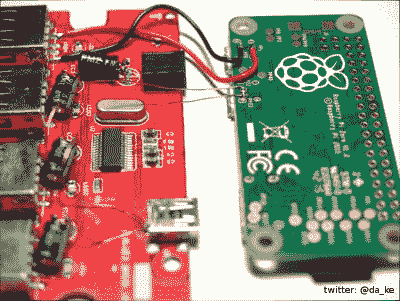

# YAPZH！(又一个 Pi 零点集线器)

> 原文：<https://hackaday.com/2016/01/10/yapzh-yet-another-pi-zero-hub/>

你可能会认为给 Raspberry Pi Zero 添加一个集线器的所有排列都已经完成了。但是你错了。[Daniel]的方法是将零点[放在现有的轮毂](http://wiki.daniel-keil.de/projekte/raspberry-pi/zero-usb-hub-housing)盒中。所用的 LogiLink 集线器是一个漂亮的金属外壳，侧面有安装法兰。它看起来很坚固，不太像一个典型的消费中心。这种黑客技术将很好地服务于 Zero 和 hub 可能会遇到一些麻烦的地方。

Wiring between Zero and Hub

它花了一些时间摆弄轮毂组件，但他让它工作。简单的部分是将零点上的电源和 USB [测试点连接到集线器。](http://hackers.gallery/841/misc/raspberry-pi-zero-pad-probing)

更具挑战性的是机械方面，以物理方式将零点安装到表壳中。四个 led 被移除，因为它们的唯一目的是指示电缆是否插入集线器。有四个直立的电解电容器，占据了 Pi 所需的空间。[Daniel]将它们重新定位成水平放置，为 0 提供空间。

随着 Zero 能够装入外壳，接下来的步骤是在 USB 板中创建安装孔，并在外壳中切割孔，以访问 HDMI 和 USB 端口以及 SD 卡支架。用 Dremel 做的一些精细的工作提供了洞和切口。幸运的是，Zero 上的安装孔与 USB 板上的一些开放空间对齐。如果他们没有，一些胶水和支架可能就足够了。

[Daniel]留给你去破解的唯一方面是访问 GPIO 端口。那将需要另一个切口来引出带状电缆来控制你的世界。在这样一篇包含大量图片的非常详细的文章之后，他不得不把一些事情留给其他黑客去做。