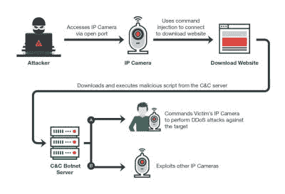

# 又一个物联网僵尸网络

> 原文：<https://hackaday.com/2017/05/17/yet-another-iot-botnet/>

[趋势科技]报道称[又一个物联网僵尸网络](http://blog.trendmicro.com/trendlabs-security-intelligence/persirai-new-internet-things-iot-botnet-targets-ip-cameras/)正在出现。这个新的僵尸网络被称为 Persirai，目标是 IP 摄像头。大多数受害者甚至没有意识到他们的相机可以全天候上网。

趋势科技已发现到目前为止已被 Persirai 利用的 1，000 台不同型号的 IP 摄像机。至少还有另外 120，000 个 IP 摄像头可以被僵尸网络用同样的方法攻击。问题始于 IP 摄像机默认将自己暴露在 TCP 端口 81 上作为 web 服务器——这不是一个好主意。

大多数 IP 摄像机使用通用即插即用，这允许它们从路由器内部打开端口并启动网络服务器，而不需要太多的安全检查。这在网络空间描绘了一个巨大的目标，上面有要求被利用的标志。登录到易受攻击的设备后，攻击者可以执行命令注入攻击，进而让摄像头下载更多恶意软件。

该漏洞只在内存中运行，所以一旦它被重新启动，它应该会再次没事，直到你的下一个恶意软件下载驱动器。检查你的设备，因为即使是大公司也会犯错。物联网正在变成一个战场。我们只是希望所有这些攻击、僵尸网络和黑客不会因为懒惰的程序员而摧毁物联网理念的承诺。

来自[维基百科](https://de.wikipedia.org/wiki/Botnet)的部分特征图片，知识共享许可。