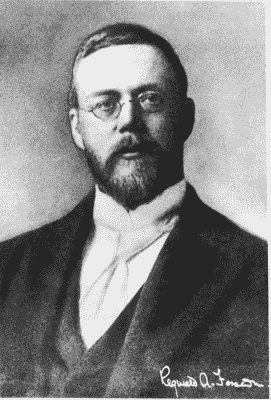
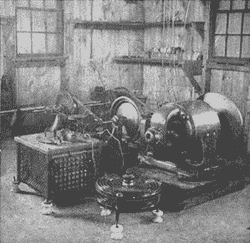

# 你们都认识雷金纳德·费森登。谁啊。

> 原文：<https://hackaday.com/2018/02/19/you-all-know-reginald-fessenden-who/>

快，说出一个在广播史上有影响力的人。你想到了谁？马可尼？特斯拉？阿姆斯特朗？赫兹？或许是萨诺夫？我们打赌只有少数人会说雷金纳德·费森登。这很遗憾，因为他是第一个做我们大多数人每天都在做的事情的人。

很少有人知道这位加拿大发明家的名字，尽管他有不少创新。不像科尔皮兹和哈特利，我们没有任何东西以他的名字命名。然而，费森登是第一个进行大西洋两岸双向无线电联系的人(马可尼的是单向的)，他也是使用无线电语音的先驱。

他做的还不止这些。他获得了用连续波而不是火花进行传输的专利，这使得现代无线电实用化。这在当时并不受欢迎，因为大多数人认为火花是产生足够能量的必要条件。1906 年，约翰·弗莱明(他给了我们有时仍被称为弗莱明阀的管子)写道，“简单的正弦曲线不可能产生所需的效果。”那是在 1906 年，费森登获得专利五年后。

## 从头开始

 雷金纳德·费森登 1866 年出生于魁北克。尽管他基本上已经完成了学位，但他在 18 岁时从毕晓普学院退学，去百慕大找了一份教书的工作。最终，他搬到了纽约，希望能为托马斯·爱迪生工作。这一开始并没有成功，因为他当时对电不太了解，但他很执着。他一直在爱迪生的一家机器商店附近徘徊，有一天一名仪器测试员下班了。绝望的工头当场雇用了他。

一旦被爱迪生雇用，他的数学技能和故障排除技能使他迅速上升，最终在新泽西州直接为爱迪生工作，成为一名初级技术员。他甚至问爱迪生是否可以研究无线技术。老板很乐意，但让他等从欧洲回来再说。

然而，在爱迪生返回之前，他被迫解雇了实验室的大部分员工，包括费森登。凭借实践经验，他找到了几份工作，最后成为了普渡大学的教授。在那里，他的工作引起了乔治·威斯汀豪斯的注意，他亲自聘请他担任匹兹堡的西宾夕法尼亚大学(现在的匹兹堡大学)电气工程系主任。

## 无线电激活

大约就在这个时候，马可尼因开发了一种实用的无线传输系统而出名，该系统利用火花隙和相干器来发送莫尔斯电码。费森登开始尝试，并意识到他可以做得更好。到 1899 年，他已经用自己设计的接收器在匹兹堡和阿勒格尼市之间发送信息。特别是，他对洛奇和马可尼开发的相干仪持批评态度，因为它不适用于将观测到的无线电效应与电磁理论联系起来的测量。一个适当调整的内聚器就像一个开关。它不是开着就是关着。如果两个信号都强到足以触发探测器，那么就很难比较这两个信号。这使得比较天线或发射机变得很困难，特别是因为当时的天线和接收机很难携带。

在 1899 年的一次讲话中，费森登展示了他一直在研究的三种不同的探测器。它们很灵敏，能够测量信号强度。他还从他早先对使用不同频率的多路电报系统进行的实验中理解了共振。他明白火花产生的宽信号不适合调谐，并想找到一种方法来产生更高的频率，这种频率是恒定的，不会像火花的衰减那样鸣响。这在今天听起来很平常，但请记住，马可尼的系统工作在大约 8 赫兹，火花抛出大量谐波，并在每个脉冲上衰减到零。

在为美国气象局工作时，费森登发明了巴雷特探测器，该探测器使用用酸制备的热铂丝来解调无线电波。他继续研究流行的(当时的)电解检测器，它使用同一种金属丝，但在操作过程中保持在酸中。

## 那又怎样？

你可能想知道为什么我们关心两个老式的无线电探测器。这里有两件有趣的事情。首先，请记住这是在电子管出现之前，所以没有可用的放大。更灵敏的探测器对使无线电更有用至关重要。此外，这些检测器不像相干仪那样只能检测振幅的开和关。这不仅实现了费森登想要的科学测量，也实现了调幅广播。

通过在传输线中使用碳麦克风，费森登能够成功地在靠近华盛顿州 DC 市的波托马克河的科布岛上传输声音。距离只有大约一英里，音频质量不适合实际使用，但它被认为是第一次传输语音。据报道，信息是:

> “一、二、三、四。你住的地方在下雪吗，泰森先生？如果是的话，打电报回来让我知道。”

## 连续波

 费森登不断试验交流发电机(就像右边的那台)并提高它们的频率。他有高达 50 赫兹的交流发电机，但是没有放大，很难得到好的结果。然而，他确实取得了一些成功，甚至预言性地将无线电接入了电话网络。

有报道称，一些音频测试甚至意外地在费森登新公司设立的苏格兰姐妹站听到。到 1906 年，他申请了一个利用无线电波测量冰山距离的系统的专利——类似于现代雷达。它在战时也被用来探测潜艇。

## 那是娱乐

1906 年的平安夜，马萨诸塞州布兰特罗克的费森登站用摩尔斯电码向 CQ 发送了一封电报。然后，他用麦克风宣布演出开始，随后留声机播放亨德尔的《拉戈》。他还亲自拉小提琴，演奏了《平安夜》。然后他祝他的听众圣诞快乐。其他一些人将发言，但他们遭受了可能是第一例麦克风恐惧症，据报道如此。

这是已知的第一个娱乐节目。它没有像几个月后德·福雷斯特的广播那样受到广泛关注。在连接收音机和电话，以及利用广播娱乐之间，你可以得出结论，我们的发明者有一个相当好的水晶球。他肯定有一个大天线，就像你在左边看到的。

在这段视频中，您可以听到原始圣诞节目的再现:

 [https://www.youtube.com/embed/i76dCrHzaJM?version=3&rel=1&showsearch=0&showinfo=1&iv_load_policy=1&fs=1&hl=en-US&autohide=2&wmode=transparent](https://www.youtube.com/embed/i76dCrHzaJM?version=3&rel=1&showsearch=0&showinfo=1&iv_load_policy=1&fs=1&hl=en-US&autohide=2&wmode=transparent)

## 个人的

费森登显然是个聪明人。有一些记录表明，他非常自负，对员工不太尊重。据说他脾气不好。你永远无法确定这些数字——尤其是那些不像其他一些数字那样广为人知的数字——有多少是真实的，有多少是夸大的。

不过，有一点是肯定的。虽然费森登为无线电话奠定了很大的基础，但他在经济上并不成功。赞助他大部分作品的公司在 1911 年解雇了他，导致了一场旷日持久的法庭大战。该公司最终被卖给了解决此案的 RCA。

他继续工作，但不是在电台。他最终获得了超过 500 项专利。他也变得古怪，导致广播新闻杂志最终停止刊登他的连载自传。1932 年，他在百慕大用安置费买下的家中去世。他的墓穴上写着:

> 凭借他的天才，遥远的国度在交谈，人们在深海中无畏地航行。

伟大的情操。可惜很少有人记得他。另一方面，他确实有了自己的民谣。

 [https://www.youtube.com/embed/xkL-zjXsUGg?version=3&rel=1&showsearch=0&showinfo=1&iv_load_policy=1&fs=1&hl=en-US&autohide=2&wmode=transparent](https://www.youtube.com/embed/xkL-zjXsUGg?version=3&rel=1&showsearch=0&showinfo=1&iv_load_policy=1&fs=1&hl=en-US&autohide=2&wmode=transparent)

