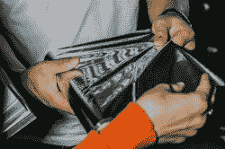
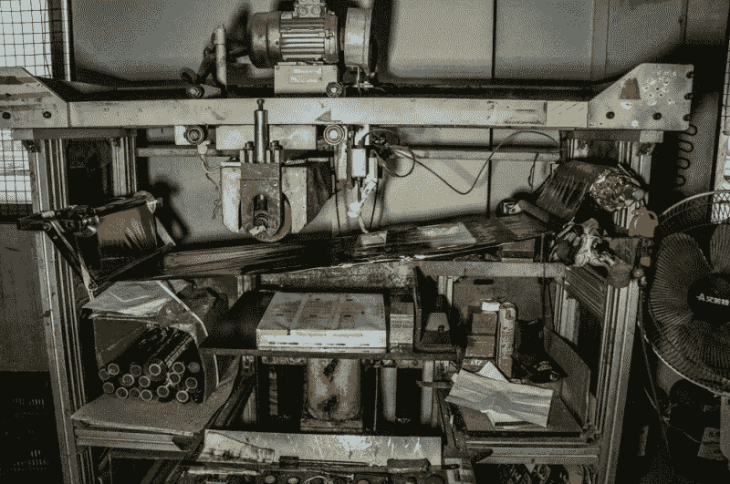
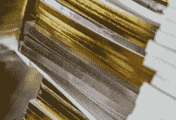

# 你带来它，这闪烁它:改装热箔烫金机

> 原文：<https://hackaday.com/2018/03/31/you-bring-it-this-blings-it-retrofitting-a-hot-foil-stamping-machine/>

热烫印是一种常用于修饰和浮雕优质印刷媒体的方法。它被用在信笺和婚礼请柬上，增添一丝奢华。操作实际上非常简单，将定制的模具加热，压入热转印箔，然后转印到打印介质上。一些最早的手稿使用金叶浮雕来装饰复杂的书法。你也可以看到它经常被用来装饰宗教书籍的侧面。

专业的烫金机通常很贵，你能从易贝买到的便宜的烫金机通常质量很差。[Lindsay Wilson]在购买一台难以可靠使用的低成本烫金机时发现了这一点。它被搁置了好几年，直到他有了另一个烫金项目。这一次他有所准备。他把机器拆开，装在重型手扳压机上，使之更加坚固。他还用自己的温度控制器改装了加热组件，以提高他想要使用的箔片的精度。

 [https://www.youtube.com/embed/69iphyxSbs8?version=3&rel=1&showsearch=0&showinfo=1&iv_load_policy=1&fs=1&hl=en-US&autohide=2&wmode=transparent](https://www.youtube.com/embed/69iphyxSbs8?version=3&rel=1&showsearch=0&showinfo=1&iv_load_policy=1&fs=1&hl=en-US&autohide=2&wmode=transparent)

 我们实际上已经在深圳的一家图书印刷厂专业地完成了这项工作，并拍了一些照片。这是热转移箔。你通常可以从安装在机器上的大卷上得到这些。它们也有各种金属色，如金属蓝、绿色、红色，以及常见的金色和银色。

这是用来在书上烫印的真正的机器。它也被用来在书的边缘盖章，使它在书店看起来更有吸引力。

 这是烫印如何装饰书籍的一个例子。在这种情况下，它被用来装饰书籍的边缘，使其更加引人注目，特别是当书店的桌子上放着一摞书时。这也让我想起了我在住过的酒店抽屉里经常看到的圣经。

现在我们只是在等待一个导热箔，这样我们就可以把电路印在书的封面上了。