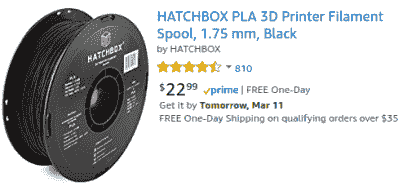
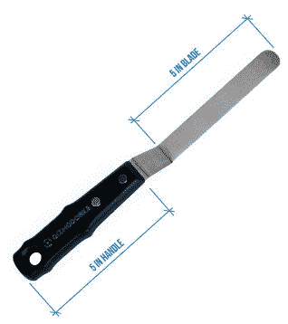

# 3D 打印机配件的基本清单

> 原文：<https://hackaday.com/2018/03/28/you-got-a-3d-printer-now-what-do-you-buy/>

你得到了你的第一台 3D 打印机，兴奋得头昏脑胀。但像所有新的添加剂制造冒险家一样，你对打印机做得越多，问题就越多。别担心，我们会支持你的。

使用新的 3D 打印机充分利用时间与手头的工具和附件以及如何使用它们有很大关系。让我们来看看每台 3D 打印机应该配备的一些配件，无论是在你的家里、学校还是黑客空间。当谈到 3D 打印时，已经有足够多的潜在恶化，这里的目标是确保你不会在最需要的时候没有工具或供应。

之前我们讨论过[在得到他们自己的 3D 打印机](http://hackaday.com/2018/01/10/you-got-a-3d-printer-now-what/)后*应该做什么*以尽可能确保这类事情的长期成功。如果你还没看过那篇文章，一定要把它加入你的阅读清单。涵盖了 3D 打印特有的定期维护和校准，以及操作员个人磨练自身技能的需要。

## 细丝:避免龙和建立你的股票

好的，显然你的 3D 打印机需要灯丝。但是*哪根*灯丝？就我个人而言，我建议你尽早买几个不同的品牌，这样你就能知道什么适合你。虽然很诱人，但不要只在亚马逊上买最便宜的 PLA。有龙。

Hatchbox brand filament is always a good bet

取决于你想做什么，你可能也想看看一些不同的注入计划。例如，木材填充 PLA 比普通 PLA 更容易打磨，所以我喜欢用它来打磨我想要平滑的较大的印刷品。请注意，注入的细丝会很快腐蚀打印机的喷嘴。

现在我给你省点麻烦，告诉你 2018 年你绝对*不*需要的东西，那就是 ABS。冒着在评论中引发一场战争的风险，没有理由继续使用 ABS 了。它不仅令人不愉快，而且对你的健康有潜在的危害(取决于你阅读了谁的研究)，而且它所具有的一点点强度优势在较新的 PLA 配方中已经变得毫无意义。如果你需要超出 PLA 能力的强度或温度承受能力，省省你的头痛吧，试试 PETG 或尼龙。

你可能仍然想使用 ABS 的唯一可能的原因是[做丙酮蒸汽平滑](https://hackaday.com/2013/03/23/smoothing-3d-prints-with-acetone-vapor/)。但是，除非你有流水线生产小雕像或艺术品，而不考虑表面细节或机械公差，否则你最好只是[把它吸起来，抓一些砂纸](http://hackaday.com/2017/11/15/visual-3d-print-finishing-guide/)。

## 数字卡尺为自己买单

如果你打算认真对待 3D 打印，你*需要*一个数字卡尺。您可以使用它来检查用于挤压机微调的细丝直径，验证校准打印的尺寸，或者让[对您想要三维复制的部件](https://hackaday.com/2018/02/06/printed-adapter-teaches-an-old-ninja-new-tricks/)进行精确测量。如果你想假装你是韦纳·冯·布劳恩或什么的，你可以买一个模拟的，但最基本的数字卡尺所提供的易用性和毫不费力的准确性是无与伦比的。

不要被骗去买一些和入门级 3D 打印机差不多贵的三丰数码卡尺；当使用挤出塑料时，您不需要这种精度。即使是便宜的卡尺也能达到 0.1 毫米的精度和足够的可重复性。一个基本的六英寸数字卡尺和一个硬存储盒的成本不应该超过 20 美元，而且会多花很多倍。

## 打印移除工具

一般来说，零件需要牢固地粘附在底座上才能成功印刷。一大块粘在床上的东西可以很容易地被牢牢地固定住，你可以用它把整个打印机提起来。这正是您在打印过程中想要的，但是当打印结束时，可能会出现问题。

Image Credit: Gizmo Dorks

你*难道*不想就这么把东西拽下来；这样做可能会损坏打印机或损坏已完成的零件。你也要非常小心地用小刀在指纹下撬开它。这听起来很合理，当然每个 3D 打印机的拥有者偶尔都会犯这样的错误，但是确实有滑倒和割伤自己的风险。即使你设法在不打开血管的情况下把指纹从床上取下来，仍然有很大的可能会刮伤或擦伤床，因为你必须以一定的角度拿刀。

为了避免伤害你自己或你的打印机，你应该花几美元买一个合适的打印清除工具。一般来说，这些薄如刀片，但没有锋利的边缘。它们通常也有一定的角度，这样你就可以拿着把手与床平行。这两个设计元素意味着损坏床的可能性更低，因为工具不会以某个角度进入。

就我个人而言，我使用的是 Gizmo Dorks 的[打印移除工具，我对它非常满意。经过两年左右的常规使用，刀片的前缘有一些刻痕，是我不得不拔出的一些较顽固的部分造成的，但并不严重。不到 10 美元，你不会错的。](http://gizmodorks.com/3d-print-removal-tool/)

## 异丙醇在打印之间清洗

[无论你的床上有什么，从 3M 蓝色颜料胶带到 PEI，你都应该经常擦拭它，以防止卷曲和翘曲。](https://hackaday.com/wp-content/uploads/2018/03/wsub_cotton.jpg)

有些人喜欢用酒精准备垫，那种你可以在急救箱里找到的东西。这不是一个坏主意，尤其是考虑到它们是如此便宜。但就我个人而言，我在打印机旁边的盒子里放了一小瓶酒精和一些棉球。在打印之前，我会好好喷一下床，用一个棉球擦干净，然后扔进垃圾桶。你也可以使用超细纤维布或类似的东西，但是你需要确保定期清洗，以免污染表面。

## 消防

火灾的风险是真实存在的，尤其是一些廉价的海外打印机充斥着市场。虽然即使是高端机器也不能完全免疫，[就像我们过去不幸看到的](https://hackaday.com/2016/03/21/ask-hackaday-mrrf-edition-3d-printers-can-catch-fire/)。你应该在打印机附近安装一个烟雾报警器。在大盒子家装店，它们的价格不到 10 美元，如果在隔夜印刷中出现问题，那么每一分钱都是值得的。

在过去，我们已经讨论过用于 3D 打印机的[精细灭火系统](https://hackaday.com/2016/04/12/ask-hackaday-open-fire-suppression-and-safety-standards/)，但是如果你想在最坏的情况下有所防备，位于打印机所在房间的一个基本的“ABC”型灭火器就足够了。再说一遍，这些东西便宜而且容易买到是有原因的。

## 还有什么？

这些是我相信每个 3D 打印机所有者都应该拥有的一些东西，它们多年来一直为我服务，也是我发现自己最经常依赖的东西。但是肯定还有其他值得一提的。当谈到桌面 3D 打印时，Hackaday 的读者会认为什么是“必备品”?更好的是，你认为 3D 打印机新用户应该避免在哪些方面浪费金钱？