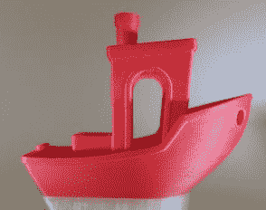
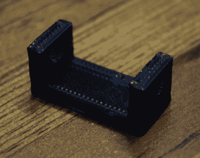

# 你有了 3D 打印机，现在怎么办？

> 原文：<https://hackaday.com/2018/01/10/you-got-a-3d-printer-now-what/>

鉴于目前市场上一些型号的价格低得令人难以置信，很有可能许多黑客读者已经带着闪亮的新桌面 3D 打印机走出了假期。甚至可能你们中的一些人已经意识到 3D 打印比你们想象的要难一些。当然，新一代的 3D 打印机比以往任何时候都更容易，但它仍然不是相同的“点击并忘记”在纸上打印的体验。

有鉴于此，我认为给那些突然发现自己迷失在解放军森林中的人一些建议来开始新的一年可能是不错的。这些信息中的一些对我们这些已经花了几年时间挤在一张打印床上的人来说可能是显而易见的，但是正如许多技术追求一样，我们倾向于将从经验中获得的知识视为理所当然。就我自己而言，几年前我第一台木制 3D 打印机面临的挑战与我想象的完全不同。我认为真正的挑战将是组装和运行机器，但在我获得真正利用这项技术的信心之前，建造机器所花的时间与数小时的试验和错误相比微不足道。

当然，每个人的经历肯定是不同的，我们很想在评论中听到你的经历。巨大的成功，毁灭性的失败，以及介于两者之间的一切。这是学习过程的一部分，对于那些刚刚起步的人来说，这是所有有价值的信息。

## 建立基线

 如果你刚刚插上你的 3D 打印机，你的第一个项目不应该是一个复制的*末日*步枪，需要 30 多个小时完成几十个打印。你需要从小处着手，但更重要的是，你需要确定打印机的状况。您希望确定机器的校准和设置情况，但如果有一个参考点来了解机器开箱后的打印质量，也会很有帮助。

他们没有告诉你的一件事是，3D 打印机存在某些固有的退化问题:喷嘴磨损、皮带丢失和磨损、床翘曲等等。如果你的第一批印刷品是一个常见的基准，如[极受欢迎的“Benchy”](http://www.3dbenchy.com)，甚至是[经典校准立方体](https://www.thingiverse.com/thing:1278865)，那么你将有一个物理参考点，稍后可以与你当前的印刷品进行比较，以查看质量是否开始下降。

## 记笔记

生产高质量的 3D 打印有许多变量，甚至在早期，你可能会在实验中注意到一些趋势。不同品牌的长丝可能需要不同的温度，以获得良好的床附着力和表面细节，即使它都是 PLA。你可能会发现*你在哪里*3D 打印往往和*如何*一样重要。工作区域的温度和湿度会对您的打印体验产生直接影响，您可能会发现，与夏天相比，冬天更难将打印品粘在床上。

当你有这些发现时，记录下来。如果你忘记了某个特定品牌的聚乳酸纤维的适当温度和挤压倍数，而你已经有一段时间没有使用过了，那么你真的会后悔，因为这样，你回家时看到的印刷品看起来很糟糕。我不会说大约一周前这种确切的情况发生在我身上，只是把它作为一个假设记在心里。

## 维护您的打印机

如前所述，随着时间的推移，你的打印机会出现一些问题，但除非你真的很努力，否则这些问题需要一段时间才会显现出来。大约每六个月检查一次你的安全带就足够了。你要确保牙齿没有磨损，并且处于适当的张力。这不是最科学的方法，但你应该能够拨动腰带，听到低沉的鼻音，就像低音吉他一样。如果拔的时候没有发出声音，它们可能太松了，应该用您的打印机使用的任何方法拧紧。

Commonly available brands of oil and grease.

喷嘴磨损有点难以量化。在正常情况下，使用直线型 PLA，您会看到数年的喷嘴磨损。在喷嘴磨损之前，你完全有可能升级到更新的 3D 打印机。但是如果你使用的是更耐磨的灯丝，比如含有添加剂(木材、金属、石头等)的 PLA，或者是在黑暗中发光的灯丝，那么你可以很快通过喷嘴。如果你在用了几卷这种细丝后发现打印质量很差，那可能是时候换喷嘴了。

应该定期进行润滑。那个[也不是说用 WD-40 喷打印机](https://hackaday.com/2016/05/17/beyond-wd-40-lubes-for-the-home-shop/)，那个东西和很多打印机用的塑料部件没关系。对于直线轴承和连杆，你需要一种轻质机油。在螺纹杆上，特别是如果穿过金属螺母，应该使用薄的锂基润滑脂。你也应该清除任何灰尘和碎片，有一个倾向于建立在杆上，用软布擦拭下来，然后再申请你的油。

## 定期打印

这个很简单:只需打印一些东西。你不必每天都打印，但每周或至少每月打印一些东西应该是你脑海中的一个目标。像其他任何东西一样，3D 打印需要一些练习才能掌握，所以你需要经常做。你不想在你有一个大项目的前一天拿出你的打印机，努力记住软件是如何工作的，或者调平床的正确过程是什么。

像 [Thingiverse](https://www.thingiverse.com) 、 [Pinshape](https://pinshape.com) 和 [YouMagine](https://www.youmagine.com) 这样的网站充斥着有趣的打印模型，从桌面玩具到合法工具，应有尽有。留意这些网站上新增加的模型，把任何吸引你眼球的东西打印出来。一定要贴上你的照片，并给创作者一些反馈；正是这种东西让这个社区持续发展。

## 去设计些东西

It’s ugly and useless, but it’s mine.

我将用我给 3D 打印机新用户的最后一条建议来结束这篇文章:[设计一些东西](https://hackaday.com/2013/12/11/3d-printering-making-a-thing-with-openscad/)。找到整洁的模型并打印出来是一件非常有趣的事情，你可能会从中获得几个月的享受。但是想象一下，如果你买了一台纸打印机，你所做的只是打印出你在网上找到的猫图片。那会有点奇怪，对吧？从一些容易上手的小东西开始，比如[补锅匠](https://www.tinkercad.com)，看看你的想象力会把你带到哪里。

桌面 3D 打印的真正“发现”时刻是你第一次成功地打印出自己的设计，第一次看着电脑上的渲染图，低头看着手中的实物，意识到你实际上已经生下了一个小塑料婴儿。我仍然保留着我根据自己的设计制作的第一张照片:这是一个丑陋的小支架，看起来像是用胶棒挤出来的，我甚至不知道它在这一点上应该是什么。但几年后，它仍然放在我的书桌抽屉里，提醒我意识到 3D 打印不仅仅是一个新奇的东西。